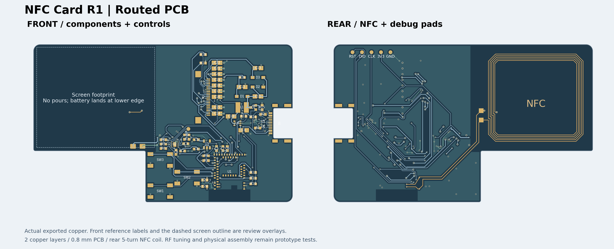

# Programmable NFC Business Card

## 当前确定方案

**外壳工艺评审：**[SLA 打印与 SWD 烧录说明](enclosure/r1-rounded-rear-soft/manufacturing-review.md)已完成，保留五个调试孔。圆角候选仍需解决薄底盖、胶接定位、涂层配合和按键轴向公差；首选向嘉立创 3D 询价，备选 PCBWay。成品板固件尚未开发，代烧录资料未就绪。

**最新圆角候选：**[加大圆角的上壳与底盖](enclosure/r1-rounded-rear-soft/README.md)已生成，正面／背面／俯视四角为 R1.2／R0.7／R3.2 mm；外尺寸与 PCB 不变，装入几何检查通过。仍待底盖固定与实物工艺验证。

**外壳方向更新，2026-09-24：**用户选择正面＋侧壁一体、独立底盖、背面内移接缝和外露圆角。[独立 CAD 候选与剖面](enclosure/r1-rounded-rear-study/README.md)保持原外尺寸，PCB 对上壳的装入路径检查通过；底盖固定、胶接工艺和实际装配仍待验证，尚未替换现有 CAD 或制造文件。

**R1 is the current editable engineering prototype.** Three front keys and a front e-paper display; rear NFC coil; right-centred recessed USB-C; two-layer 0.8 mm PCB; transparent printed enclosure, 85.2 × 53.2 × 5.8 mm. The selected battery is nominally 31 × 12 × 3 mm.

**Reviewed prototype checkpoint, 2026-09-24:** the perimeter GND rim is removed, the rear coil has 45° corners and equal offsets to the three exposed edges, and USB CC2 now branches at its protection pad. DRC/connectivity checks pass. **C1 input decoupling placement remains a before-order finding.** [Review and discussion items](hardware/pcb-r1-review.md). RF tuning, battery measurements and physical assembly remain unverified. The organized pre-optimization checkpoint is commit `ccf9f92`.

**Latest follow-up:** battery pads are routed at the user-selected **B position beneath the screen**, with the pack lead exit toward the upper right; both pads were subsequently shifted **1.5 mm right**, to (32.5,18.7)/(35.5,18.7) mm. Three redundant signal vias and one unused stub were removed; reopened DRC and independent copper checks pass. [Regional height/button handoff](enclosure/r1-height-handoff.md) records the accepted 3.4 mm battery and 0.25 mm ferrite assumptions. Thickness/button work is deferred; the active case remains **5.8 mm**. Its old wire/ferrite service bodies need revision for the new pads.

## R1 file index

| Entry | Purpose |
| --- | --- |
| [Native EDA project](../../eda/NFC-Card-R1.eprj2) | Primary editable source: one PCB and one four-page schematic |
| [Manufacturing files](hardware/production/r1/README.md) | Gerber for bare PCB; BOM and CPL for assembly; PDF, STEP and portable EDA backup |
| [Design and verification](hardware/pcb-r1-delivery.md) | Design decisions, checks, limits and reproduction commands |
| [Design inputs](hardware/r1-design.json) | PCB, screen, flex, battery and enclosure dimensions |
| [Clear enclosure](enclosure/README.md) | Editable CAD, assembled STEP and printable tray/lid/three-key meshes |
| [Evidence](hardware/records/r1-validation.json) | Saved DRC, netlist, physical copper, winding and export checks |
| [Scripts](scripts/README.md) | Current export, verification and package commands |
| [Progress](docs/progress.md) | Remaining engineering and physical work |
| [Complete local ZIP](artifacts/NFC-Card-R1-prototype.zip) | Rebuildable handoff containing PCB, CAD and checks; do not upload it as a Gerber ZIP |
| [Historical archive](archive/README.md) | E-series designs, experiments, old indexes and migration map |

## Physical validation still required

- Measure the complete protected battery, sealed edges and wires against the assumed 32.5 × 14 × 3.4 mm envelope.
- Fit the fully inserted display flex, printed enclosure, keys and USB plug; check screen-to-aperture alignment and adhesive retention.
- Bring up the assembled PCB and tune NFC with the final screen and enclosure. C23/C24 = 220 pF is provisional.

[Bench experiments](docs/nfc-bench-test.md) and [firmware](firmware/pn532_probe/) are separate from production-board qualification. No order has been placed.
