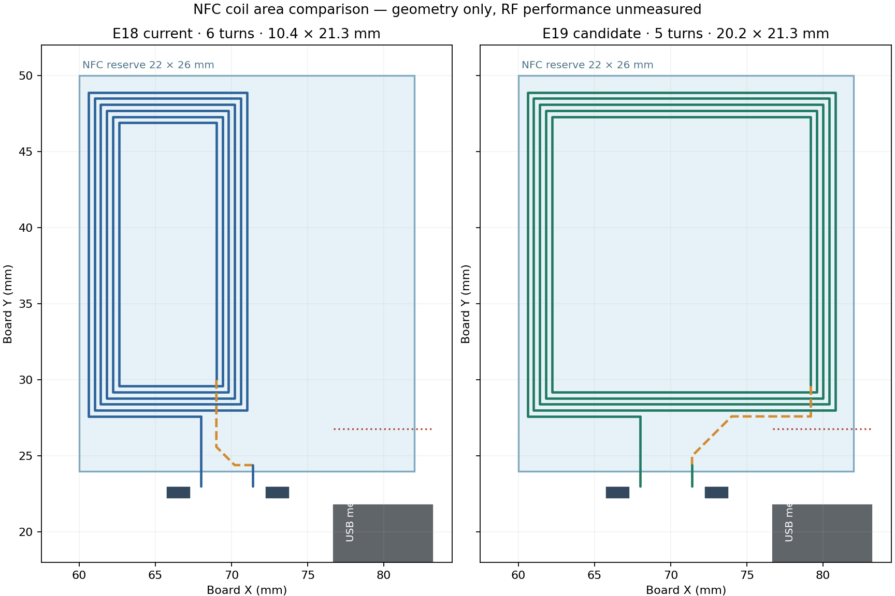

# 线圈面积与嘉立创工艺复核

用户指出 E18 线圈只占右上角一小片，判断是对的。E18 外圈中心线为 **10.4 × 21.3 mm**，外框面积 221.5 mm²；名义 NFC 预留区为 22 × 26 mm，E18 外框只占约 **39%**。预留区里没有其他器件焊盘，也没有非 NFC 走线。原来把 USB 金属壳周围的“留 5 mm”经验余量分别用于 X、Y 方向，于是强行取 `x≤71.7`。这不是嘉立创或芯片厂给出的固定净空规则；从实际两个矩形的最近距离看，限制过严。[NXP 天线设计说明](https://www.nxp.com/docs/en/application-note/AN11564.pdf)指出邻近金属会产生涡流、降低电感和 Q，需要实物评估，必要时用铁氧体，并没有给本项目一个通用 5 mm 免测值。

## E19 放大候选：独立图页，不覆盖 E18

| 几何 | E18 当前 | `Board1_5` / E19 五圈候选 |
| --- | ---: | ---: |
| 外圈中心线 | x=60.6–71.0, y=27.6–48.9 mm | x=60.6–80.8, y=27.6–48.9 mm |
| 外框面积 / 预留区占比 | 221.5 mm² / 39% | 430.3 mm² / 75% |
| 圈数、线宽/铜边间隙 | 6 圈、0.25/0.15 mm | 5 圈、0.25/0.15 mm |
| J1 金属包络到线圈及跨接铜的最短平面距离 | 约 8.0 mm | 约 5.7 mm |
| 当前 `estimate-nfc-coil.py` 的 L 粗估 | 1.05 µH | 1.15 µH |
| 理想每侧调谐电容粗估，未计寄生 | 约 263 pF | 约 241 pF |

放大候选把外框面积提高 **1.94 倍**，五圈矩形面积之和约为 E18 的 **1.87 倍**。这只是几何/均匀磁场下的耦合潜力指标，**不是读距增加 1.87 倍的预测**。减少一圈是为了让电感粗估保持在原量级；NFC 调谐值仍要按实际叠层、芯片、走线、屏幕、电池和壳体实测。[Nordic nRF52840 NFCT 规格](https://docs.nordicsemi.com/r/bundle/ps_nrf52840/page/nfc.html)要求差分线圈及两侧匹配电容；[Nordic 调谐说明](https://docs.nordicsemi.com/r/bundle/nwp_026/page/wp/nwp_026/nwp_026_estimate_values.html)也要求两侧取同值并通过实测调整。仓库旧记录中的 1.12 µH 与当前估算脚本重跑的 1.05 µH 不一致，两者都不能当作测量值。

可复核的 [E19 路线计划](nfc-expanded-five-turn-study.json)包含 E18 的 C23/C24 及其接地支路。以“已合网、尚未落线圈”的 E17 快照为底运行 `check-proposed-route.py`：**0 违规**，同线圈相邻铜边最窄 0.15 mm；底层五圈、顶层内端跨接、两处换层。顶层跨接绕开 J1 上方的近金属区域；保留原来的电容和落点位置。J1 距离按其文档化金属包络 `x=76.704–83.204, y=10.224–21.775` 计算，并从走线中心线扣除半线宽。

随后从 E18 独立复制出 `Board1_5`，把 E18 的 29 段线圈铜线和内端过孔替换为 E19 的 26 段与新内端过孔；原理图、电容、馈线、外壳 V7、板框和旧图页均不改变。验证结果见 [E19 机器记录](records/e19-expanded-coil-validation-2026-09-23.json)：

| 检查 | `Board1_5` / E19 |
| --- | --- |
| 保存重开 | 58 元件 / 248 焊盘 / 825 铜线 / 174 过孔 / 两层 GND 覆铜 |
| 四页原理图 DRC | 各 0 项 |
| PCB 原生 DRC | 24 项全是原有 J1 槽边告警；新增项 0 |
| 原理图到 PCB | 58 位号 / 238 引脚，0 网名差异 |
| 铜连通与线圈旁路 | 47 网、0 断网、0 悬空端；断开线圈外圈一段铜线后 NFC 恰好分为 NFC1/C23 与 NFC2/C24 两组 |
| 制造导出 | Gerber/钻孔/BOM/CPL/装配 PDF 重导，17 个 Gerber 成员、174 个过孔钻孔命中、BOM/CPL 各 58 位号；底层阻焊的螺旋没有开窗。**后续板框完整性复核发现 Gerber 有两条轮廓路径及另一层完整矩形；当前制造包检查已改为失败，不能上传下单。**见[整板复核](pcb-e19-independent-review.md) |
| CAD | E19 STEP 对板材 0 实质侵入；对 V7 上下壳、加强筋、键帽 0 实质碰撞 |

这证明扩大方案通过当前铜间距、连通和 CAD 几何检查；**导出的 Gerber 板框有歧义，制造包未通过完整性检查**，J1 槽边原有告警及其他生产门槛也未解决，**更不证明射频读距会更好**。E18/E19 都需要实板测调谐，C23/C24 的 220 pF 只是起始值。

## 工艺怎么选

| 嘉立创路线 | 当前官方能力 / 本板影响 | 判断 |
| --- | --- | --- |
| **0.8 mm、双层 FR-4、1 oz、线圈盖阻焊** | [PCB 能力表](https://jlcpcb.com/capabilities/Capab)给线圈盖油的专门下限 **0.15/0.15 mm**；本候选是 **0.25/0.15 mm**。线圈不露铜，HASL 只作用在开窗焊盘；[经济型 PCBA 表](https://jlcpcb.com/capabilities/pcb-assembly-capabilities)列出 0.8 mm 绿板、HASL、2–30 片，可用 84 × 52 mm 单板。 | **首选**，维持现在的板厚、USB 连接器和装配路线；放大线圈本身不要求换工艺。 |
| 2 oz 或更厚铜 | [刚性 PCB 能力表](https://jlcpcb.com/capabilities/Capab)中 2 oz 常规走线/间距至少 **0.16/0.16 mm**；当前线圈间隙 0.15 mm。 | 不直接替换铜厚；若供电确实需要厚铜，须重画并重新检查天线电感与工艺。 |
| 线圈整圈开窗露铜 | [线圈专门规则](https://jlcpcb.com/capabilities/Capab)：1 oz 时至少 **0.25/0.25 mm**，并列明使用 ENIG，避免 HASL 粘连。现有 0.15 mm 间隙不合适；0.8 mm 经济型 PCBA 又只列 HASL。[标准型 PCBA](https://jlcpcb.com/capabilities/pcb-assembly-capabilities)的单板下限是 70 × 70 mm，本卡 84 × 52 mm 若走该通道需拼板。 | 没有明确射频收益就不选；若需要开窗，必须重画节距并另选制造/装配通道。 |
| 0.4/0.6 mm 更薄硬板 | [刚性 PCB 能力表](https://jlcpcb.com/capabilities/Capab)列有 0.4/0.6 mm，但[经济型 PCBA](https://jlcpcb.com/capabilities/pcb-assembly-capabilities)从 0.8 mm 起；本板 J1 与 0.8 mm 板边缺口配套。 | 不因线圈面积改动板厚；要变薄需重选 J1 并重做 CAD/装配。 |
| 单独 FPC 天线 / 铁氧体 | [FPC 能力表](https://jlcpcb.com/capabilities/flex-pcb-capabilities)可做更细线（1/3 oz 时常规 3/3 mil），但它是额外的柔性件与连接/贴合工序；嘉立创当前页面称 rigid-flex 暂不支持。靠近电池或其他金属时，[NXP](https://www.nxp.com/docs/en/application-note/AN11564.pdf)指出铁氧体可能改善耦合。 | 留作实测后备选，不是单纯“线不够细”就该换。 |

嘉立创还在[刚性板能力表](https://jlcpcb.com/capabilities/Capab)注明，0.2/0.25 mm 孔且过孔直径小于 0.45 mm 属额外收费档。本 E18 快照中 **131/174** 个过孔是约 0.2/0.3 mm，主要来自既有布线；放大方案保持两处线圈换层，不会单独改变这一工艺档。具体价格和可选组合以实际下单页为准，不把官网能力表当报价。

外壳另走 3D 打印工艺：[嘉立创 8001 透明/半透明 SLA 树脂](https://jlc3dp.com/help/article/photosensitive-8001-resin)建议壁厚 **>0.8 mm**，标称公差为 ±0.2 mm 或 0.3%；透明件默认打磨喷油，细小气泡和纹理无法完全避免。当前 V7 上盖有 0.5 mm 薄板、电池袋底板为 0.4 mm，CAD 不碰撞不等于这些薄处能按该工艺稳定打印。需先打薄壁样片或让工厂确认，必要时改为薄片前盖/局部加厚，不能直接按 V7 的整体装配检查结果下透明壳订单。

**建议**：优先把 E19 当作首块射频样板候选；如预算允许，同时打 E18 与 E19 两种线圈作对照。比较装壳谐振和手机读距，再定量产版与最终电容值。开发板的 NFC 功能测试无法替代这一步；本记录也不是成品生产放行。
