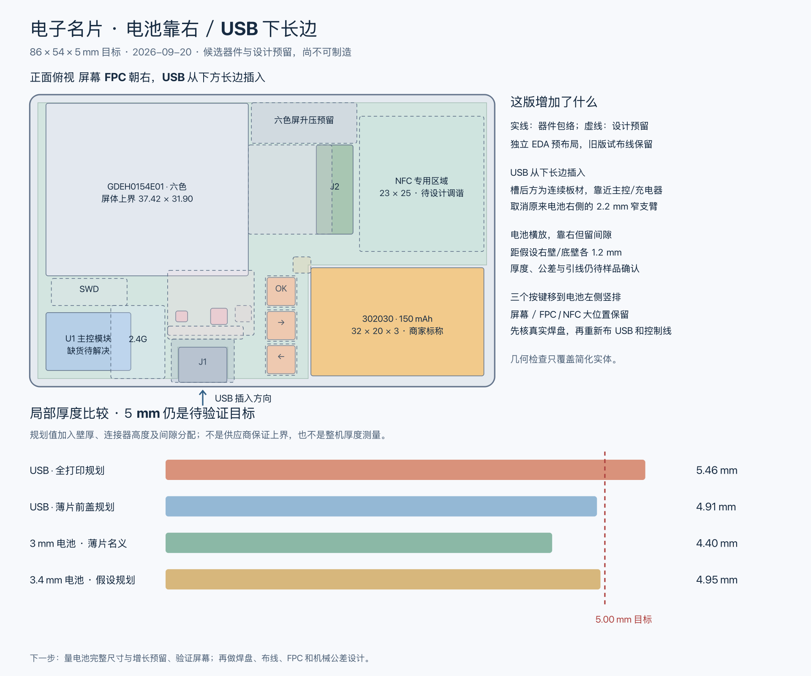
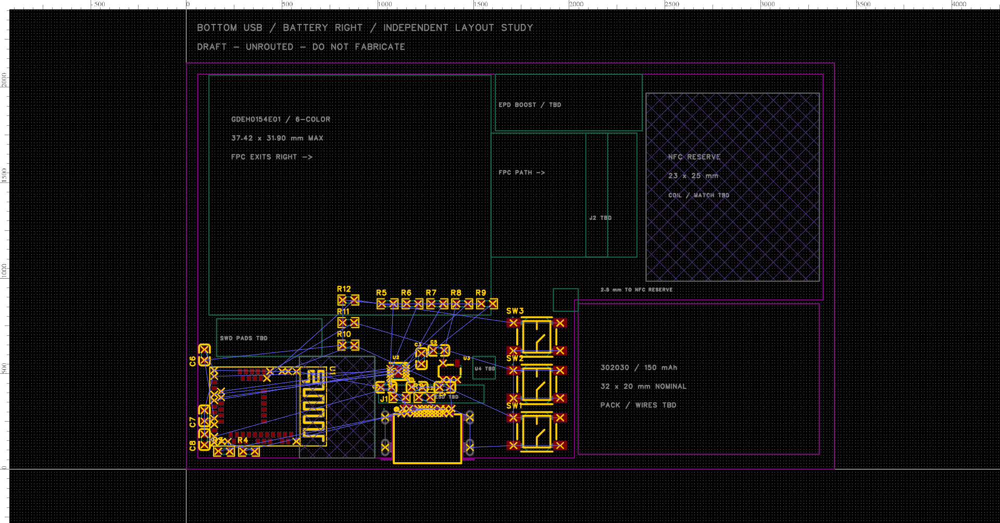

# 电池靠右、USB 下长边的独立方案

2026-09-20：按用户建议新增独立版本，保留旧版试布线工程与全部已有 FreeCAD 模型。新方案用于继续评估排布，尚未布线，不能下单。

后续已另做 [84 × 52 mm 紧凑机械比较](../enclosure/compact-layout.md)，尚未迁入本 EDA 工程；本文坐标仍是原 86 × 54 mm 版。用户已确认不推进断电可读，保留内置 NFCT。

屏幕后置线圈、背面碰卡仍为后一版备选；断电可读动态标签的历史调研见[备选与采购记录](../docs/nfc-next-version-options.md)。

- [新 EDA 工程](../../../../../eda/archive/nfc-business-card/NFC-Business-Card-Bottom-USB.eprj2)，PCB 页为 **E6 下边 USB - 排布评估未布线**。
- [新 FreeCAD 模型](../enclosure/pcba-e6-bottom-usb.FCStd)、[平面图](../enclosure/pcba-e6-bottom-usb.svg)、[机械报告](../enclosure/pcba-e6-bottom-usb-report.json)。
- [验证数据](pcb-bottom-usb.json)；原 [41 条 DRC 的试布线](pcb-routing.md)继续保留。

## 排布与使用姿态

图纸仍以 86 × 54 mm 横向坐标表示，原点在左下角。用户认可竖持使用：把横图顺时针转 90°，屏幕位于上方，电池位于下方，三个按键成为中段偏左的一排，USB 在左侧。暂不更改按键信号定义；屏幕内容方向、键帽标识和单手按压体验待验证。

| 对象 | 新坐标与方向 | 意图与限制 |
| --- | --- | --- |
| 电池 | 左下角 (52, 2)，32 × 20 × 3 mm | 横放靠右；与假设的右壁、下壁内缘各留 1.2 mm，不能作为厂家保证的尺寸增长余量 |
| PCB 电池缺口 | x ≥ 51.5、y ≤ 22.5 | 缺口直接通向右边，取消电池右侧狭窄支臂；电池左、上各留 0.5 mm 名义间隙 |
| USB J1 | EDA 原点 (32, 5.475)，0° | 插口朝下长边，信号焊盘朝板内；端面 y = 0.8 mm，外壳开孔和插头仍待验证 |
| USB 板槽 | x = 27.38–36.62，槽顶 y = 7.3 | 与电池缺口相距 14.88 mm；其中还要容纳按键和电路，并非全部自由布线宽度 |
| SW1 / SW2 / SW3 | 中心 x = 46.5，y = 5 / 11.3 / 17.6，0° | 实际焊盘留在 PCB 内；键帽与受力支撑仍为包络假设 |
| R1 / R2 | (28.3, 9.55) / (31.6, 9.55)，0° | CC 电阻随 USB 移到插座后方 |
| 电池引线 | 参考区 (48.7, 21)，3.3 × 3 mm | 假设可从左侧绕到左上接点；出线、线长、固定和连接器未选 |

屏幕、FPC 路径与插座目标、右上 NFC 和左下 BLE 预留区的大位置保留。电池缺口上缘到 NFC 预留区为 2.5 mm，原方案为 1.5 mm；这只是几何通道，不代表 RF 净空或布线已经充分。

没有采用电池竖放：若在右侧保留类似下边位置，20 × 32 mm 的包络会进入现有 NFC 区，需要同时重做天线区域。当前先保留横放。PCB 从有窄支臂的轮廓改成右下大缺口，仍须通过壳体支撑承受插拔与按键力，不能凭连通实体检查证明机械强度。

## EDA 状态

通过官方 API 导出、导入为新项目，再在副本内删除旧铜线、过孔与铺铜后重排。三页原理图及器件连接关系保留；原来的 `.eprj2` 字节哈希未改变。

- 27 个元件、145 个焊盘，焊盘网络与原理图一致；新工程移动前后的网表完全一致。
- 当前 0 条铜线、0 个过孔、0 个铺铜。参考区域只是空间分配，屏幕驱动、FPC、电池/NTC、ESD、SWD 和 NFC 天线尚未完成。
- 原生 DRC 共 **122 条：98 条未连接、12 条板框到 SMD 焊盘间距、12 条同封装内板框到 SMD 焊盘间距**。后两类仍来自 USB 槽口，移位没有解决封装本身的间距审查。
- 122 是新未布线方案的状态，不是旧版 41 条试布线成果被覆盖。保留原规则，尚未豁免或关闭这些报错。

## 验证与下一步

**机械几何通过：** `freecad-study.py generate --variant e6-bottom-usb` 与归档模型的 `check` 均保存重开检查。27 个简化形体有效，PCB 为一个连通实体，已建模器件没有碰撞、越出假设内腔或侵入 NFC，所检查的预留区没有冲突。USB 开口仍作为内腔检查例外。

**PCB 几何与保存通过：** API 保存重开后的工程数据无变化；145 个焊盘的包围盒未越出板框，没有不同元件焊盘包围盒交叠、器件主体包围盒交叠或焊盘进入 NFC 区。板厚约 0.8000 mm，SQLite `quick_check` 返回 `ok`。这些检查不代替焊接庭院、阻焊、槽边距、阻抗、回流或 DFM。

**视觉通过空间方案检查：** 只启动一次临时 FreeCAD GUI，通过 API 生成并查看等轴测和顶视图；另检查完整 SVG 渲染及 EDA 画布。已保存带显示属性的独立模型。FreeCAD 是大件与预留区包络，EDA 是实际的 27 个封装，两者不等于完整装配模型。

记录位于本机 `artifacts/archive/bottom-usb/`；可重复的 FreeCAD 命令见[软件说明](../../../docs/software.md#电池靠右usb-下长边变体)。原 EDA 与三个既有 `.FCStd` 的 SHA-256 均与本轮开始时一致。

下一步按此新方案补齐六色屏外围/FPC、电池接点/NTC、USB ESD 和 SWD，并核 USB 槽口与板厂规则，再安排完整布线。先用纸样或结构样片验证竖持按键位置；收到样品后核电池完整包体、出线及屏幕排线。薄片前盖下 USB 规划厚度仍为 4.91 mm，3.4 mm 电池的假设规划值仍为 4.95 mm；换位置没有消除厚度、公差和实物验证缺口。
