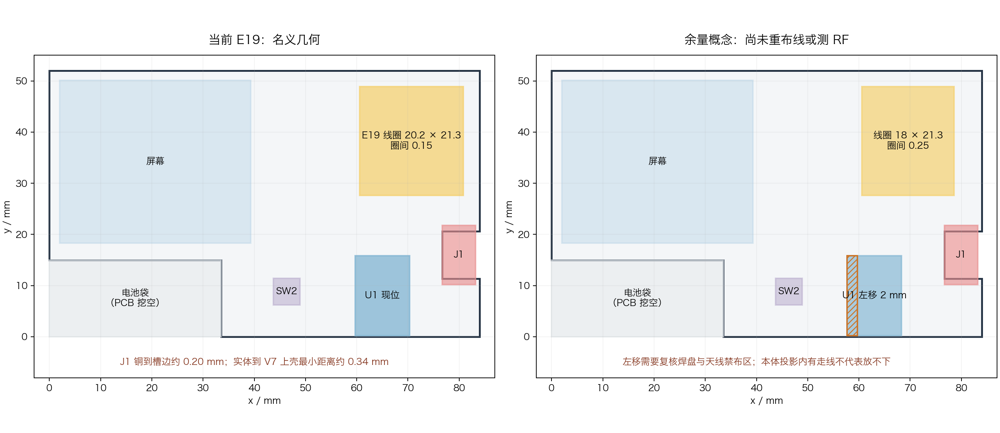

# E19 整板复核：从“能过 DRC”改为“有制造与装配余量”

审查对象是工程 SHA256 `16cd65a2089653ea6b0b5723ef6ad56e50db22991cd7fb656e3a4ffb35cc9505` 的 `Board1_5`、本地 `artifacts/coil-api-study/expanded-snapshot.json` 及同版 Gerber/BOM/CPL；可复核的摘要见 [E19 记录](records/e19-expanded-coil-validation-2026-09-23.json)。以下是图纸与文件检查，没有实板。此前面积漏检的原因是只按连通、DRC 和电感粗估验线圈，没有检查线圈占预留区的比例和假设的 USB 净空；这不是工具限制。

| 优先级 | 发现与证据 | 处理 |
| --- | --- | --- |
| **阻塞下单** | 当前 `.GKO` 含正确 L 形轮廓**及第二条 USB 封装辅助轮廓**（2 条绘制路径，其中一条未闭合）；`.GME` 又含完整 **84 × 52 mm 矩形**。此前 `check-e16-manufacture.py` 只核板框顶点和外包络，错报 `ok=true`。增强后的检查器对 E19 返回 `ok=false`、两项轮廓问题；E16/E18 导出同样存在。 | 从 EDA 源或导出配置去掉机械层矩形，把 J1 的辅助轮廓移出制板板框层；重导并独立核实只剩一条正确闭合板框。不能直接上传当前压缩包。[嘉立创下单说明](https://jlcpcb.com/help/article/instructions-for-ordering)要求切割内容集中在唯一明确的轮廓层，警告多轮廓层可能选错。 |
| **连接器与板厂适配待核** | J1 的 12 个信号焊盘距 USB 槽边名义 **0.2007 mm**，满足[嘉立创公开的锣边到铜 0.2 mm 下限](https://jlcpcb.com/capabilities/Capab)；原生 DRC 因工程内 0.3 mm 规则报 24 个叶项。**两数相减的 0.0007 mm 不是产品只剩的安全公差，不能据此认定易坏或必须换连接器。** | 先对照原厂推荐封装与同型号参考设计，核板厚、焊盘、槽边、锣刀内角和壳脚，再与板厂工艺匹配。移动 U1/缩小线圈不会改变这一局部尺寸。 |
| **壳体工艺与装配待核** | **已纠正：0.13 mm 是到 z=4.0 统一参考平面的高度差，不是实体间隙。**重新测 E19 STEP 与 V7 实体：J1 到上壳 **0.339979 mm**、下壳 **0.398321 mm**，均无名义相交，见[实体记录](records/e19-j1-shell-clearance-2026-09-23.json)。插头模塑件可通过的最大宽度 9.20 mm 对 9.24 mm 缺口，名义差 0.04 mm。嘉立创 [8001 SLA](https://jlc3dp.com/help/article/photosensitive-8001-resin)公差 ±0.2 mm 或 0.3%，建议壁厚 >0.8 mm；当前底板/上盖主板厚是 0.4/0.5 mm。 | 沉板 USB 并非已证实装不下。要根据真实实体与公差核外壳、插头和薄壁工艺，不能用统一参考平面得出缺空间的结论；电池和屏幕到货尺寸也须加入叠加。 |
| **RF 未定** | E19 五圈为 0.25/0.15 mm 盖阻焊铜线，线距正好落在[嘉立创线圈专门下限](https://jlcpcb.com/capabilities/Capab)。同页还列一般“同网络线距 0.25 mm”；线圈专门规则应优先，但应在生产稿确认时检查间隙没有被 CAM 改写/短接。220 pF 匹配电容仅为起始值。 | 实板装电池/屏/壳测 13.56 MHz 谐振、Q 和手机读距；若想提高蚀刻余量，研究 0.20–0.25 mm 线距的中等面积线圈，不能以电感估算替代测试。 |
| **费用/可维修性** | 174 个过孔中 **131 个**约为 0.2/0.3 mm，[嘉立创](https://jlcpcb.com/capabilities/Capab)将 0.2/0.25 mm 孔配 <0.45 mm 外径列为额外收费档；TP3/TP4/TP5 在顶层屏幕下，装壳后不能用 SWD 救援。 | 报价时正确选小孔规格；下版能腾出空间再考虑大孔重布。决定是否需要底面测试点和外壳探针孔。 |

再次独立检查：E19 的 NFC 预留区以 0.5 mm 网格取样，两层 GND 实际填充均为 **0 个命中**；原理图与 PCB 238 引脚网名 0 差异、非 GND 铜网 0 断网、原生 DRC 无新增项。BOM/CPL 58 位号和 XY 一致，CPL 的 58 个角度与面别也同快照一致。**这些电气一致性结果不能抵消板框 Gerber 问题。**覆铜 27/16 个填充区的逐区接地检查仍未建立可信判据，不能宣称全部已连通。

**板框清理试验（审查包，不是生产放行）：**[脚本](../scripts/prepare-outline-review-package.py)限定只接受本版已核实的“两条 GKO 路径 + 一条 GME 参考矩形”。它生成的 [E19 审查包](../../../artifacts/coil-api-study/outline-cleaned-review/NFC-E16-gerber.zip) 仅改动 `.GKO`，删去 `.GME`；其余 **15 个 Gerber 成员逐字节相同**，BOM/CPL/PDF 原样复制。用当前快照重新运行制造检查为 `ok=true`：1 条闭合板框、174 个过孔钻孔命中、BOM/CPL 各 58 位号，最大贴装坐标差 0.0005 mm。源工程仍会导出旧的多路径文件，必须固定正式导出流程并核对嘉立创生产稿；J1 铜到槽边余量及 RF 问题也独立存在。试过在 EasyEDA 导出参数中整体关闭 `Line` 对象，但**连正确板框也一起消失**，因此不能把这个开关当作修复。

## 布局退一步的量化比较

| 假设候选 | 外框/线距 | 外框面积 | 右侧板边铜净距 | 粗估电感 |
| --- | --- | ---: | ---: | ---: |
| 当前 E19 | 20.2 × 21.3 mm、0.15 mm | 430 mm² | 3.08 mm | 1.15 µH |
| 中等面积概念 | 18 × 21.3 mm、0.20 mm | 383 mm² | 约 5.28 mm（外圈左边仍为 x=60.6） | 1.03 µH |
| 中等面积概念、一般同网络间距 | 18 × 21.3 mm、0.25 mm | 383 mm² | 约 5.28 mm | 0.99 µH |

后两行只是 `estimate-nfc-coil.py` 的 **几何方案**，尚未落 EDA、过 DRC 或测 RF；预计每侧匹配电容也需重调。缩线圈能扩大天线到板边及圈间的余量，**不能改善 J1 槽边或壳体厚度**。

U1 现位于 (65, 8) mm，模块名义本体约 10.6 × 15.6 mm。若中心左移 2 mm，新增占用的西侧窄条（x=57.7–59.7, y=0.2–15.8）有 **58 段现有走线、10 个过孔、18 个网络**穿过；左移 5 mm 的西侧条有 **74 段走线、至少 16 个过孔、18 个网络**。**这些只是本体投影内的交叉对象计数，既不是物理碰撞结果，也不是必须重布的数量。**是否冲突要分别核焊盘、模块天线禁布区、器件包络与图层；当前没有据此证明左移放不下。按用户要求，先确定布局，再为选定布局重布，现有走线不约束器件位置。

## 沉板 USB 参考与设计顺序（2026-09-23 更正）

[GCT USB4500](https://gct.co/connector/usb4500)是标准的 Mid Mount 产品，外形高度 3.16 mm、下沉偏移 0.80 mm，[原厂安装说明](https://gct.co/usb-connector/usb-type-c)明确说明其通过 PCB 开槽降低高度。本板采用 0.8 mm PCB，连接器与板厚在槽内共用高度；增加铜层数量不会改变连接器的机械外形。

此前“多层板工艺”指把 EDA 规则切到 `JLCPCB Capability(Multiple Layers Board)`，用 0.3/0.2 mm 小过孔完成扇出；当前铜层仍为双层。这与真正改四层板不同，详见 [E16 小孔扇出记录](pcb-e16-usb-right-mid.md#小孔扇出成功2026-09-22)。

已找到同型号参考：[KiCad 9.0.7 随附的 TinyTapeout 示例 PCB](https://github.com/KiCad/kicad-source-mirror/blob/9.0.7/demos/tiny_tapeout/tinytapeout-demo.kicad_pcb)中 J15 使用 USB4500-03-0-A；其[封装源码](https://github.com/TinyTapeout/tinytapeout-kicad-libs/blob/0301871/footprints/TinyTapeout.pretty/GCT_USB4500-03-0-A_REVA.kicad_mod)包含沉板槽的直线和圆弧让位。该参考用于交叉核对，不能仅凭公开源码认定适配本板工艺。下一步先完成原厂图纸／参考封装／本板三方尺寸比较，再冻结布局与装配余量，最后布线。嘉立创能力表也明确不支持无圆角的矩形槽，原先纯直角的理想 CAD 缺口不能代替实际锣刀轮廓。

## 嘉立创怎样做这块板

线圈是普通 PCB 铜箔图形。用户提交的 Gerber 决定每圈几何；工厂按可选的标准叠层、铜厚、阻焊、表面处理等工艺参数做 CAM/DFM，然后经成像、蚀刻、钻孔电镀、阻焊、检测与外形铣切制造。[嘉立创制造流程](https://jlcpcb.com/blog/pcb-manufacturing-process-step-by-step)明确列出这些工序。**版图逐单定制，工艺平台标准化**；这不是每位客户重新发明一套线圈工艺，也不是把铜线用普通打印机打印上去。

本板 0.8 mm、双层 FR-4、1 oz、盖阻焊线圈落在其公开能力内，线圈本身不要求特殊设备。小过孔要选额外收费档；超出常规组合、特殊备注或含糊图层会进入额外工程审查。[嘉立创](https://jlcpcb.com/help/article/how-to-confirm-the-production-file)说明工程师会把客户 Gerber 转成生产文件，并提供“生产稿确认”让客户复核。我们的当前 Gerber 轮廓有歧义，必须先在源文件/导出端消除，再核工厂生产稿。
