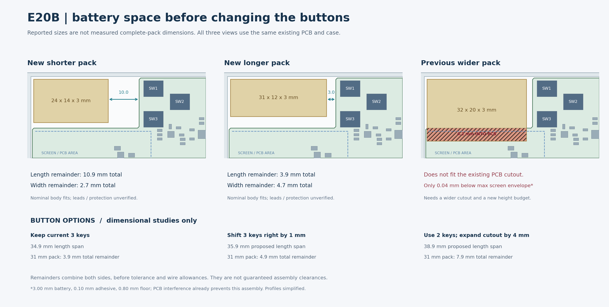

# E20B battery and button space study

Recorded 2026-09-23. **Read-only geometry study; native PCB, schematic and existing CAD remain unchanged.**

## User inputs

The user reports two new purchases, expressed as thickness × width × length: **3 × 14 × 24 mm** and **3 × 12 × 31 mm**, plus the previous **3 × 20 × 32 mm** option. The new packs have not arrived. Whether the reported dimensions include protection and sealed edges is uncertain; capacities and lead exits are unknown. [Structured purchase record](../../../hardware/battery-purchase-candidates.json).

The existing 32.5 × 14 × 3.4 mm review envelope remains an assumption, not a measured battery. Both new nominal bodies fit inside that envelope, but unknown protection/lead extensions can change the result.

## Current usable geometry

The active clear enclosure has **no battery divider**. The straight left inner wall is at X = 0.6 mm and the PCB cutout side is at X = 35.5 mm: **34.9 mm** nominal length span. The analogous width span is Y = 0.6–17.3 mm: **16.7 mm**.

The older `battery.cavity_xy_mm` 33.7 × 15.5 entry in `e20-design.json` belongs to the former frame construction. It is not the cavity generated by the active clear-shell script. Current measurements use the actual saved assembly and native PCB profile. Rounded corners, print tolerances and wire space prevent treating straight spans as a guaranteed maximum pack size.



| Nominal battery, length × width × thickness | Total length remainder | Total width remainder | Existing E20B body fit |
| --- | ---: | ---: | --- |
| 24 × 14 × 3 mm | 10.9 mm | 2.7 mm | No nominal solid collision |
| 31 × 12 × 3 mm | 3.9 mm | 4.7 mm | No nominal solid collision |
| 32 × 20 × 3 mm | 2.9 mm | −3.3 mm | Intersects PCB; not compatible with current layout |

Remainders are **the sum of both sides**, before tolerance and wire allowances. At the existing (1.5, 1.5) pack origin, the 31 mm battery has a 0.9 mm left gap and 3.0 mm to the straight PCB edge on its right. The 24 mm battery has 10.0 mm on its right. Both have 1.1 mm nominal distance to the lid when thickness is exactly 3.0 mm and the adhesive is 0.1 mm.

The 20 mm wide battery crosses the PCB edge by **4.2 mm** at the existing pack origin. FreeCAD measures approximately **107.20 mm³** of PCB/battery intersection. Even if that PCB strip were removed, the exact 3.0 mm nominal battery would have only **0.04 mm** below the maximum screen envelope. It therefore needs both a new board cutout and a new height/tolerance budget. Removing one button alone does not solve this width/height conflict.

## Is the layout excessively compact?

Existing E20B has no native spacing errors and no native component-body collisions. The capacitor column has approximately 0.45 mm copper-edge and 0.50 mm model-body gaps. These results do not establish routing access or production yield; the board is still unrouted.

For the two newly purchased nominal battery sizes, the geometry does **not** establish a need to remove a button. The 31 mm pack is not restricted to the 32.5 mm rectangle shown in the earlier overview: that rectangle was the assumed pack envelope, not the entire available pocket.

## Button alternatives measured without implementation

| Study | Proposed length span | Remainder for 31 mm pack | Scope / tradeoff |
| --- | ---: | ---: | --- |
| Keep current three keys | 34.9 mm | 3.9 mm | Existing native layout |
| Shift all three keys +1 mm in X; cutout to X = 36.5 mm | 35.9 mm | 4.9 mm | Keep all buttons and their relative spacing; new PCB profile and lid holes needed |
| Remove spare SW2; move SW1/SW3 right and enlarge cutout by 4 mm | 38.9 mm | 7.9 mm | SW1 at (44.1, 4.5), SW3 at (44.1, 12.5); key centres become 8.0 mm apart |

The two-key study preserves the original basic interaction: SW1 selects a main category and SW3 selects its option. SW2 remains an optional spare in the current interaction specification. See [architecture](../../../docs/architecture.md#5-二级菜单与切换一致性).

For both moved-key studies, translated native switch bodies do not intersect neighbouring component models and the proposed cutout does not cut any component pad. Three-key +1 mm movement leaves 0.800 mm between SW3 and C8, with 0.595 mm to R8. The two-key study leaves 0.900 mm to C8. These are **partial geometry checks**, not a native DRC or full assembly pass. Button caps, travel, lead routing, copper clearance, PCB supports, new hole positions and profile corner radii still need coordinated implementation if an option is selected. The simple cutout subtraction used here is not a final manufacturing profile.

## Current recommendation

Evaluate the two new batteries against the existing E20B envelope first; their nominal dimensions do not justify deleting a button by themselves. Keep the 32.5 × 14 × 3.4 mm review envelope until complete packs are measured. If additional assembly room is preferred, the +1 mm three-key option and +4 mm two-key option provide measurable alternatives. The 20 mm wide old battery should not set the current mechanical target.

Before freezing placement, measure the complete protected pack, maximum thickness, sealed edges, lead exit and the actual lead bend needed to reach the solder pads. Battery capacity/runtime selection also remains open.

## Evidence and reproduction

- [Measured results](records/e20b-battery-space-study.json).
- [Current native placement and clearance evidence](pcb-e20b-functional-comparison.md).
- [Comparison PNG](../enclosure/renders/e20b-battery-space.png).

```sh
/Applications/FreeCAD.app/Contents/Resources/bin/freecadcmd projects/nfc-business-card/scripts/study-e20b-battery-space.py
python3 projects/nfc-business-card/scripts/render-e20b-battery-space.py
```

The comparison image was visually inspected. No native DRC was rerun for these unimplemented alternatives; the original E20B result remains 0 spacing errors and 154 unconnected items.
