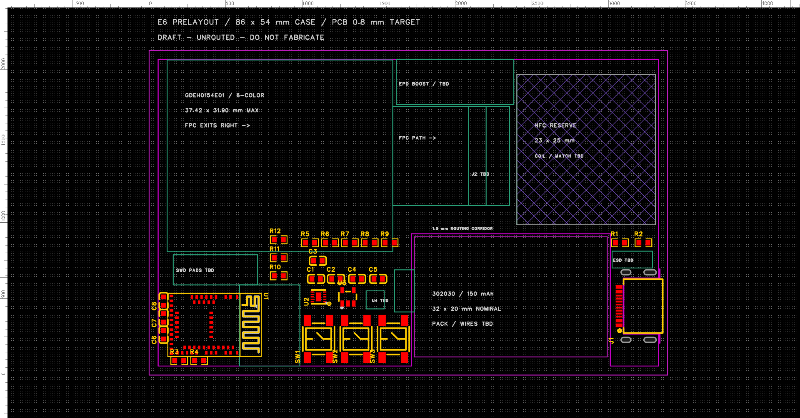

# 六色屏 / 302030 PCB 预布局

更新：2026-09-20。本文保留首次预布局快照，当时未布线、DRC 为 122 条。源工程后续已进入[第一轮试布线](pcb-routing.md)，当前打开 `Board1 → E6-302030 试布线 - 未完成`；仍不能生产。以下图片、坐标和检查结果均指首次预布局。



## 已放入的内容

- 从三页原理图导入 27 个元件、145 个焊盘，保留原有网络。没有把旧黑白屏的 J2 候选转入 PCB。
- 外壳参考为 86 × 54 mm；实际板框包围尺寸为 83 × 51 mm，另有电池和沉板 USB 的开放缺口。两层板的物理堆叠已设为约 0.8 mm；这是设计设置，不是制造商交付公差。
- 屏体采用 37.42 × 31.9 mm 上界，位于左上，排线向右；保留排线路径、插座包络和升压器件区。**这些是装配参考图形，尚无六色屏插座焊盘或完整驱动电路。**
- 电池按商家标称 32 × 20 mm 放在右下缺口；右上保留 23 × 25 mm NFC 区，并设置跨层禁止元件、填充和铺铜。此规则没有禁止导线，不代替完整射频净空与天线设计。
- USB ESD、SWD、屏幕负载开关及电池出线均标为待定区域。没有用假焊盘掩盖缺失电路。

坐标和检查快照见 [pcb-prelayout.json](pcb-prelayout.json)。坐标沿用 FreeCAD：外壳左下角为原点，单位 mm；EDA API 使用 mil，转换为 `mm / 0.0254`。

## 提前发现的问题及调整

| 项目 | 发现与本轮处理 | 仍需解决 |
| --- | --- | --- |
| 按键 | 5.2 mm 主体对应的库焊盘总跨度约 8 mm；三个按键旋转 90°，中心向上移动 1.4 mm | FreeCAD 按键/键帽位置后续同步，装配与手指操作待验证 |
| USB 沉板槽 | 原 CAD 槽起点 x=79 mm 会切到信号焊盘；先对照库内开槽参考，再将连接器整体内移 0.8 mm，以让固定脚留在板上 | 原厂推荐焊盘、开槽、阻焊/锡膏与库一致性仍需逐项审核 |
| USB 插口 | 当前端面 x=85.2 mm，比外壳外缘内缩 0.8 mm；固定脚到板边/孔到板边的首轮告警已消除 | 必须检查真实插头能否插到底，以及侧壁开口和支撑 |
| USB 槽边距 | 12 个信号焊盘到槽边约 0.2 mm，小于当前规则 0.3 mm；封装内自带的槽参考也产生对应告警 | 保留告警。先核原厂机械图与板厂槽加工能力，再决定修改封装、板框或有依据的局部规则 |
| 窄通道 | 电池缺口上边 y=23.5 mm，NFC 区从 y=25 mm 开始，最窄布线通道只有 1.5 mm；电池与 USB 槽间基板桥宽 2.2 mm | 试布 USB、供电及回流路径；必要时上移 NFC 区或重新安排 USB/电池，另核插拔强度 |
| 电源外围 | 实际阻容占用超出原先的电源预留框，部分位于屏幕投影下 | 元件高度、屏幕后方绝缘和支撑需回到三维装配核对 |

本次仅修改 EDA，**现有 FreeCAD 模型保留上一版坐标**。屏幕、电池和 FPC 主区域沿用原排布；按键、USB、出线区以及阻容放置以上表和 EDA 为准，不应把两个文件当成自动同步模型。

排线仍未验证：最短尾长、连接器插入深度、接触面、引脚 1 方向、锁扣操作空间、折弯半径和 Z 向高度变化都需要实际屏幕及最终插座。平面预留足够不等于实物能插上。

## 检查结果

- 保存并关闭 PCB 图页后重开，27 个元件的位置、145 个焊盘网络、板框、区域和物理堆叠保持一致。客户端把 270° 规范化为 −90°，恢复了非激活层显示设置，并补入空网络的默认长度规则；已核对这些差异。
- 从 PCB 导出的网表通过现有脚本的 **108 项关键引脚检查**，32 个命名网络与原理图草案一致。该结果证明网络分配，**不证明铜线已连接**。
- 基于导出的库封装做平面包围框检查：145 个焊盘角点均在板材内，无不同元件间的焊盘/主体包围框重叠，无焊盘侵入 NFC 区。此检查不覆盖完整 courtyard、边距规则、外壳、排线折弯和射频。
- EDA 原生 PCB DRC：**122 条，未通过**。98 条连接性错误来自未布线；12 条板框到 USB 贴片焊盘间距错误，另 12 条来自 USB 封装内自带的槽参考。没有关闭规则消除告警。
- 层叠源数据合计约 0.800024 mm（序列化取整）；SQLite `quick_check` 为 `ok`；导出的 `.epro2` 包通过 ZIP CRC 检查；保存重开后的 EDA 画布已目视检查。

本机复核命令：

```sh
python3 projects/nfc-business-card/scripts/check-schematic-netlist.py projects/nfc-business-card/hardware/records/eda-prelayout-pcb.enet
python3 projects/nfc-business-card/hardware/records/eda-prelayout-check-layout.py
```

API 执行记录、原始封装快照、改动前数据库备份、DRC 面板记录与 `.epro2` 导出在被忽略的 `artifacts/archive/eda-prelayout/`；检查脚本使用本轮导出快照，不会自动读取后来编辑的工程。长期设计源是根 `eda/` 下的工程，本文的图和 JSON 是本次评审快照。

下一步可先核 USB 封装和局部试布线，同时补 ESD、SWD 与六色屏电路；屏幕、电池实物确认后再收敛最终插座、排线、外壳和制造文件。
