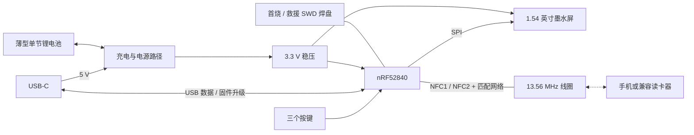

# 架构选择

当前主控为 nRF52840，满足用户新增的 USB 编程要求；nRF52832 只作早期 NFC/薄度比较。下载与原型选项见 [USB 编程方案](usb-and-prototyping.md)。

## 1. 需要的是可编程标签端

手机/读卡器产生 13.56 MHz 磁场，名片在 NFC-A 标签端响应。电池供主控和墨水屏使用，按键选择后由固件更换 NDEF 数据。这个交互不要求名片产生读卡场；日常所说的“主动切换”与 NFC 协议里的主动通信模式不是一回事。

nRF52832 的 NFCT 支持 NFC-A listen、106 kbps 和外部场检测唤醒；Nordic SDK 提供 Type 2 标签库。其 Type 2 库的“只读”指手机一侧不能改写，主控固件仍可设置下一次提供的 NDEF。资料：[nRF52832 NFCT](https://docs.nordicsemi.com/r/bundle/ps_nrf52832/page/nfc.html)、[Nordic NFC 文档](https://nrfconnectdocs.nordicsemi.com/ncs/latest/nrf/protocols/nfc/index.html)。



BLE 天线和 NFC 线圈是两套不同结构。Raytac 模块附带的 PCB 天线服务于 2.4 GHz 无线，不会替代 NFC 线圈；V1 不启用 BLE 广播、Wi-Fi 或联网功能。

## 2. 对外内容与兼容性

默认每个身份提供一个 **NDEF HTTPS URI**。固件内保存 `profile_id / display_name / subtitle / https_url`，屏幕显示当前身份及可选二维码，二维码与 NFC 使用相同 URL。只有选中索引需要持久化，不需要存动态资料数据库。

- iPhone 支持背景读取的机型可显示链接通知，用户点击后打开；不能承诺贴近后无确认地自动打开。Apple 明确说明背景读取条件和 URI 记录要求：[官方说明](https://developer.apple.com/documentation/corenfc/adding-support-for-background-tag-reading)。
- Android 与具体读卡器做实物兼容测试。支持 ISO14443A 并不自动代表上层软件会解析 NDEF 或打开链接。
- HTTPS URL 可以先指向已有个人页面或社交主页，不需要为 V1 建后端。若最终需要名片页和 `.vcf` 下载，可单独开发；NFC 读取本身不需要名片联网，打开网页通常需要手机联网。
- 不以原始 vCard 作为唯一默认记录，避免把“读到字节”误当成“所有手机自动存入通讯录”。
- V1 不做任意 UID 切换、MIFARE/DESFire 门禁兼容或支付仿真。这些是不同的协议和认证需求。

## 3. 三种 NFC 实现的取舍

| 路线 | 能否按键切换 NDEF | 电池断开后 | 固件/硬件影响 |
| --- | --- | --- | --- |
| nRF52 内置 NFCT | 能，由主控更新对外缓冲区 | 本设计不提供 NFC 服务 | 最少硬件；主控启动、唤醒及更新过程必须协调 |
| MCU + NTAG I²C Plus | 能，主控通过 I²C 写入 | 可被动读已写入内容 | EEPROM 写入寿命、RF/I²C 并发与写保护需处理 |
| MCU + ST25DV | 能，属于 Type 5 | 可被动读取 | ISO15693/Type 5 兼容性另验；不能拿仅支持 Type 2 的读卡器覆盖测试 |

无电可读已被用户明确排除为必要条件，因此首版不增加动态标签芯片。参考：[NTAG I²C Plus 数据手册](https://www.nxp.com/docs/en/data-sheet/NT3H2111_2211.pdf)、[ST 动态 NFC 标签](https://www.st.com/en/nfc/st25-dynamic-nfc-tags.html)。

## 4. 固件起点与资源

Nordic SDK 路线的候选固定到 **nRF Connect SDK v3.4.0**，manifest 仓库 commit `99553055607b2e9885fbc80ccd11fa9da81c2df0`，对应 annotated tag object `cc3a680d04d2374de9d8e8997ce3950f25e1179e`。已通过 GitHub API 核对，不是本地构建验证。若原型使用 EN04/Seeed Arduino 例程，先保留其板厂工具链；最终 USB bootloader 与应用的分区/镜像格式需统一，不预设互通。

- [record_text 样例](https://github.com/nrfconnect/sdk-nrf/tree/v3.4.0/samples/nfc/record_text)：作为 Type 2 生命周期起点，把文本记录改成 SDK 的 URI 编码。
- [system_off 样例](https://github.com/nrfconnect/sdk-nrf/tree/v3.4.0/samples/nfc/system_off)：研究场检测唤醒。`sample.yaml` 的 `platform_allow` 包含 `nrf52dk/nrf52832`；这不等同于该板列入每个集成测试组合。
- `writable_ndef_msg` 用于了解可写标签机制，V1 不需要引入。

200 × 200 单色全帧缓存需要 5,000 bytes；双缓存是 10,000 bytes。当前 nRF52840 提供 256 KB RAM / 1 MB Flash，但 USB、SDK、栈、驱动与升级分区也占空间，最终以 map/size 文件为准。中文只生成实际使用的字形子集，首版不引入 LVGL。

## 5. 切换、显示与断电一致性

建议交互：左/右浏览身份，确认键应用；浏览态明确显示“待确认”。在没有 NFC 场、没有正在传输的会话时应用切换；若手机正在读，保持该次数据稳定，提示移开后完成切换。

计划状态流程：

1. 确认新索引，检查 URL 长度与 NDEF 编码是否成功。
2. 停止 NFC 标签服务，等待外部场离开，进入切换状态。
3. 将新的选择和 `display_dirty` 状态持久化，使用可恢复的存储记录，避免擦写中断丢失唯一有效索引。
4. 更新屏幕并等待 BUSY 完成；超时保持 NFC 禁用，允许重试。
5. 写入完成状态，发布新 NDEF 缓冲区并重新启用 NFC。
6. 重启时先恢复有效索引，若显示状态未完成就补刷屏，再启用 NFC。

这只是待实现的事务设计。墨水屏是物理介质，任意时刻硬断电都可能留下旧图或半刷图；不能声称软件能让断电瞬间的像素原子更新。开机统一补刷、切换时暂停 NFC，并对关键断电点做实测。频繁浏览只改 RAM，确认才写 Flash，避免每个按键都擦写。

先采用容易调试的 System ON 低功耗等待，再验证 System OFF。nRF52 从 System OFF 被 NFC 场唤醒会经历重启路径；恢复索引、生成 NDEF、重新响应的时序必须实测，不能在 NFC 唤醒路径先等待数秒全屏刷新。正常已完成状态的场唤醒直接恢复 NFC；异常未完成状态先恢复显示并要求重新贴近。

## 6. 电源与续航估算

建议电源链：USB-C 5 V → BQ25186 电源路径/充电 → 3.3 V 低静态电流 LDO → 主控与屏幕；USB 数据线与 VBUS 检测按 nRF52840 参考电路另接。电池使用带保护的单节锂聚合物包，另按电芯要求安排温度检测。充电器 SYS 在外接电源时可能高于主控电压，不能直接接到 3.3 V 器件。

BQ25186 的 4 µA 电池模式电流只是单颗芯片典型值；整机还包括 MCU、屏幕驱动、LDO、电池保护、分压和漏电。关闭常亮 LED，避免永久低阻电压分压，屏幕刷新后深睡或受控断电，并防止 GPIO 反向供电。3.3 V LDO 在电池接近 3.3 V 时进入压差限制，实际可用容量须实测。

以下是**敏感性模型，不是续航承诺**，电流统一按电池端平均电流计算：

```
每日耗电 mAh = 待机电流 mA × 24
              + 每天刷新次数 × 刷新电流 mA × 秒数 / 3600
              + 每天读取次数 × 读取电流 mA × 秒数 / 3600
理想天数 = 标称容量 × 可用比例 / 每日耗电
```

假定 50 mAh、可用 80%、每天刷新 20 次（10 mA × 3 秒）、读取 20 次（5 mA × 0.5 秒）：

| 整机待机假定值 | 每日总耗电 | 模型天数 |
| --- | --- | --- |
| 10 µA | 0.421 mAh | 95 天 |
| 50 µA | 1.381 mAh | 29 天 |
| 100 µA | 2.581 mAh | 15 天 |

这些运行电流、频率和可用比例均为计算假设。测得真实波形后替换参数，补充自放电、低温、老化和静置读卡场等情况。不要用芯片休眠数字直接宣传整机续航。
