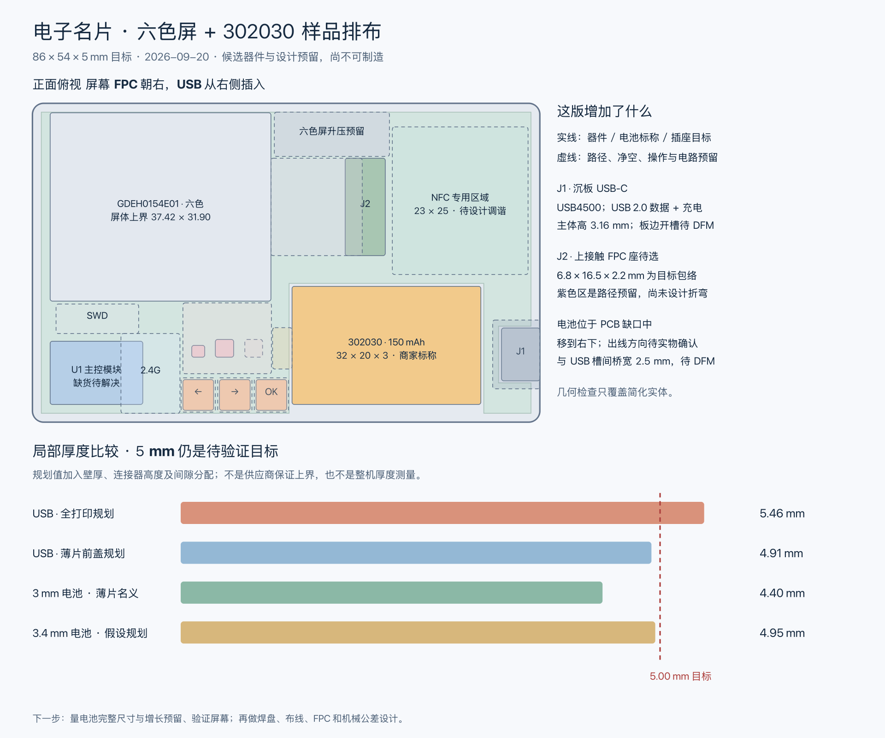
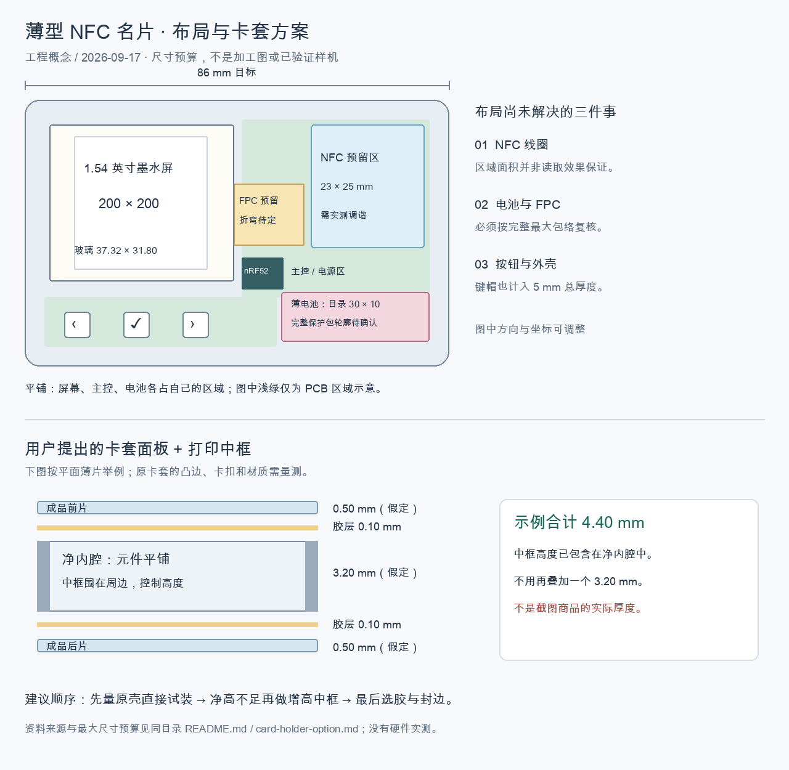

# 结构与厚度预算

## 当前确定方案

**当前 CAD 入口：[nfc-card-e16-enclosure-v7.FCStd](nfc-card-e16-enclosure-v7.FCStd)**（2026-09-23）。它是与 E16 板子（三键、L 形板框、右边缘 USB 缺口）一致的协调样件，几何检查通过，并对导出的真实元件 STEP 0 干涉；下一节列出 V7 详情与待打印验证项。更早的 E14 空间研究（[pcba-e14-battery-layout.FCStd](pcba-e14-battery-layout.FCStd)、[平面图](pcba-e14-battery-layout.svg)）与 V1/V2 样件保留作历史对照，报告状态为 `E14_CAD_SPATIAL_STUDY_NOT_PRINTABLE_SHELL`。

**外壳第一版候选：** [nfc-card-e14-enclosure-v1.FCStd](nfc-card-e14-enclosure-v1.FCStd) 已基于意图包络生成上下壳验证样件：84 × 52 × 5.0 mm 外包络、0.8 mm 底板、1.2 mm 周边壁、0.8 mm 前盖，含 39 × 33.6 mm 屏幕窗口、3 个 Ø4 mm 按键孔、右侧 USB-C 开口和 301230 区域浅凹槽。可打印样件对应 [STEP](nfc-card-e14-enclosure-v1.step)、[下壳 STL](nfc-card-e14-bottom-v1.stl)和[上壳 STL](nfc-card-e14-top-v1.stl)；[平面/剖面复核图](nfc-card-e14-enclosure-v1-review.svg)和[几何报告](nfc-card-e14-enclosure-v1-report.json)检查无壳体相交、无参考包络相交且上下壳各为单一实体。脚本为 [e14-enclosure-v1.py](e14-enclosure-v1.py)。实际 EDA 快照中的 J1 中心约为 (49.5, 5.5) mm，尚未与这个右侧开口同步，因此 V1 只作为验证样件，不含卡扣、螺柱、胶槽、密封和最终公差，不能直接作为生产下单文件。

**EDA 坐标协调样件 V2：** [nfc-card-e14-enclosure-v2-eda-coordinate.FCStd](nfc-card-e14-enclosure-v2-eda-coordinate.FCStd) 已按 E14 实际快照把 USB 开口移到 y=0 坐标边，把屏幕机械区、按键和 301230 目标放到对应坐标；配套 [STEP](nfc-card-e14-enclosure-v2-eda-coordinate.step)、[下壳 STL](nfc-card-e14-bottom-v2-eda-coordinate.stl)、[上壳 STL](nfc-card-e14-top-v2-eda-coordinate.stl)和[几何报告](nfc-card-e14-enclosure-v2-eda-coordinate-report.json)。V2 用于解决 PCB 与外壳坐标关系，壳体各一实体且无壳体相交；它仍不是生产壳，需先冻结 Layer 11 板框、J1 朝向、真实电池包体和 DFM。

**E16 右侧中部 USB 样件 V1：** [nfc-card-e16-enclosure-v1.FCStd](nfc-card-e16-enclosure-v1.FCStd) 按 E16 落盘坐标生成：右壁 USB 开口（y 10.38–21.62、贯穿壁厚，另加下壳底面让位槽）、屏窗上移到 y 17.5、三键孔改为等距 y 3.30/9.20/15.10。配套 [STEP](nfc-card-e16-enclosure-v1.step)、[下壳 STL](nfc-card-e16-bottom-v1.stl)、[上壳 STL](nfc-card-e16-top-v1.stl)和[几何报告](nfc-card-e16-enclosure-v1-report.json)，脚本 [e16-enclosure-right-mid-usb.py](e16-enclosure-right-mid-usb.py)。几何检查：上下壳各为单一实体、无壳体相交、**连接器本体与两壳接触体积均为 0**。报告同时记录两条待解约束：3 mm 电池与 5 mm 高度的顶盖重叠 54 mm³（高度预算不足），以及 84 × 52 板框与 81.6 × 49.6 内腔的尺寸基准矛盾。

**E16 右侧中部 USB 样件 V2（已被 V4 取代）：** [nfc-card-e16-enclosure-v2.FCStd](nfc-card-e16-enclosure-v2.FCStd) 解决 V1 报告里的两条待解约束：

- **尺寸基准确定**：不再用"外壳外缘 84 × 52 + 内腔 81.6 × 49.6"的托盘结构（PCB 84 × 52 放不进 81.6 × 49.6 的内腔）。改成**叠层式**——PCB 板框就是整机外缘，两块壳各带 **1.0 mm 内缩台阶**贴在 PCB 正反面，PCB 侧边外露。这样整机外缘 = 板框 = 84 × 52 mm，不再有内外矛盾。
- **连接器包络改成实测**：V1 假设本体伸到 x = 88.45 mm（板外 4.45 mm）。用 `pcb_ManufactureData.get3DFile()` 从已保存的板导出 STEP 装配体后直接量到 **x 76.7 → 83.2 mm（本体长 6.5 mm，与 GCT 目录一致）、y 10.22 → 21.77 mm、z 高出板面 0–3.17 mm**，也就是说**接插面在板边内侧 0.8 mm，根本不外伸**，整机长度就是 **84 mm**。连接器坐在板框缺口里，两块壳按缺口裁剪，因此**不需要在外壳壁上开 USB 槽**。（导出方法：`get3DFile('name','step',['Component Model'],'Outfit',true)` 后 `sys_FileSystem.saveFile()`；文件会以隐藏临时名落在 `~/Downloads`。）
- **5.0 mm 高度预算成立**：把 301230 电芯放在 PCB 顶面（板子左下 x 3–33、y 1.5–13.5 无元件、只有三键的两条走线穿过），叠层为 0.4 底盖 + 0.3 板下间隙 + 0.8 PCB + 3.0 顶腔 + 0.5 顶盖 = **5.0 mm**。代价是两块盖板只有 0.4 / 0.5 mm 厚，厚一点或电芯大一点就会超过 5 mm。

- **屏幕窗口按原厂图纸重定**：GDEH0154E01 模块是 **37.32 × 31.8 × 0.85 mm**，有效区 27 × 27 mm，三边留 2.4 mm、FPC 侧留 7.92 mm。之前 V1/V2 的窗口取的是模块外形再加余量（39 × 33.6），既压不住模块边框、又会露出边框。现在窗口改成**有效区 + 0.4 mm**（27.8 × 27.8，位于 x 4.0–31.8、y 20.3–48.1），顶盖在模块边框上做一圈凸台把屏幕压住。
- **屏幕必须架空安装**：用导出的 STEP 量出屏幕包络下最高的元件（升压电感/二极管）在 PCB 顶面上方 **1.51 mm**，所以屏幕背面定在 z 3.15 mm，靠泡沫/垫片压向顶盖凸台；这一点写进了报告的限制项。

配套 [STEP](nfc-card-e16-enclosure-v2.step)、[下壳 STL](nfc-card-e16-bottom-v2.stl)、[上壳 STL](nfc-card-e16-top-v2.stl)、[几何报告](nfc-card-e16-enclosure-v2-report.json)、渲染审查图 `artifacts/e16-cad-preview/e16-enclosure-v2-iso.png` 和脚本 [e16-enclosure-right-mid-usb-v2.py](e16-enclosure-right-mid-usb-v2.py)。几何检查：上下壳各为单一实体、无壳体相交、无参考件相交、**连接器与两壳接触体积 0**。为避让 U1 天线端和第一颗按键，上壳台阶在对应位置开了局部缺口。

仍未验证：电芯最大外形/胶带/鼓胀/出线折弯、键帽与行程、屏幕贴合、台阶粘接方式、插头应力与壁厚公差，都需要实物样件。

**E16 右侧中部 USB 样件 V7（当前，与板子一致）：** [nfc-card-e16-enclosure-v7.FCStd](nfc-card-e16-enclosure-v7.FCStd) 是 V6 把第三个键孔从 `(46.3, 6.35)` 挪到 `(46.3, 8.80)` 之后的版本，键位与已落盘的 PCB 完全一致：SW1 `(38.1, 3.30)`、SW3 `(38.1, 15.10)`、SW2 `(46.3, 8.80)`，三个 Ø4.6 孔 + 三个齐平键帽（做法与 V5 相同）。几何检查：上下壳各一实体、连接器零接触、电池袋底板 201 mm³ + 上盖 251.25 mm³ 回归通过、三个键帽各一实体且与壳体/彼此/按下 0.25 mm 后 **0 干涉**；`check-e16-board-fit.py` 对导出的真实元件 STEP 复检为 **壳体 / 加强筋 / 键帽 0/0/0 干涉**，最高件仍是 J1（板面上 3.87 mm，到上盖内表面 0.13 mm）。配套 [STEP](nfc-card-e16-enclosure-v7.step)、[下壳 STL](nfc-card-e16-bottom-v7.stl)、[上壳 STL](nfc-card-e16-top-v7.stl)、[键帽 STL](nfc-card-e16-keycaps-v7.stl)、[几何报告](nfc-card-e16-enclosure-v7-report.json)、渲染图 `artifacts/e16-cad-preview/e16-enclosure-v7-{iso,top}.png` 和脚本 [e16-enclosure-right-mid-usb-v7.py](e16-enclosure-right-mid-usb-v7.py)。**与板框缺口基准的关系**：板框缺口内缘已于 2026-09-23 从 77.50 改到 76.704（见[下标基准复核](../hardware/pcb-e16-usb-right-mid.md#j1-与板框基准复核2026-09-23已修正并复验)），V7 **仍然有效**——该处 1.0 mm 台阶早已按 USB 让位切掉（x 76.0–84.5、y 10.12–21.87），上盖内表面到 J1 顶面仍余 0.13 mm，上下壳不需要出新版。两块打印板在 x 76.704–77.50 段会比板边多出 0.8 mm 悬空，正好落在 J1 上方 0.13 mm 余量内，不影响装配。

**E16 右侧中部 USB 样件 V6（三键版，已被 V7 取代）：** [nfc-card-e16-enclosure-v6.FCStd](nfc-card-e16-enclosure-v6.FCStd) 按 2026-09-23 的三键三角形方案准备：键位 `(38.1, 3.20)`、`(38.1, 9.50)`、`(46.3, 6.35)`（第三颗用按键列右侧到 U1 之间的空地），三个 Ø4.6 孔 + 三个齐平键帽（做法与 V5 相同）。几何检查：上下壳各一实体、连接器零接触、电池袋体积回归通过、三个键帽各一实体且与壳体/彼此/按下 0.25 mm 后 **0 干涉**；加强筋无需改动（新键帽离筋 #2 还有 0.6–0.8 mm）。配套 [STEP](nfc-card-e16-enclosure-v6.step)、[下壳 STL](nfc-card-e16-bottom-v6.stl)、[上壳 STL](nfc-card-e16-top-v6.stl)、[键帽 STL](nfc-card-e16-keycaps-v6.stl)、[几何报告](nfc-card-e16-enclosure-v6-report.json) 和脚本 [e16-enclosure-right-mid-usb-v6.py](e16-enclosure-right-mid-usb-v6.py)。**与板子的关系**：V6 按 A 组坐标 (38.1,3.2)/(38.1,9.5)/(46.3,6.35) 生成；但 A 组在 PCB 侧有 9 处冲突、且 `KEY_OK_N` 需换层才能绕开 `KEY_NEXT_N`，推荐的替代方案 B（SW1/SW3 保持 (38.1,3.3)/(38.1,15.1)，第三颗放 (46.3,8.8)）是 0 冲突，采纳 B 时外壳只需把第三个孔从 (46.3,6.35) 挪到 (46.3,8.8)（出 V7）。原理图/PCB 已按方案 B 落盘，因此与板子一致的是 V7，不是 V6/V5。

**E16 右侧中部 USB 样件 V5（被 V7 取代）：** [nfc-card-e16-enclosure-v5.FCStd](nfc-card-e16-enclosure-v5.FCStd) 在 V4 基础上加**两个齐平键帽**并按原厂图纸收紧按键几何：SKQGABE010 本体 5.2 × 5.2 × 1.5 mm、行程 0.25 mm，自由状态顶面在 z≈3.0，距上盖下表面 1.0 mm；键帽是 Ø4.2 × 0.5 的圆片骑在 Ø4.6 孔里、下接 Ø3.2 × 0.95 行程柱（总高 1.45 mm），不按时与上盖齐平、按下刚好走完行程。因为带下翻法兰的键帽会撞上 y 16.4–17.2 的加强筋，改用孔定位、无机械卡扣；同时把**加强筋 #1 的西端从 x=34.5 收到 x=41.0**。几何检查：上下壳各一实体、连接器零接触、电池袋底板 201 mm³ + 上盖 251.25 mm³、两个键帽各 1 实体且与壳体/彼此/按下 0.25 mm 后均 0 干涉。叠层剖视图：[nfc-card-e16-v5-stack-section.svg](nfc-card-e16-v5-stack-section.svg)（三张切片：电池袋 / 按键列 / 屏幕 FPC，脚本 `generate-e16-v5-section-svg.py`）。配套 [STEP](nfc-card-e16-enclosure-v5.step)、[下壳 STL](nfc-card-e16-bottom-v5.stl)、[上壳 STL](nfc-card-e16-top-v5.stl)、[键帽 STL](nfc-card-e16-keycaps-v5.stl)、[几何报告](nfc-card-e16-enclosure-v5-report.json)、渲染图 `artifacts/e16-cad-preview/e16-enclosure-v5-{iso,top}.png` 和脚本 [e16-enclosure-right-mid-usb-v5.py](e16-enclosure-right-mid-usb-v5.py)。

**E16 右侧中部 USB 样件 V4（被 V5 取代）：** [nfc-card-e16-enclosure-v4.FCStd](nfc-card-e16-enclosure-v4.FCStd) 是 V3 的修正版。V3 把两块 3D 打印板也按 L 形板框生成，结果是电池袋**上下都没有板**（33.5 × 15 mm 的通孔，电芯无处安放），同时那条跨在电池袋上的加强筋悬在空中，上壳其实是 2 个实体。V4 把打印板改成**整卡轮廓减 USB 缺口**，只有 1.0 mm 台阶继续跟随 L 形板框，电池袋因此重新封闭：底部 0.4 mm 底板托住电芯、顶部 0.5 mm 上盖封口，几何报告把底板/上盖的体积（201 / 251.25 mm³）作为回归检查写进去。外壳外缘仍是 84 × 52 mm，电芯不再压在 PCB 上，整机厚度 **4.5 mm**：

| 层 | 厚度 |
| --- | ---: |
| 下壳底板 | 0.4 |
| 板下间隙 | 0.3 |
| PCB（连接器要求 0.8） | 0.8 |
| 顶腔（屏幕区：最高元件 1.51 + 屏幕 0.85 + 余量） | 2.5 |
| 上盖 | 0.5 |
| **合计** | **4.5** |

**打印能力对照（2026-09-23 查 JLC 3DP 8001 树脂工艺页）**：该工艺写着 **推荐壁厚 > 0.8 mm**、公差 **±0.2 mm 或 0.3%**、最小可打印体 5 × 5 × 5 mm（或 10 × 2 × 2 mm）。V5 的关键特征与它对比：

| V7 特征（与 V5 相同） | 尺寸 | 对照 |
| --- | --- | --- |
| 下壳底板 | 0.4 mm | **低于推荐 0.8 mm**，树脂可打但偏薄、易翘 |
| 上盖 | 0.5 mm | 同上 |
| 电池袋上盖 | 0.5 mm（跨 33.5 × 15） | 同上，靠三条加强筋防塌 |
| 台阶 | 1.0 mm 宽 × 0.3 mm 高 | 通过 |
| 加强筋 | 0.4 mm 高 × 0.7–0.8 mm 宽 | 打印可行，但低于推荐壁厚 |
| 键帽 | Ø4.2 × 0.5 圆片 + Ø3.2 × 0.95 柱 | 圆片厚度同样偏薄 |
| 键帽配合 | 孔 Ø4.6 / 键帽 Ø4.2（单边 0.2 mm） | 与 ±0.2 mm 公差同量级，样件应实测；必要时把孔放到 Ø4.8 |

代价与出路：如果坚持厂商推荐的 0.8 mm 壁厚，叠层会从 0.4 + 0.3 + 0.8 + 2.5 + 0.5 = 4.5 mm 变成 0.8 + 0.3 + 0.8 + 2.5 + 0.8 = **5.2 mm**，超出当前目标；因此要么选能稳定做 0.4–0.5 mm 的树脂/厂商并接受样件验证，要么退回"薄片前盖（PET/FR4）+ 打印中框"的混合结构（4.35 mm 那条路线）。这一条属于下单前的工艺选择，不是模型缺陷。

挖空处不保留台阶（电池袋里不放台阶），上下壳其他位置仍按 1.0 mm 内缩台阶贴合板边；屏窗、**两键孔**（y 3.30 / 15.10，孔距 11.8 mm）、USB 让位沿用 V2。上盖 0.5 mm 薄板跨在电池袋和空腔上会塌，所以保留了三条 0.4 mm 高的加强筋（y 16.4–17.2 / x 42.6–43.4 / 电池袋顶面 y 7.1–7.9），高度都在元件最高点（板面以上 1.51 mm）与上盖之间，电池袋那一条现在与上盖连成一体，几何检查确认不碰屏幕、FPC、按键、U1 和电芯。配套 [STEP](nfc-card-e16-enclosure-v4.step)、[下壳 STL](nfc-card-e16-bottom-v4.stl)、[上壳 STL](nfc-card-e16-top-v4.stl)、[几何报告](nfc-card-e16-enclosure-v4-report.json)、渲染图 `artifacts/e16-cad-preview/e16-enclosure-v4-{iso,top}.png` 和脚本 [e16-enclosure-right-mid-usb-v4.py](e16-enclosure-right-mid-usb-v4.py)。几何检查：上下壳各一实体、无壳体相交、无参考件相交、连接器零接触、电池袋底板 201 mm³ + 上盖 251.25 mm³（回归项）。

**视觉检查（2026-09-23）**：E16 样件用纯 Python 从 STL 渲染出着色等轴测图和正视顶视图（`artifacts/e16-cad-preview/e16-enclosure-v7-{iso,top}.png`，脚本 [render-stl-iso.py](../scripts/render-stl-iso.py)，不依赖 FreeCAD GUI）。图中确认：下壳是整片底板 + L 形台阶，上壳正面完整覆盖电池袋（不再是通孔），屏窗、**三个** Ø4.6 mm 键孔（V7 键帽在三孔里齐平）和右边缘 USB 缺口位置与设计一致；上下壳各为单一实体、键帽各为单一实体，没有悬空面。几何检查与视觉检查现已分别完成；V5 的两张同名渲染图保留作两步比较。

**5 mm 叠层账（2026-09-22，按 E16 样件实测）**：GCT USB4500-03-0-A 要求 **0.80 mm** 板厚，PCB 不能减薄。整机 5.0 mm 减去 0.8 mm PCB，上下壳只剩 4.2 mm；壳壁 0.8+0.8 时留给元件的净高是 **2.6 mm**，而 301230 电池标称厚 **3.0 mm**，在顶盖上压出 54 mm³ 重叠。定量结论：**3 mm 电池 + 0.8 mm PCB + 可打印上下壳装不进 5.0 mm**。出路只有三条：(a) 换 ≤2.6 mm 薄电池；(b) 整机放宽到约 5.4 mm；(c) 电池区局部沉台/开窗。需要按实际到货电池的最大包络选定后 CAD 再定案。

**高度预算剖面：** [nfc-card-e16-height-budget.svg](nfc-card-e16-height-budget.svg) 把 5 mm 叠层按 E16 样件画成切片（纵向放大）：下壳 0.8 + PCB 0.8（连接器硬要求）+ 上壳 0.8 之后，元件净高只有 2.6 mm，而 3.0 mm 标称电池在顶盖上压入 0.2 mm（54 mm³，图中红色带）。生成脚本 [generate-e16-height-budget-svg.py](../scripts/generate-e16-height-budget-svg.py)。

**EDA 同步边界：** 当前 E14 快照里的 J1 中心仍在约 (49.5, 5.5) mm 的底边 USB 候选位，而本 V1 外壳按右边 USB（约 x=76 mm）空间研究生成；两者尚未冻结为同一机械方案。PCB 板框、J1 朝向/位置和 USB 开口需先在 EDA 中统一，再重新生成外壳和供应商文件。

**与 E14 EDA 的关系：** CAD 用 30 × 12 × 3 mm 电池包体做空间占位，并把 PCB 电池缺口、屏幕、NFC 净空和右下功能块表达成简化实体；E14 实际坐标快照显示当前板框、屏幕机械区和电池目标尚未完全同步，USB 开口、FPC、RF、按键结构和装配公差也仍待确认。现有 `pcba-e6-84x52-detail.FCStd` 保留作历史对照，此前几何/视觉检查不能代替 E14 的实际器件、走线和装配检查。

2026-09-20 用户要求优先减薄，成品含打印边缘和突出物不超过 **85.60 × 53.98 mm、厚度 ≤5 mm**，争取再小一圈。历史 86 × 54 mm 方案略大于此包络。

当前采用 **84 × 52 mm**，不为再缩小 1 mm 压缩装配余量。已另存 [实际封装细化模型](pcba-e6-84x52-detail.FCStd)与[平面图](pcba-e6-84x52-detail.svg)：电池保持平铺，J2 排线座向屏幕靠近，并加入 U4/U5 候选和 SWD/电池/NTC 平面焊盘。36 个简化形体检查通过，等轴测、顶视与平面图已查看；5 mm 厚度、真实排线和引线、公差仍未确认。J2 接触长度与库焊脚存在待解决差异，翻盖需在装前盖前操作。新版 [EDA 检查记录](../hardware/pcb-84x52.md)给出范围与限制。

**按键约束：两颗即可完成二级菜单操作，第三颗作备用输入。** E16 当前是**三颗**（SW1 (38.1,3.30)、SW3 (38.1,15.10) 一列 + SW2 (46.3,8.80)，方案 B），外壳 V7 开三个键孔；更早的 E14/E6 模型仍保留三个位置，只作历史对照。三边开槽、一边连接的连体弹片作为待比较的结构方向，尚未建成或验证，不能仅凭开关本体放得下就认定外壳按键也可用。

此前 [84 × 52 紧凑模型](pcba-e6-84x52.FCStd)与 83 × 51 比较保留，详见[紧凑排布记录](compact-layout.md)。标准卡套适配不作为硬要求。

## 当前装配约束

**E16 V7 的装配顺序（2026-09-23 定，待样件验证）**

打印件共 4 件：下壳、上壳、**三个键帽**（[键帽 STL](nfc-card-e16-keycaps-v7.stl)，三件同料一次打）。打印时下壳/上壳平放（大平面朝下）、键帽立着打（轴竖直，Ø4.2 圆片朝上），避免支撑落在键孔的配合面上。

1. 去毛刺后先试装键帽：Ø4.2 圆片应能在 Ø4.6 孔里自由滑动，**三个**键帽顶面与上壳齐平（z=4.5），不装开关时能靠自重落到底、按键柱下端到 z≈3.05。
2. 从壳内侧把三个键帽放进键孔：SW1 (38.1, 3.30)、SW3 (38.1, 15.10)、SW2 (46.3, 8.80)；键帽柱分别对准三颗开关。
3. **先在台面完成电芯引线与板子的焊接**（不要等板子点胶后再焊）：把电芯引线分别焊到板子顶面焊盘 **BP = `BAT_PACK_TBD` (49.5, 23.55)**、**BN = `GND` (47.7, 23.70)**、**NTC = `BAT_NTC_TBD` (45.60, 23.70)**；焊前用万用表确认极性、焊后测电芯两端电压与 NTC 阻值。没有热敏的电芯可以焊一颗 10 kΩ 假负载，或让固件在初始化里清 `TS_EN`（见 [E16 记录](../hardware/pcb-e16-usb-right-mid.md)的电池接口一节）。引线长度要能允许板子最后落位，走线穿过电池袋东侧的板边缝隙。
4. 电芯放进下壳电池袋（33.5 × 15 mm，底板 0.4 mm）：底板上贴 0.5 mm 双面胶/泡棉定位，电芯顶面与上盖内表面留 0.6 mm；引线沿袋边收拢，不要压在板子边缘上。
5. PCB 随引线一起放进下壳台阶：J1 对准右边缘缺口（缺口 y 11.38–20.62、内缘 x=76.704），先看 USB 插头能否顺畅插入；确认后沿 1.0 mm 台阶环带点胶。
6. 屏幕背面贴 1.5 mm 泡棉（压缩量约 0.5 mm），背面朝上放进上壳，靠上壳凸台压住模块边框。
7. 合上上壳压合固化：上壳台阶同时压在 PCB 顶面，屏幕被泡棉顶到凸台上，J1 在缺口处不外露缝隙。
8. 装配后检查：**三个**键帽顶部与上壳齐平、按下 0.25 mm 有明确手感；屏幕窗口对正；USB 插头能插到底；整机厚度卡尺量 ≈4.5 mm。

**合壳前自检清单（装壳后 SWD 与电池焊点都不可再接触，务必先做）**

| 项 | 做法 | 通过标准 |
| --- | --- | --- |
| 烧录 | 工厂首烧或 SWD 烧入本板固件（此时 TP3/TP4/TP5 还可接触） | USB-C 能枚举、能重新烧录 |
| 屏幕 | 插好 FPC，上电 | 全屏刷新无死点、无错行 |
| 三键 | 逐颗短按 | 键 1 换一级、键 2 换二级、键 3 有电平变化（功能待定） |
| 充电 | 接 USB，读 `ICHG`/实测电流 | 默认复位是 10 mA；固件应设 `ICHGCODE` 15–20（20–25 mA，约 0.5C） |
| 电池 | 焊好后测电压与 NTC 阻值 | 极性正确、NTC 在合理范围（或已清 `TS_EN`） |
| NFC | 桌面实验已覆盖卡模拟与内容切换；本板读距在最终天线落铜后再测 | 手机能读到当前 NDEF 并随按键切换 |
| 断电 | 拔 USB 后测漏电流 | 符合预期（休眠电流待实测标定） |

（这条清单是照着"合壳即不可维修"来的：SWD 焊盘在顶层屏幕包络内、电池焊点在腔体里，所以要留**最后一次**台面检查机会。）

仍在实物阶段才能定的量：电芯最大包络（含保护板/胶带/鼓胀）、泡棉压缩量、打印公差（建议按 ±0.2 mm 预留）、键帽手感与是否需要在键帽柱上加一滴胶。

此前标出的屏幕升压位置主要来自排线占用后剩余的空间，不是必须保持不变的专用矩形区。实际器件按 FPC 弯折/插合净空、屏幕后背间隙和紧凑电源回路安排；不能将整片地铜或所有屏幕外围都视为升压模块包络。

工厂贴装 J2 等元件后，最终总装目标是插排线并固定屏幕、焊接并固定电池包引线、装按键与合壳；NTC 的连接和热贴合仍待定。PCB 需通过定位台阶、限位和盖板固定，留制造公差；外壳承接 USB 插拔力，屏幕得到平整支撑，电池不受挤压。上述结构尚未在现有空间模型中完成。烧录与交付分工见[装配交接](../docs/usb-and-prototyping.md#工厂烧录与装配交接)。

## 此前 FreeCAD 空间研究

### 电池靠右、USB 下长边（独立新方案）

新增 [pcba-e6-bottom-usb.FCStd](pcba-e6-bottom-usb.FCStd)、[平面图](pcba-e6-bottom-usb.svg)和[报告](pcba-e6-bottom-usb-report.json)，旧模型均保留。电池横放在 (52, 2) mm，USB 移至下方长边，三键竖排在电池左侧；竖持时成为中段偏左的横排。屏幕/FPC/NFC 大位置保留，取消原来电池右侧的窄 PCB 支臂。

27 个简化形体检查通过，等轴测、顶视图和 SVG 已目视检查。新 EDA 工程采用同样的大件分区，27 个实际封装及 145 个焊盘检查通过；尚未布线，也未解决 USB 槽边距和 5 mm 厚度公差。见[新方案完整记录](../hardware/pcb-bottom-usb.md)。以下旧版研究保留供比较。

### 六色屏与 302030 电池排布

2026-09-20 完成独立的[样品排布图](pcba-e6-302030.svg)、[FreeCAD 模型](pcba-e6-302030.FCStd)与[生成报告](pcba-e6-302030-report.json)。复用同一宏的 `e6-302030` 变体；旧模型保留。这是 86 × 54 × 5 mm 目标下的包络研究，尚非 PCB 布局或可打印外壳。

**后续 EDA 预布局已发现实际焊盘带来的差异：** 按键旋转并上移 1.4 mm，USB 内移 0.8 mm 且调整槽口，电池出线参考区上移。当前 [EDA 记录](../hardware/pcb-prelayout.md)中的 PCB 桥宽为 2.2 mm；本页以下的 2.5 mm 仍指原 FreeCAD 模型。本轮保留机械源文件，尚未把这些调整同步回三维装配。随后[试布线](../hardware/pcb-routing.md)又调整 C1–C8 和 U3；电池仍在 (44, 3) mm，与本页六色屏模型一致，和旧窄电池模型左下位置不同。第二轮发现电池缺口与沉板 USB 的组合限制布线空间，下一步比较 USB 移位和电池旋转/平移；尚未修改本页机械模型。

- 六色屏放左上，采用原厂屏体尺寸上界 **37.42 × 31.9 × 1.0 mm**，FPC 朝右，显示区支撑与保护膜仍未建模。
- 302030 电池移至右下，暂按商家标称 **32 × 20 × 3 mm** 建模，PCB 在该处开缺口，避免电池叠在 PCB 或屏幕后面。假设引线从左短边接向电源区，需实物确认。
- 主控移至左下，三个按键置于下边中部，屏幕升压区移至排线通道上方。右上保留 **23 × 25 mm** NFC 区；这只证明空间没有被其他包络占用，不能证明天线性能。
- FPC 插座继续使用 **6.8 × 16.5 × 2.2 mm** 的目标包络，实际料号未选。六色屏所需的接触方向、折弯与插入位置仍需核对。
- 电池缺口与 USB 槽之间只有 **2.5 mm** 名义 PCB 桥宽，屏体上边缘距假设侧壁内缘 **0.8 mm**。焊盘、锚孔、走线、插拔受力和玻璃支撑可能要求再次调整。

本模型采用 **0.8 mm 背壁 + 0.3 mm 薄片前盖** 作比较方案，不代表材料与粘接已定。电池区域名义叠层为 `0.8 + 0.2 + 3.0 + 0.1 + 0.3 = 4.40 mm`；规划时采用 `0.9 + 0.15 + 完整电池厚度 + 0.15 + 0.35`，结果如下：

| 假设完整电池厚度 | 电池区薄片前盖规划厚度 | 与 5 mm 比较 |
| ---: | ---: | --- |
| 3.0 mm | 4.55 mm | 剩 0.45 mm |
| 3.2 mm | 4.75 mm | 剩 0.25 mm |
| 3.4 mm | 4.95 mm | 仅剩 0.05 mm |
| 3.5 mm | 5.05 mm | 超出 |
| 4.0 mm | 5.55 mm | 超出 |

在这些假设下，完整电池及厂家要求的尺寸增长空间合计最多 **3.45 mm**。这不是允许挤压电池的尺寸，也不是卖家保证；3.4 mm 只是敏感性情景。USB 区薄片前盖规划仍为 **4.91 mm**，主控区为 **4.75 mm**；这些局部值不能取代完整装配公差分析。

**验证：** 新模型保存后重开，26 个几何实体有效；已建模器件无碰撞、无越出假设内腔（USB 侧开口例外）、无占用 NFC 区，PCB 为一个连通实体。新增排线、升压、出线、SWD、2.4 GHz 和电源预留区检查；故意挡住 FPC 通道或将电池改厚至 3.8 mm 的隔离副本均被拒绝。STEP 重读为 11 个有效实体，体积与源模型相符。旧布局的尺寸、坐标、叠层和原有两个模型文件哈希不变。

**视觉：** 已检查完整 SVG 渲染及等轴测预览；器件位置、分区和文字完整。此次 FreeCAD 顶视 PNG 上部出现异常，未作为视觉通过依据，俯视以同源尺寸生成的 SVG 为准。未完成实物装配、FPC 折弯、按键机构、RF 或 DFM 检查。

到货先量电池含保护板/胶带/焊点的长宽厚及出线方向，并取得允许充放电电流和尺寸增长要求；用 DESPI-E01 测六色屏刷新、供电及二维码读取，再确定最终焊盘与外壳。具体生成和检查命令见[软件说明](../docs/software.md#六色屏与-302030-变体)。

### 旧版黑白屏与窄电池排布

2026-09-20 新增 [PCBA 排布图](pcba-layout.svg)、[可编辑模型](pcba-layout.FCStd) 和 [生成宏](pcba-layout.FCMacro)。包含沉板 USB、FPC 座、主控、电池采购目标、三按键及电源/屏幕/NFC 预留区。候选器件依据见 [系统设计](../hardware/system-design.md) 和 [BOM](../hardware/candidate-bom.md)。25 个几何实体有效，已建模物理器件没有相互碰撞或侵入 NFC 平面预留区；USB 侧壁开口作为例外，不能据此认定可装配或 RF 通过。

| USB 区叠层方案 | 名义厚度 | 公差规划 |
| --- | ---: | ---: |
| 双 0.8 mm 打印壁 | 4.96 mm | 5.46 mm |
| 0.8 mm 背壁 + 0.3 mm 薄片前盖 | 4.46 mm | 4.91 mm |

以上是局部叠层设计分配，不是供应商保证或整机测量。当前三维模型仍按双打印壁作参考；薄片仅作预算对照，按键、FPC 折弯与固定结构尚未完成。

生成、检查、STEP 导出与 GUI 预览统一使用[脚本工作流](../docs/software.md#freecad-脚本工作流)，默认输出到新的 `artifacts/freecad/` 子目录，保留已有模型。检查命令读取磁盘副本，不能检查其他 FreeCAD 进程中尚未保存的编辑。当前 PCB 轮廓与多数 XY 坐标为固定研究值，修改参数后必须重排和重验；报告只是当次快照。

### 早期现成板包络模型

2026-09-19 开始 [layout-study.FCStd](layout-study.FCStd)，由 [layout-study.FCMacro](layout-study.FCMacro) 生成，尺寸来源和缺失项见 [设计启动记录](../docs/design-start.md)。这份文件用于研究 86 × 54 × 5 mm 内的候选器件位置，包含参数化外形、简化盒子和证据属性；不是可打印外壳或 PCB。

宏在生成模型时输出 [几何检查报告](layout-study-report.json)，只检查已建模盒子的碰撞及是否超出假设内腔。本轮已成功生成、重新打开并目视检查；当前简化组件没有碰撞或超出假设内腔。驱动板、FPC、USB 插头、完整电池包等未建模，不能判定装配通过。报告是生成时的快照，手动修改模型后不会自动更新。

在 FreeCAD 中可选择对象修改 `Length`、`Width`、`Height` 和 `Placement`；选择“设计目标与未验证项”修改卡片外形及壳壁参数。外形、前后基准面与部分 Z 位置有关联表达式，XY 排布需要自行调整；不自动重排器件。前壁默认隐藏，可在模型树中选中后按空格切换显示。

重新生成前先将手工修改另存为新文件。两份宏现在都拒绝覆盖已有模型和报告；历史模型继续保留供比较。源参数的修改和生成方法见 [软件说明](../docs/software.md#freecad-脚本工作流)。

以下保留早期结构研究及制造约束。

结论：86 × 54 mm 的平面尺寸给小屏、窄电池和主控平铺留出了空间。**≤5 mm 可以作为工程目标，但不能凭器件标称高度保证。** 2026-09-18 用户希望尝试透明树脂打印，当前先验证 SLA 样片的外观和薄壁表现；全打印壳仍需重新核算厚度，混合前盖保留为备选。见 [试样安排](finish-and-manufacturing.md#当前透明-sla-试样安排)。

**USB 需求更新：** 当前主控已转向 nRF52840。下面的图与主控表保留的是早期 nRF52832 比较方案，没有计入 USB 插座，不是当前版本已通过的布局。nRF52840 + USB-C 必须重新做平面与剖面预算，见 [USB 版尺寸分析](../docs/usb-and-prototyping.md)。

[SVG 源图](layout-options.svg) 是概念级位置/尺寸示意，没有走线、装配检查或 RF 仿真，不可直接加工。毫米坐标仅用于空间研究，FPC 位置与弯曲方式尚未冻结。

## 1. 外壳路线

| 路线 | 结构 | 优点 | 代价与建议 |
| --- | --- | --- | --- |
| H：混合前盖 | 半透明 SLA 框/底壳 + 约 0.3 mm 透明 PET/PC 薄片前盖 | 高器件区域不再覆盖厚打印面板；屏幕清晰，0.8 mm PCB 更容易装配 | 需要薄片裁切、粘接与按键开孔；作为薄度备选 |
| **P：全打印** | 透明 SLA 前/后壳 + 周边框，屏幕区透明处理或开窗 | 外观与材料统一，可自行安排内腔和开孔 | **当前先试材料与薄壁样片**；以下约 0.9 mm 壁的早期比较预算仍显示厚度紧张，不能据此承诺 USB 版 ≤5 mm |
| F：FDM 快速模型 | 家用打印框体/尺寸模型 | 快速试握持与按钮位置 | 不直接用家用打印结果承诺最终薄壁精度、透明度或耐用性 |
| R：成品卡套改造 | 保留成品前后面板，必要时加入打印中框 | 省去大面积薄板打印；适合先验证 | 用户提出的候选，需先量测卡套；见 [单独评估](card-holder-option.md) |

混合前盖是在主控上方也使用薄片，并非只给屏幕开一个小窗口。只改屏幕窗口、主控仍夹在两层厚壳之间，不能改善主控区域的厚度瓶颈。半透明树脂遮住屏幕会影响对比度，显示区使用透明窗口。

## 2. 早期 nRF52832 主控区域的比较预算

单位 mm。模块公差取原厂图，PCB <1 mm 的厚度公差取 JLCPCB 公布的 ±0.1 mm；打印壁保守按每片 +0.2 mm 估算。实际公差相关性和工厂可保证值需另确认。

| 项目 | H：标称预算 | H：上界预算 | P / 0.8：标称预算 | P / 0.8：上界预算 |
| --- | ---: | ---: | ---: | ---: |
| 后壳壁 | 0.90 | 1.10 | 0.90 | 1.10 |
| PCB | 0.80 | 0.90 | 0.80 | 0.90 |
| 模块焊接抬高 | 0.10 | 0.10 | 0.10 | 0.10 |
| MDBT42V-P512KV2 | 1.50 | 1.70 | 1.50 | 1.70 |
| 前盖/前壁 | 0.30 | 0.35 | 0.90 | 1.10 |
| 绝缘、胶与装配间隙合计预留 | 0.30 | 0.30 | 0.30 | 0.30 |
| **合计** | **3.90** | **4.45** | **4.50** | **5.20** |

焊接抬高、薄片公差、胶/间隙都是设计分配值，尚未得到供应商保证；不是统计置信区间，也不是正式公差分析。后续若增加支撑柱、胶层或双面器件，应重新计算。

- H 路线可尝试将整壳外高设为 **4.8 mm**，让约 4.45 mm 的局部上界留出内部余量；外形公差按 +0.2 mm 才到 5.0 mm。必须确认这是整件装配外高的可交付公差，不能分别给两半壳各加 0.2 后仍声称相同结果。
- P 路线改 **0.6 mm PCB**，上表 PCB 列各减 0.2 mm，变成 **4.30 / 5.00 mm**，基本没有未分配余量。需减少实际公差、改变前盖或下沉主控；不能靠硬挤装配。
- 改 nRF52840 模块，上表模块列各加 0.5 mm；H 上界变成 **4.95 mm**，不足以装入所提 4.8 mm 壳。需要重新设计，不能原位替换后仍沿用厚度结论。
- 上述预算只针对主控区域；整机最大高度还要分别检查 FPC 座、按钮、USB-C 座、胶接边和保护板。USB 口的插头外壳需要足够插入空间，中框承担插拔力。

来源：[Raytac 图纸](https://www.raytac.com/upload/download_files/03056be9fb6b807f9344a27b3bbc0e02.pdf)、[PCB 能力](https://jlcpcb.com/capabilities/Capab)、[8001 树脂工艺](https://jlc3dp.com/help/article/photosensitive-8001-resin)。

## 3. 平面布局约束

- 玻璃可旋转成约 **37.32 × 31.80 mm** 横向放置，左边屏幕，右边为 NFC 预留区与主控，下方放按钮和窄电池。电池没有 PCB 垫在下面；使用有缺口的 PCB 或分区形状。
- 概念图以目录中的 30 × 10 mm 电池和 8.4 × 6.4 mm 主控包络演示。完整保护电路/引线轮廓大于目录值时必须扩大电池区，不能削减保护结构来凑尺寸。
- 电池完整包体最大厚度暂定采购目标 **≤2.6 mm**。以 H 路线计算，1.10 后壁 + 2.60 电池 + 0.35 前片 + 0.30 预留 = 4.35 mm；该目标必须由样品与交付图确认。
- 不把屏幕、电池、主控竖向叠在同一区域。屏幕玻璃需要边缘支撑与抗扭保护，薄壳不等于可随意弯折的银行卡。
- 概念图右上预留约 23 × 25 mm NFC 区，只代表需要保持空间，**未证明该面积的线圈能达到读取指标**。NFC 线圈尺寸、绕组、铜净空、地平面、电池金属层与手持影响要联动测试。
- 小独立 NFC 区若读取不稳定，再比较周边大线圈/FPC 天线、扩大外形或加入薄铁氧体；铁氧体也要计入厚度。不能直接把线圈画在电池下面就当问题解决。
- 按键最高点以未按下状态测量，包括键帽；活动行程、打印毛刺和装配偏差不能由压住开关来吸收。

## 4. PCB 与打印可制造性

JLCPCB 当前经济型 PCBA 页面列出 **0.8–1.6 mm** 板厚；0.6 mm 裸板可以制造，不代表同样可以用该贴片通道。**经济型的单板下限是 10 × 10 mm，84 × 52 mm 可以单板下单、不需要拼板、工艺边或定位点**（70 × 70 mm 是标准型通道的下限，见[下单通道选择](../hardware/pcb-e16-usb-right-mid.md#下单通道选择2026-09-23-查嘉立创-pcba-能力页)）。最终以针对实际 Gerber/BOM 的 DFM 和报价为准。[贴片能力](https://jlcpcb.com/capabilities/pcb-assembly-capabilities)

初步考虑 0.8 mm、单面器件的定制板；层数由走线与 NFC 净空决定，2 层可先评估，不强行提前冻结。0.4 mm 板更易翘曲、夹具和按键受力更难处理，不作为首版默认。

8001 半透明 SLA 的厂商建议壁厚 **>0.8 mm**，公差 ±0.2 mm 或 0.3%；半透明默认不打磨，透明选项有打磨/喷涂处理。这个材料适合结构验证，耐热与长期日晒不是强项，最终随身使用外壳需另验材料性能。不能把 0.4 mm 大面板当成工厂已保证可制造的方案。

先做一个小试片：同一零件中包含 0.9/1.0 mm 壁、薄片台阶、按钮孔、几档装配间隙和胶槽，量测后再画整壳。初版优先可拆卸胶带/简单机械固定，避免薄树脂复杂卡扣导致无法修板；最终密封方式另定。

## 5. 结构冻结条件

1. 模块、屏幕、FPC 座、电池包和按钮均有最大尺寸与真实样品。
2. 叠层模型包含焊料、胶、绝缘、线材、保护板、键帽和加工公差。
3. 用实际电池/屏幕/壳材组成 RF 样片，找到可用 NFC 位置并调谐。
4. 工厂确认板厚、模块装配、拼板与打印薄壁；完成试片测量。
5. 所有最高点实测 ≤5.0 mm；同时完成按键、玻璃保护、充电温升与正常携带强度验证。
