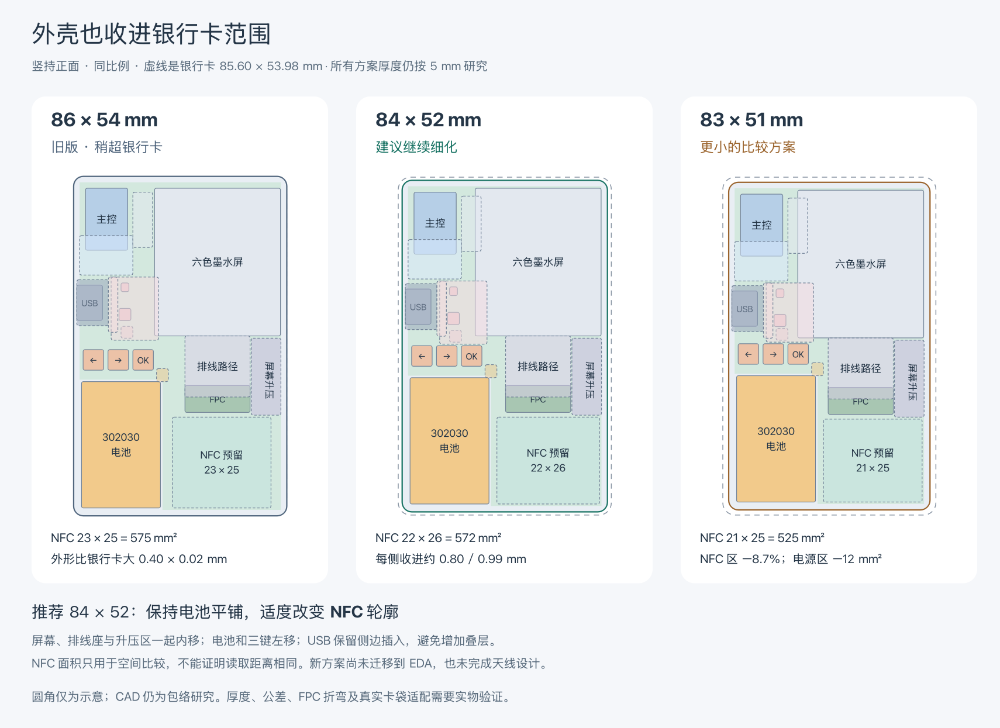

# 银行卡包络与 NFC 轮廓重排

2026-09-20：用户确认优先减薄，成品长宽（含打印边缘及突出物）不超过银行卡，能再小一圈更好；取消断电可读功能的推进，保留 nRF52840 内置 NFCT。屏幕后置线圈与隔磁片仍只作后续备选。

**2026-09-21 更新：优先薄，并在银行卡以内保留排布余量。** 用户确认 84 × 52 与 83 × 51 相差 1 mm 不必强求，当前选择 **84 × 52 mm**。已另建 [84 × 52 EDA 与 CAD 细化版](../hardware/pcb-84x52.md)，加入真实候选封装及平面焊盘；此页比较模型与旧工程保留。

**以下为此前机械比较的检查记录。** [原 84 × 52 FreeCAD](pcba-e6-84x52.FCStd)、[平面图](pcba-e6-84x52.svg)、[生成报告](pcba-e6-84x52-report.json)和[比较检查记录](compact-layout-review.json)当时只覆盖机械包络与离线封装，没有修改 EDA；新版的实际插座位置与检查结果以细化记录为准。

[比较图 SVG](compact-layout-comparison.svg)。竖持是原横图顺时针转 90°：屏幕在上、三键中段偏左横排、USB 在左侧。

## 外形比较

按银行卡 ID-1 名义长宽 **85.60 × 53.98 mm** 比较；旧模型 86 × 54 mm 实际略大，不能继续写成严格满足银行卡包络。[ISO 公布的尺寸](https://www.iso.org/standard/31432.html)（该页面为已撤回的 2003 版，当前版本见 [ISO/IEC 7810:2019](https://www.iso.org/standard/70483.html)）。这里比较外形，不声明本产品符合银行卡标准。

| 方案（含假设壳壁） | 相对银行卡每侧内缩 | NFC 预留区 | 电源外围预留 | 结论 |
| --- | --- | --- | --- | --- |
| 旧 86 × 54 mm | 长边方向超 0.20，短边方向超 0.01 mm | 23 × 25 = 575 mm² | 16 × 12 = 192 mm² | 保留作历史对照 |
| **84 × 52 mm** | **0.80 / 0.99 mm** | **22 × 26 = 572 mm²**，比旧版少 0.52% | 192 mm² | 当前主选；其他主要区域预算较宽裕 |
| 83 × 51 mm | 1.30 / 1.49 mm | 21 × 25 = 525 mm²，少 8.70% | 15 × 12 = 180 mm² | 保留比较；不为少 1 mm 压缩余量 |

这不是把器件整体缩放：两种新布局保留屏幕、电池、主控、USB、FPC 座及按键的原尺寸和 Z 高度。83 × 51 也生成并检查了独立模型，临时结果在 `artifacts/compact-layout/83x51-final/`，可用同一生成命令复现；当前只归档推荐版的 `.FCStd`。

外形是**包络目标**，已计入 0.8 mm 假设侧壁，而非裸 PCB 尺寸。真实圆角、倒角、粘接台阶、卡扣和打印偏差尚未建模；图中的圆角仅用于示意。成品验收仍需测量实际最大长宽和厚度。变窄有助于卡袋适配，但 5 mm 厚物体能否插入特定软卡袋，需要尺寸样片验证。

## 原 84 × 52 比较版的调整

以下为横向坐标，原点左下，单位 mm：

| 对象 | 新位置 / 尺寸 | 与旧下边 USB 方案的关系 |
| --- | --- | --- |
| 屏幕 | (2, 18.5)，37.42 × 31.9 | 左移 1、下移 2；上边仍距假设内壁 0.8 |
| FPC 座 | (52, 26.2)，6.8 × 16.5 | 与屏幕同移；保持相对位置，不假定排线可以任意延长 |
| FPC 路径 | (39.42, 26.2)，15.48 × 16.5 | 仍需核实上接触座、实际插入及 Z 向折弯 |
| 屏幕升压区 | (40, 43)，19.5 × 7.5 | 面积 146.25 mm² 不变；外围尚未全部放入 |
| 电池 | (50, 2)，32 × 20 × 3 | 左移 2，继续横放在缺口；右/下假设内壁间隙各 1.2 |
| 按键中心 | x = 44.5，y = 5 / 11.3 / 17.6 | 三键一起左移 2，信号定义不变 |
| NFC 区 | (60, 24)，22 × 26 | 适度改长宽比；只是天线设计空间 |
| USB | EDA 原点目标 (32, 5.475)，0° | 位置不变；信号焊盘朝板内 |
| PCB 外框 | x = 1.5–82.5，y = 1.5–50.5 | 带原 USB 槽；右下缺口从 x = 49.5、y ≤ 22.5 开始 |

电池缺口到 NFC 区的名义距离由 2.5 降到 1.5 mm；电池标称包体到 NFC 区为 2 mm。FPC 座右边到 NFC 区为 1.2 mm，升压区右边到 NFC 区仅 0.5 mm。它们是几何余量，**不是经验证的 RF 隔离距离**；实际线圈需要在该区域内进一步留边。

USB 槽到电池缺口相距 12.88 mm，比旧版少 2 mm；按键仍占其中一部分，不能把整个宽度算作自由布线通道。实际按键焊盘包络到电池缺口约 1 mm。电池引线预留也随之左移，出线方向仍待样品确认。

## NFC 可以变形，但没有已经确认的“基础最小面积”

原来的 23 × 25 mm 是早期空间分配，**不是器件要求或实测最低限值**。线圈可以采用矩形、圆角矩形及其他适当轮廓；面积相同也不能保证耦合、读卡位置容忍度或距离相同。长宽比、手机天线、铜线参数、匹配及装机环境都要一起检查。[Nordic 天线选择](https://docs.nordicsemi.com/r/bundle/nwp_026/page/wp/nwp_026/nwp_026_choice_of_antenna.html)、[NXP 天线形状说明](https://www.nxp.com/company/about-nxp/smarter-world-blog/BL-NFC-ANTENNA-DESIGN-MADE-EASY)。

本轮对照了以下分区方式；后三项是几何筛选与工程推断，没有制作 RF 样品：

| 方向 | 本次判断 |
| --- | --- |
| 保留右侧独立区，23 × 25 改为 22 × 26 | 新模型可容纳；其他主要预留区不缩减，优先细化 |
| 顶部横条，例如 (41, 36.5) 的 41 × 14 mm | 面积约 574 mm²，但同时占用 FPC 座及升压区；不能只把线圈换形就得到空位 |
| 电池旋转成 20 × 32，放 (62, 2) | 在 84 × 52 模型中会与现 NFC 区重叠 20 × 10 mm；配顶部横条仍须重排 FPC 和升压，不作为当前首选 |
| 沿整张卡外缘绕线圈 | 不能把圈内 PCB 地铜、电池及屏幕当成无影响空间；需另研究导电材料、分层与调谐，当前不直接采用 |
| 屏幕背面线圈 + 铁氧体 | 可能释放独立 NFC 区，但增加叠层和验证事项，仍放在后续版本 |

导电平面会改变天线电感、品质因数和调谐；不能靠避开铜线本身就忽略圈内/背后的金属。最终需要把屏幕、电池和外壳装齐后验证，而不是仅在空板上调好。[ST AN2972 §3.4、§4](https://www.st.com/resource/en/application_note/an2972-how-to-design-an-antenna-for-dynamic-nfc-tags-stmicroelectronics.pdf)。该文用作通用布局依据，其动态标签匹配数值不能直接套给 nRF52840。

## 厚度优先级

这轮只减少 XY，**没有宣称整机变薄**；仍按 5 mm 包络、0.8 mm 背壁和 0.3 mm 薄片前盖研究。屏幕、电池保持平铺，避免为了更小长宽而叠高。

- USB 区：全打印壳规划 5.46 mm；薄片前盖规划 4.91 mm。
- 电池区：完整包体按 3.4 mm 假设时规划 4.95 mm；卖家最大厚度与尺寸增长空间仍未确认。
- 键帽/行程预留最高点 4.95 mm，是另一个限制。直接把外壳厚度改成 4.5 mm 会截掉这个预留，需要重新设计按键结构。
- 下一步先核薄片前盖的固定台阶、低凸出键帽、USB 插入深度和支撑；做带圆角/侧缘倒角的尺寸样片检验卡袋适配，再确定可交付厚度。不要用压缩电池间隙获得账面薄度。

## 原比较版验证结果与边界

- **几何：通过。** 两种新变体均由 `freecad-study.py generate --variant e6-84x52` / `e6-83x51` 保存后重开；各 27 个形体有效，PCB 是一个连通实体，无已建模物理碰撞、内腔越界或 NFC / 指定预留区冲突。归档的 84 × 52 模型另用 `check` 通过。
- **离线封装：通过本次范围。** 对此前 Bottom-USB 的 27 个元件、145 个焊盘作建议平移，所有焊盘角点位于建议板框内，未发现跨器件焊盘/本体包围框重叠或占用 NFC。只读快照与计算记录在 `artifacts/compact-layout/`；结果及建议坐标已归档至 `compact-layout-review.json`。
- **视觉：已检查。** 84 × 52 的等轴测/顶视、两种新方案的完整 SVG 渲染与竖持比较图均已查看。只开一次临时 GUI；83 × 51 没有另开 GUI 预览。
- **保留性：通过。** 既有 4 个 CAD 模型与 2 个 EDA 工程哈希未变；旧 `e6-bottom-usb` 变体重新生成的报告与原报告完全相同。两种新方案的实际器件尺寸、Z 和屏幕/FPC 相对位置均核对未变。
- **尚未完成：** EDA 迁移与新增 DRC、完整屏幕外围、FPC/NTC/ESD/SWD 焊盘、实际线圈、走线、焊接/阻焊/槽边距、RF、结构公差与装机。原 EDA 的 122 条 DRC 没有因本次离线计算而消失。

可重复的建模、检查和预览入口见[软件说明](../docs/software.md#银行卡以内的紧凑变体)。当前沿 84 × 52 继续，具体进展以[实际封装排布](../hardware/pcb-84x52.md)为准；83 × 51 留作比较。
