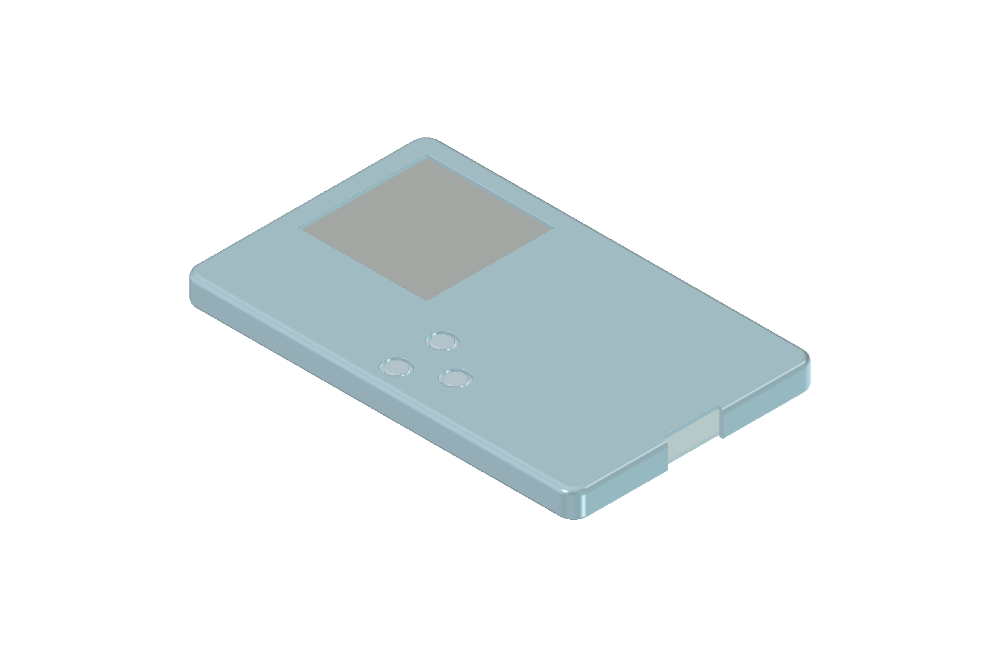
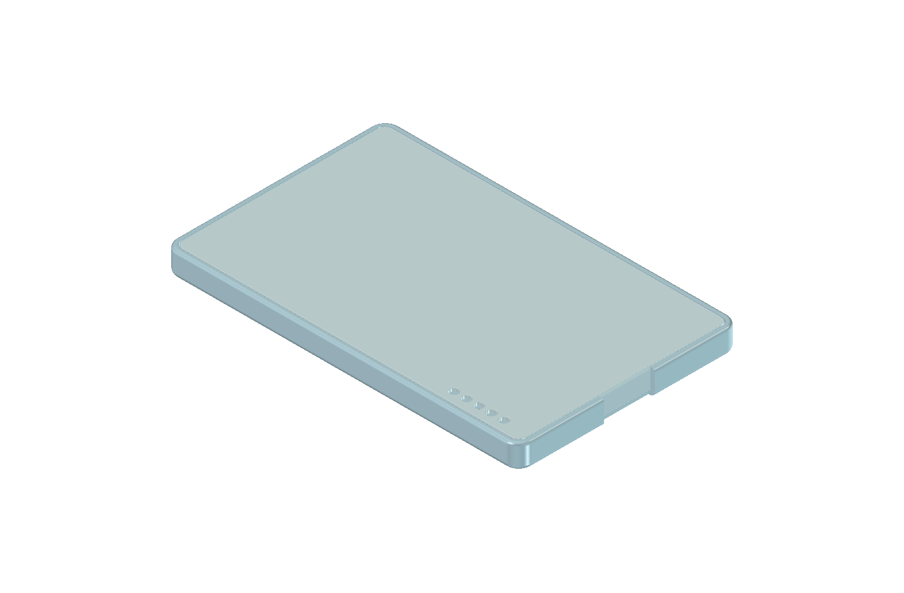

# R1 更圆润的背盖外壳候选

## 当前确定方案

2026-09-24：根据用户反馈，将上一版偏小的去锐边圆角增大，保持 **85.2 × 53.2 × 5.8 mm** 外尺寸、PCB 和连接器基准。外露背面接缝继续位于平面内。本版仍是几何候选，**底盖定位与竖向胶接未验证，不能直接下单**。

同日完成 [打印工艺、下单平台与 SWD 烧录评审](manufacturing-review.md)：SLA 透明树脂方向可继续，但 0.8 mm 大底盖、喷涂配合、底盖固定和键帽 0.05 mm 轴向余量尚待收敛。重开五个打印零件的实体检查通过、两份壳体网格封闭；用户确认保留五个调试孔。下一步先完成结构与公差设计并向供应商做工程询价。

| 部位 | 上一版 | 本版 |
| --- | --- | --- |
| 正面到侧壁 | R0.6 | **R1.2 mm** |
| 侧壁到底面 | R0.4 | **R0.7 mm** |
| 俯视外轮廓四角 | R2.6 | **R3.2 mm** |
| 背面窄框的直边平面宽 | 0.72 | **0.42 mm** |

这一版的曲面占比更大，仍保留直侧壁，并非厚度方向整个侧边都是半圆。背面若继续加大圆角，会进一步吃掉用户要求保留的平面窄框，需要重分配接缝与边缘空间。0.42 mm 是局部平面带的宽度，不是整面侧壁的厚度；其打印、打磨和抗崩边能力仍需供应商确认。





预览采用 Shaded 隐藏 CAD 切线，颜色仅用于看曲面，不能作为透明树脂效果预测。

## 底盖五孔的用途

五个直径 2 mm 的孔对应 PCB 背面调试焊盘，供探针接触，用于 SWD 首次烧录、调试和异常固件恢复。本次保持原位置，没有删除。按 PCB 原生 X 从 65 到 77 mm 的顺序，焊盘网络依次是 **GND、VDD_3V3、SWDCLK、SWDIO、NRESET**；图中左右顺序随背面视角翻转，接线须按 PCB 丝印或原生坐标确认。3.3 V 焊盘的连接用途须按所用调试器说明确认，不能默认为可向已上电电路再次灌电。

孔本身不是接口座，不用于螺丝或散热。用户已确认保留，方便封壳后调试和恢复；仍需探针定位夹具。本次没有进行烧录，也未假定 USB 更新固件已实现。

## 几何验证与文件

- [FreeCAD 模型](rear-cover-study.FCStd)、[壳体 STEP](rear-cover-study.step)、[检查报告](report.json)、[直边剖面](section.png)。
- 保存后重开：两个壳体有效且各为单实体；两个 STL 是封闭网格。
- PCB 与上壳最小距离 **0.512535 mm**，与上一版相同。真实板框连续扫掠和已建模元件的保守包围盒扫掠检查通过；既有实体对壳体的静态干涉为零。
- 三个键帽的最大移动包络检查通过。没有改 PCB，没有重新运行电气 DRC。
- 已目视检查正、背面渲染与剖面。原活动 CAD 的 SHA-256 未变；原候选保留。
- 仍不覆盖真实排线、导线、工具和治具的完整装配过程。沿用[上一版的胶接与材料限制](../r1-rounded-rear-study/README.md#固定方式仍须收敛)。

## 重建

沿用[同一个生成脚本](../study-r1-rear-cover.py)，用 `NFC_REAR_STUDY_STYLE=soft` 选择本版；未设置时仍生成上一版。输出必须是新目录：

```sh
NFC_REAR_STUDY_STYLE=soft \
NFC_REAR_STUDY_OUT="$PWD/projects/nfc-business-card/artifacts/rear-cover-soft-rebuild" \
PYTHONHOME=/Applications/FreeCAD.app/Contents/Resources \
PYTHONPATH=/Applications/FreeCAD.app/Contents/Resources/lib \
/Applications/FreeCAD.app/Contents/Resources/bin/freecadcmd \
  projects/nfc-business-card/enclosure/study-r1-rear-cover.py
```

检查输出 `report.json` 的全部检查结果，不能只看 FreeCAD 退出码。GUI 预览沿用[宏](../preview-r1-rear-cover.FCMacro)，设置 `NFC_REAR_DISPLAY_MODE=Shaded` 和独立 GUI 配置文件；`NFC_REAR_RENDER_OUT` 可指定不同图像输出位置。剖面命令为 `NFC_REAR_STUDY_OUT=<模型目录> python3 projects/nfc-business-card/enclosure/render-r1-rear-section.py`。
