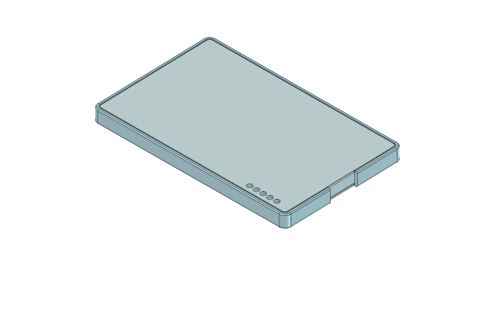
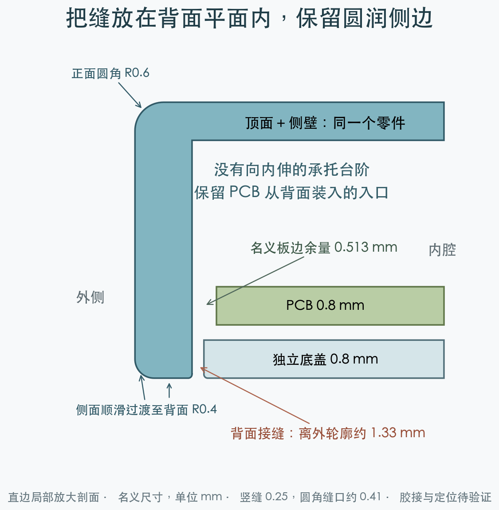
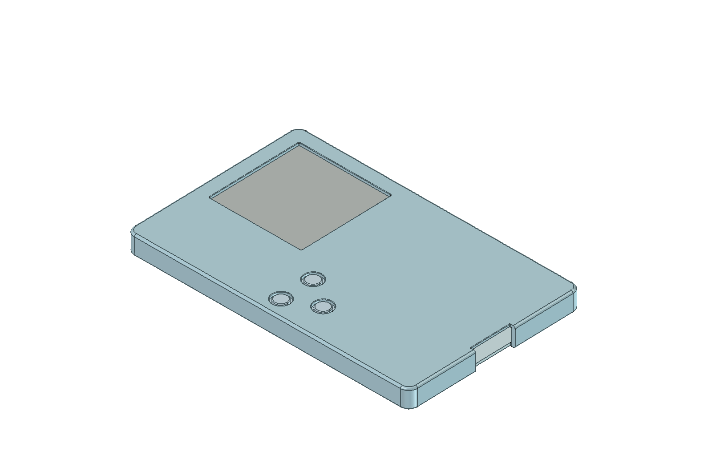

# R1 圆角上壳与背面嵌入底盖研究

## 当前确定方案

后续外观比较见[加大圆角版本](../r1-rounded-rear-soft/README.md)：正面 R1.2、背面 R0.7、俯视四角 R3.2 mm。本目录保留原始小圆角候选供对照。

2026-09-24：用户选择正面＋侧壁一体、独立底盖，并要求接缝进入背面平面内，保留窄边；外露边缘采用圆角。这里是**可对照的几何候选，尚未成为可下单版本**。原 5.8 mm 外壳保留，PCB、连接器基准和器件位置不变。厚度继续沿用 5.8 mm，未把另一项 5.6 mm 研究合并进来。

- [可编辑模型](rear-cover-study.FCStd)、[上下壳 STEP](rear-cover-study.step)、[几何报告](report.json)。目录中的 `upper.stl` / `rear.stl` 仅供几何研究，不应直接当成制造批准文件。
- [生成脚本](../study-r1-rear-cover.py)、[GUI 预览宏](../preview-r1-rear-cover.FCMacro)、[剖面绘图脚本](../render-r1-rear-section.py)。
- 结构、装配入口已计算；材料、胶接、定位治具、实物装配尚未验证。



渲染使用不透明颜色区分曲面与接缝，不是透明树脂的成品效果预测。轮廓上的细线包括 CAD 圆角切线，并非全部都是零件接缝。USB 让位沿用原基准，局部中断背面的周边窄框。

## 接缝与圆角



| 项目 | 本候选的名义尺寸 |
| --- | --- |
| 整体 | 85.2 × 53.2 × 5.8 mm |
| 俯视外轮廓圆角 | R2.6 mm，沿用原外形 |
| 正面至侧壁圆角 | R0.6 mm |
| 侧壁至背面圆角 | R0.4 mm |
| 背面上壳边界距最外轮廓 | 1.2 mm |
| 接缝中心距最外轮廓 | 1.325 mm |
| 竖向配合缝／外露缝口 | 0.25 mm／约 0.41 mm（两侧各 R0.08） |
| 背面窄框的直边平面宽 | 0.72 mm，扣除外圆角与接缝小圆角 |
| 底盖 | 82.3 × 50.3 × 0.8 mm，装配目标为与上壳背面齐平 |
| 屏幕与按键孔外露边／键帽面边缘 | R0.12 mm／R0.2 mm |

保留内部支撑、胶合与配合所需的功能平面，不把“全部圆角”解释成将所有内腔尺寸也整体内缩。屏幕开窗平面四角采用 R0.3；原有效显示区四周的 0.4 mm 开窗余量未改变。USB 缺口和调试孔外露边也做小圆角。



## PCB 能否装入

从原 FCStd 实体量得 PCB 外包络为 **81.774763 × 49.774699 mm**，入口是 **82.8 × 50.8 mm**。精确实体最短距离为 **0.512535 mm**。这不是用标称矩形代替板框：检查使用真实板轮廓的连续向下扫掠体，同时用各已建模元件的包围盒覆盖整个装入路径，检查它们与上壳的相交体积。

| 从最外轮廓向内占用 | 最窄入口 | PCB 直边单侧名义余量 | 结论 |
| --- | --- | --- | --- |
| **1.2 mm：本候选，不另加台阶** | **82.8 × 50.8 mm** | **约 0.513 mm** | 对上壳的直线装入检查通过 |
| 1.4 mm：额外伸入 0.2 mm | 82.4 × 50.4 mm | 约 0.313 mm | 几何可过，但胶接台阶很窄 |
| 1.7 mm：额外伸入 0.5 mm | 81.8 × 49.8 mm | 约 0.013 mm | 名义无碰撞也不构成实用装配余量 |
| 2.0 mm：额外伸入 0.8 mm | 81.2 × 49.2 mm | -0.287 mm | 真实板轮廓扫掠与台阶相交，挡住装入 |

因此不能为了给底盖做承托，直接增加整圈内伸台阶。当前候选保持入口贯通；底盖在最后装入。预期工序为：上壳朝下，先放键帽与屏幕，再处理排线并安装 PCB、电池，最后用治具定位底盖。

上述计算只证明 PCB 与元件沿路径**不撞上壳**。未证明手指/工具可达、真实排线的插接与弯折、线材不被夹住，也未完整验证先装屏幕和键帽后所有装配步骤。冻结 CAD 中的电池走线服务体未复制到新候选，不能据此认可其他任务中新改的电池引线。

## 固定方式仍须收敛

本版刻意没有缩小入口的承托台阶，也没有卡扣。底盖需要在治具中保持齐平，研究的连接是**周边竖向胶接缝**；原来水平一圈 0.06 mm PSA 的做法不能原样搬来。0.25 mm 是候选缝宽，具体树脂、胶种、固化工序、透明外观、胶液溢出、强度与可维修性均未选定或验证。不能把底盖“几何放得下”称为“已经可靠固定”。

如后续要求可靠卡扣、承托台阶或反复拆装，需要重新分配边缘空间，研究局部结构或外轮廓适度放大；这些变化本次没有静默采用。

保持 0.8 mm 大面板是延续现有设计，不代表板厂工艺批准。[JLC 打印指南](https://jlc3dp.com/help/article/3d-printing-design-guideline)按零件大小增加建议壁厚；本板的薄面板、局部圆角和小零件需单独审核。树脂型号尚未确认，不能套用 8001 的能力或寿命作为保证。

## 验证与重建

已运行：FreeCAD 1.1.3 生成与保存后重开；两个壳体均为有效单实体，两个 STL 均为封闭网格；既有实体对新壳体的静态相交体积为零；真实 PCB 轮廓及元件保守扫掠对上壳的相交体积为零；三个键帽按约 0.50 mm 总移动包络检查，与上壳及去除活动压头后的开关固定部分无干涉。检查器先用非对称方块验证相交体积，并用明显过窄入口验证失败路径。

已目视检查正面与背面 GUI 渲染和剖面图。几何检查与视觉检查均不替代打印样件、强度、胶接和装配验证。没有改 PCB，本次没有重新运行电气 DRC。

从仓库根目录运行，输出必须是新目录：

```sh
NFC_REAR_STUDY_OUT="$PWD/projects/nfc-business-card/artifacts/rear-cover-rebuild" \
PYTHONHOME=/Applications/FreeCAD.app/Contents/Resources \
PYTHONPATH=/Applications/FreeCAD.app/Contents/Resources/lib \
/Applications/FreeCAD.app/Contents/Resources/bin/freecadcmd \
  projects/nfc-business-card/enclosure/study-r1-rear-cover.py
```

必须检查新目录中的 `report.json`、有效实体和网格结果；FreeCAD 的退出码本身不足以判断脚本成功。源 CAD 与冻结设计输入的 SHA-256 记录在报告中，运行前后保持一致。GUI 预览使用 `NFC_REAR_STUDY_OUT` 指向模型目录和独立 `--user-cfg` / `--system-cfg`；宏只退出自己的临时进程，不保存源几何。归档剖面重建命令：`python3 projects/nfc-business-card/enclosure/render-r1-rear-section.py`。
