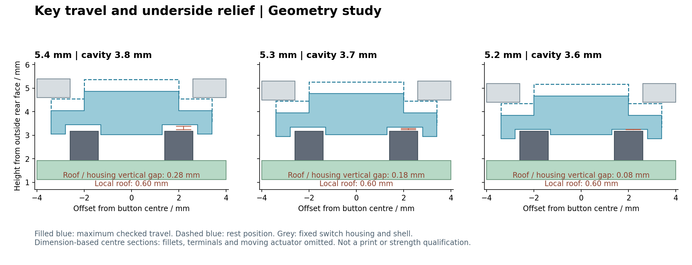

# R1：3.6 mm 内腔／5.2 mm 总厚度候选

## 当前确定方案

2026-09-24：用户要求继续压缩 3.8 mm 内腔，本轮将研究推进到 **内腔 3.6 mm、总厚度 5.2 mm**，上下大面各 0.8 mm。候选已生成并通过名义几何检查，供后续试装设计使用；尚未替换 5.8 mm 打包文件，也未成为可直接下单版本。

3.8 mm 是上一轮分配了约 0.3 mm 顶部间隙的目标，不是硬性结构下限。继续减薄会减少装配余量。PCB、USB-C、支撑高度、外轮廓圆角及 SWD 五孔不变；仍保留 **3.4 mm 电池包络＋0.1 mm 胶层**，没有以压电池来获得空间。

## 厚度比较

以下均为名义尺寸，尚未扣除加工与装配偏差：

| 内腔／总厚度 | USB-C 顶部间隙 | 3.4 mm 电池＋胶层间隙 | 按到底时凹位顶面至开关外壳的竖向间隙 |
| --- | ---: | ---: | ---: |
| 3.8／5.4 mm | 0.31 mm | 0.30 mm | 0.28 mm |
| 3.7／5.3 mm | 0.21 mm | 0.20 mm | 0.18 mm |
| **3.6／5.2 mm** | **0.11 mm** | **0.10 mm** | **0.08 mm** |

三组均使用 1.0 mm 外缘、0.4 mm 底面凹位、0.6 mm 局部顶面的键帽，三个键帽的完整运动包络均无干涉。5.3 mm 在本轮作为几何对比，独立导出的是 5.2 mm 候选。若完整电池实测为 3.2 mm，5.2 mm 方案的电池顶部间隙为 0.30 mm，但 USB-C 的 0.11 mm 不变。

内腔若进一步到 3.5 mm，沿当前堆叠计算，USB-C 仅剩约 0.01 mm，3.4 mm 电池加胶层为零间隙；不能将这个零余量算例作为本工艺的可靠装配尺寸。



## 键帽与验证

沿用[5.4 mm 研究](../r1-usb-height-5.4/README.md)的底凹位结构，但更低的外缘不能把中央压柱也带下去。本轮将中央压柱底端保持在原 **Z=3.52 mm**，原始接触间隙约 0.05 mm；新增静止键帽对**整个开关**的检查，确认没有名义预压干涉。按压扫掠继续使用约 0.50 mm 总位移，并沿用已注明的活动压头排除假设。

[检查报告](report.json)记录：三个键帽有效且各为单实体，中央压柱实际底面匹配原基准；静止时与完整开关无体积干涉；完整位移包络与上壳、PCB、固定开关和其余元件无干涉；所选上壳与已建模装配体无静态干涉。FCStd 保存重开通过，五件 STEP 有效且单实体、五份 STL 封闭；组合 STEP 有五个实体。原 5.8 mm 来源的 SHA-256 未变，SWD 底盖 BREP 不变。

剩余约束：0.6 mm 局部键帽强度、0.05 mm 静止轴向间隙和约 0.08 mm 按压竖向间隙都未通过树脂打印与实际回弹验证；USB 约 0.11 mm 余量没有覆盖完整公差链。真实电池包、排线、焊点和导线仍需试装；本次未加入可拆底盖固定结构。不得把几何通过解释成工艺或整机可靠性验收。

## 文件与复现

- [完整候选 FCStd](rear-cover-study.FCStd)、[五件打印零件 STEP](print-parts.step)。
- 独立壳体 `upper.step/.stl`、`rear.step/.stl`；独立键帽 `key-1.step/.stl` 至 `key-3.step/.stl`。
- [正面预览](front-iso.png)、[背面预览](rear-iso.png)。

代码经 `python3 -m py_compile`，完成结果以 `report.json` 为准，不仅检查 FreeCAD 退出码。生成必须使用新目录：

```sh
NFC_USB_HEIGHT_MM=5.2 \
NFC_USB_HEIGHT_OUT="$PWD/projects/nfc-business-card/artifacts/usb-height-5p2-rebuild" \
PYTHONHOME=/Applications/FreeCAD.app/Contents/Resources \
PYTHONPATH=/Applications/FreeCAD.app/Contents/Resources/lib \
/Applications/FreeCAD.app/Contents/Resources/bin/freecadcmd \
  projects/nfc-business-card/enclosure/study-r1-usb-height.py

NFC_USB_HEIGHT_OUT="$PWD/projects/nfc-business-card/artifacts/usb-height-5p2-rebuild" \
python3 projects/nfc-business-card/enclosure/render-r1-key-section.py
```

不指定 `NFC_USB_HEIGHT_MM` 时仍生成原 5.4 mm 研究。GUI 预览复用 `preview-r1-rear-cover.FCMacro`，指定本候选目录和独立配置，不保存源文件。
