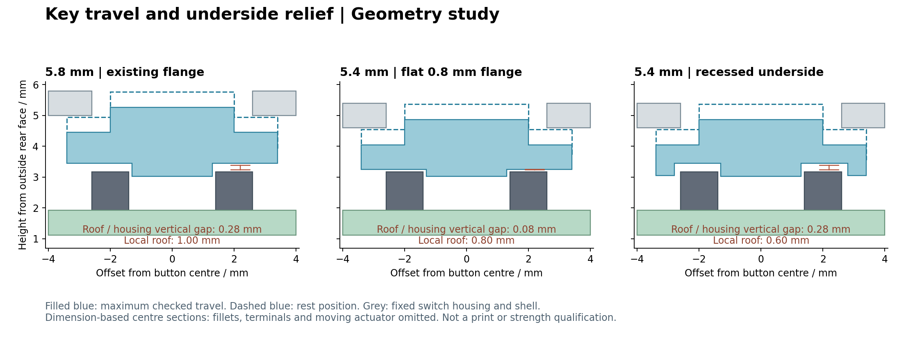

# R1：以 USB-C 高度为基准的 5.4 mm 候选

## 当前确定方案

2026-09-24：按用户要求恢复减薄设计，以现有 USB-C 的安装高度为约束，完成 **5.4 mm 总厚度／3.8 mm 内腔**候选。上下大面仍各 0.8 mm；圆角、外轮廓、2.54 mm SWD 孔和 PCB 安装基准保留，前壳与屏幕向下移 0.4 mm，重新设计三个键帽底面。**当前是按键与厚度几何候选，尚未作为可打印交付版；打包版仍为 5.8 mm。**

电池继续保留完整包络 **3.4 mm＋0.1 mm 胶层**；3.2 mm 仅作为用户提出、待实测的对比输入，没有将挤压软包作为装配方式。即使电池实测降至 3.2 mm，USB-C 仍占约 3.49 mm 内腔高度，整体下限不会随电池再降低同样幅度。软包尺寸与膨胀需要留意，[VARTA 电池类型说明](https://www.varta-ag.com/fileadmin/varta_storage/downloads/Webinare_PDF/Batteries_101.pdf)也列出 pouch/polymer 的 swelling 问题；该资料不能替代本电池的最大尺寸或寿命余量。

## 厚度结果

| 项目 | 5.4 mm 候选 |
| --- | ---: |
| USB-C 顶部名义间隙 | 0.310 mm |
| 3.4 mm 电池＋0.1 mm 胶层顶部间隙 | 0.300 mm |
| 若完整电池实测为 3.2 mm，顶部间隙 | 0.500 mm，仅对比 |
| 主控最大高度至壳内面 | 0.480 mm |
| 最大屏幕背面至 0.25 mm 铁氧体 | 1.270 mm，堆叠计算 |
| 最大屏幕背面至假设 1.0 mm 焊点／导线 | 0.620 mm，堆叠计算 |

USB 的 3.49 mm 来自原库模型加 0.32 mm 支撑；它是本布局的名义高度，不是供应商最大公差。3.49＋两面各 0.8＝约 5.09 mm 只是零间隙算术下限。取约 0.3 mm 名义余量得到 5.4 mm 研究目标；这个余量尚未扣除打印误差、翘曲、胶厚和元件公差。

## 键帽改动



剖面按尺寸绘制，省略圆角、引脚和活动压头；蓝色实线为检查的最大位移，虚线为静止位置。它不是透明树脂外观预测。

原键帽用一整片 1.0 mm 厚的圆形限位边。简单减薄外壳，会让这片边在按下时撞开关固定外壳。本候选保留 1.0 mm 外缘，在开关外壳上方挖 **5.6 × 5.6 mm、深 0.4 mm**的底面凹位，并保留中央 Ø2.6 mm 压柱；可见按钮仍为 Ø4.0 mm、边缘 R0.2。三个开关及 PCB 均未移动。

按 [ALPS SKQGABE010 规格 §7.2](https://tech.alpsalpine.com/cms.media/SKQGAB_KQG_719_EN_cc4e10226e.pdf#page=3)的行程上限 0.45 mm，加原有约 0.05 mm 接触间隙，检查约 0.50 mm 总位移。该行程是间隙检查边界，不是要求强行把实物开关压下 0.45 mm。

| 外厚／键帽结构 | 凹位顶面或平底至开关固定外壳的竖向间隙 | 几何结果 |
| --- | ---: | --- |
| 5.8／原 1.0 mm 平底 | 0.28 mm | 通过 |
| 5.6／0.8 mm 平底 | 0.28 mm | 通过 |
| 5.4／0.8 mm 平底 | 0.08 mm | 名义不碰撞，余量小 |
| 5.2／0.8 mm 平底 | −0.12 mm | 每键约 0.535 mm³ 干涉 |
| **5.4／1.0 mm 外缘＋0.4 mm 底凹位** | **0.28 mm** | 三键完整位移包络通过 |

这里的 0.28 mm 是**竖向间隙**，不是键帽所有表面的最短距离。完整键帽最短距离约 0.10 mm，来自沿用的中央压柱与活动区排除边界；固定开关检查沿用 Ø2.8 mm 活动区假设，仍需实物核对。

代价必须一起考虑：挖空后局部顶面厚度为 **0.6 mm**，外缘留下较窄的裙边；其打印、刚度和寿命未验证。原静止轴向间隙 **0.05 mm**也尚未解决公差、静止预压和回弹问题。因此“完整行程不撞”不等于按钮已可以可靠量产。下一步应先做该键帽与壳孔的局部配合样件，验证最薄处、偏压和回弹；若材料不接受 0.6 mm 局部结构，需要调整键帽工艺或回退厚度，不能直接压电池补偿。

## 文件与验证

- [完整候选 FCStd](rear-cover-study.FCStd)、[五个打印零件 STEP](print-parts.step)。
- 独立壳体：`upper.step/.stl`、`rear.step/.stl`。
- 独立键帽：`key-1.step/.stl`、`key-2.step/.stl`、`key-3.step/.stl`。
- [检查报告](report.json)、[正面预览](front-iso.png)、[背面预览](rear-iso.png)。这些导出供几何评审和后续样件准备，未批准直接下单。

FreeCAD 检查通过：用水平下表面连续扫掠构造完整键帽运动包络，三个键帽与上壳、PCB、固定开关和其他已建模元件均无干涉；降低后的上壳与已建模装配体无静态干涉；SWD 底盖保持原 BREP；FCStd 保存重开有效，五个独立零件各为单实体、五份 STL 封闭，组合 STEP 为五个有效实体。代码经 `python3 -m py_compile`，索引改动经 `git diff --check`。正背面 GUI 渲染与按键剖面已目视检查。

边界：没有加入可拆底盖固定结构或 RESET 孔；没有重建真实 FPC、导线、铁氧体和焊点实体；屏幕最大尺寸／铁氧体／焊点间隙仅为堆叠计算；没有验证包含松散线材和工具的装配过程，没有做实体按键力／回弹／寿命测试。原 5.8 mm 文件和 PCB 均保留。

## 复现

输出必须是新目录：

```sh
NFC_USB_HEIGHT_OUT="$PWD/projects/nfc-business-card/artifacts/usb-height-rebuild" \
PYTHONHOME=/Applications/FreeCAD.app/Contents/Resources \
PYTHONPATH=/Applications/FreeCAD.app/Contents/Resources/lib \
/Applications/FreeCAD.app/Contents/Resources/bin/freecadcmd \
  projects/nfc-business-card/enclosure/study-r1-usb-height.py

NFC_USB_HEIGHT_OUT="$PWD/projects/nfc-business-card/artifacts/usb-height-rebuild" \
python3 projects/nfc-business-card/enclosure/render-r1-key-section.py
```

读取完成报告；FreeCAD 退出码本身不足以证明成功。GUI 预览复用 `preview-r1-rear-cover.FCMacro`，指定上述模型目录和独立 GUI 配置。
