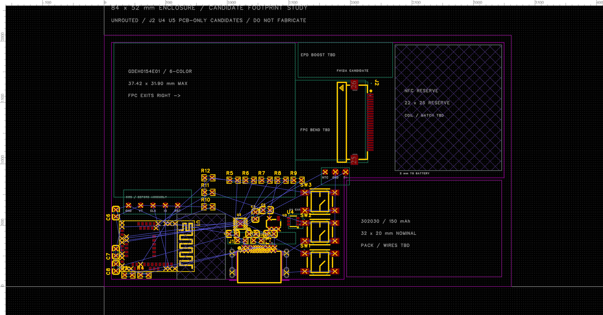

# 84 × 52 mm 实际封装排布

2026-09-21：用户确认成品含打印边缘不超过银行卡，优先薄、排布有余量；不为再缩小 1 mm 强行挤压空间。当前沿 **84 × 52 mm** 继续，83 × 51 留作比较。厚度仍按 5 mm 目标研究，未证明可制造或达到实物公差要求。

- [EDA 原始工程](../../../eda/NFC-Business-Card-84x52.eprj2)，PCB 图页 **E6 84x52 - 实际封装排布未布线**。
- [新版 FreeCAD](../enclosure/pcba-e6-84x52-detail.FCStd)、[平面图](../enclosure/pcba-e6-84x52-detail.svg)、[机械报告](../enclosure/pcba-e6-84x52-detail-report.json)。
- [PCB 检查与完整坐标](pcb-84x52.json)。旧 Bottom-USB、旧试布线和此前 84 × 52 CAD 全部保留。

**按键需求补充（2026-09-21）：至少两键完成全部基本操作，空间允许时保留第三键。** 两键分别轮换一级栏目与二级选项，二级选到即自动应用；第三键功能待定。当前三键坐标、网络、模型和检查快照保留，最终数量需同时验证外壳按压结构，见[交互架构](../docs/architecture.md)。（2026-09-23 更新：E16 先收敛为两颗、当天又按方案 B 恢复为三颗（SW1 (38.1,3.3)、SW3 (38.1,15.1)、新增 SW2 (46.3,8.8)）；本页的三键坐标是历史状态，见[E16 设计记录](pcb-e16-usb-right-mid.md#三键已实施2026-09-23方案-b)。）

## 本轮实际变化

外壳参考框为 84 × 52 mm，PCB 外接矩形为 81 × 49 mm，并保留沉板 USB 槽与右下电池缺口。屏幕、电池、三键和 NFC 分区来自紧凑比较；所有坐标以横向左下为原点，单位 mm。

| 对象 | 本轮结果 |
| --- | --- |
| 电池 | (50, 2)，32 × 20 × 3 商家标称；在 PCB 缺口中平铺，不增加叠层 |
| 三键 | 中心 x=44.5，y=5 / 11.3 / 17.6；竖持时为横排 |
| NFC | (60, 24)，22 × 26；参考框和双面禁布区一并迁移。未画实际线圈，后续需要按线圈设计调整禁布规则 |
| J2 排线座 | 实际库封装 FH12A-24S-0.5SH(55)，上接触，C506794；原点 (53.24, 34)，−90°，插口朝屏幕 |
| U4 屏幕电源开关 | TPS22919DCKT，C2860814；原点 (39, 13.5)，0° |
| U5 USB 数据 ESD | TPD2EUSB30DRTR，C97502；原点 (33.8, 9.4)，0°；VBUS/CC 的保护仍待设计 |
| SWD | 五个直径 1.2 mm 的顶层圆焊盘，2.54 mm 间距，y=16.8；依次 GND / VTref / SWDCLK / SWDIO / NRESET |
| 电池与 NTC | y=23.7；x=49.8 为 BP、x=47.7 为 BN，直径 1.5；x=45.6 为 NTC，直径 1.2。NTC 回路共用 GND；实际传感器、热接触和应力释放未完成 |
| 屏幕外围区 | (40, 43.3)，19.5 × 7.2，140.4 mm²；让开 J2 锚脚，完整六色屏外围尚未放入 |

**J2/U4/U5 是 PCB 上的选型占位，未接入原理图和网络，均排除 BOM。** 三页原理图沿用原草案，其中旧 J2 仍是暂停使用的底接触候选；本轮没有宣称原理图与新增器件同步。下一轮应先修订原理图及库关联，再同步 PCB，避免覆盖这些试排位置。库编号仅用于追溯，不代表现货或已确认可贴装。

八个裸焊盘已赋予原有网络，但没有铜线相连；设有顶层阻焊开窗及负焊膏扩展，制造前仍须检查实际 Gerber/钢网。VTref 是调试器电压参考，不在本轮授权外部供电或设备接线。

## 排线座带来的真实约束

此前 6.8 × 16.5 mm 只是占位框。这轮核对 [Hirose 官方 FH12A 图纸](https://www.hirose.com/en/product/document?clcode=CL0586-0555-2-55&documentid=0000906835&documenttype=2DDrawing&lang=en&productname=FH12A-24S-0.5SH%2855%29&series=FH12)并读取实际库焊盘：

1. **本体、焊盘和打开空间需要分开算。** 本体尺寸上界为 6.4 × 16.7 × 2.2 mm；库锚脚外跨约 17.6 mm，比原厂推荐的 17.1 ±0.1 mm 更宽，锚脚长宽也有差异。当前保留库原形用于空间检查，未批准其用于制造，后续需校正或换经核对的封装。
2. **尾长需要扣除插入段。** 图纸插入深度参考约 5 mm；把插座从原占位位置向左靠近屏幕，本体左边约 x=48，信号焊盘最右约 x=55.53，距 NFC 区约 4.47 mm。此为几何距离，不是 RF 验证结果。屏幕尾部中心与插口尚有约 0.45 mm 偏移，Z 向过渡、弯曲半径和真正可用余长仍需样品核对。
3. **存在触点兼容性问题。** 屏幕图纸触点长 3.2 ±0.2 mm，Hirose 推荐至少 3.3 mm；屏幕尾宽 12.5 ±0.1 mm，插座推荐 FPC 为 12.5 ±0.07 mm。仅针数、间距和上接触匹配不够，必须确认交付尾部与插座兼容，必要时换座。
4. **装配顺序影响厚度。** 翻盖打开高度参考约 3.6 mm，叠加板面和焊接预算后约 5.4 mm；应在装前盖前插接排线。闭合高度可放进当前包络，不意味着能在封壳后打开或已验证插拔动作。

屏幕尺寸来源为已归档的 `downloads/gdeh0154e01.pdf` 第 5 页，详见[六色屏评估](../docs/gdeh0154e01-evaluation.md)。FH12A 原厂文件及校验值已加入[下载清单](../docs/download_manifest.json)。

2026-09-21 资料复核补充：官方 DESPI-E01 电路标注 **FPC-05FB-24PH20 / C2856831**。已取得 XUNPU 图纸并完成[实际库封装名义尺寸检查](fpc-connector-review.json)：24 个信号焊盘和 2 个固定焊盘，共 79 项尺寸比较通过；完整铜焊盘包围框约 16.60 × 4.75 mm。露铜长度要求与屏幕标称范围相容，但尾宽/厚度公差仍待确认；[完整对照](../docs/gdeh0154e01-evaluation.md#参考板同款插座)。下一轮继续核对装配与制造细节；当前工程、CAD 和本页整板检查结果仍对应 FH12A，未替换。

## 检查结果

- **EDA 几何：** 30 个元件、180 个元件焊盘和 8 个独立焊盘，共 188 个；未发现跨元件焊盘/本体包围框重叠、焊盘角点落在板外或占用 NFC 区。没有放宽 DRC 规则；U5 与 CC 电阻之间的一处新增间距错误已通过移位消除。
- **DRC 未通过：134 条。** 110 条未连接，24 条为继承的 USB 槽边距报告（其中两类各报告 12 条）。相比旧版 122 条，新焊盘引入了待连接端点；未接网络的候选器件不会因此被 DRC 验证为已完成。铜线、过孔、铺铜仍均为 0。
- **保存重开：** 元件、网络和几何无丢失；顶层独立焊盘的未使用底层阻焊默认值由客户端从 null 实体化为 0。焊盘重命名操作的坐标量化偏差小于 0.002 mm。SQLite `PRAGMA quick_check` 为 `ok`。
- **FreeCAD 几何：** `generate --variant e6-84x52-detail` 及归档模型 `check` 通过，36 个简化形体有效；PCB 为一个连通实体，无已建模碰撞、内腔越界或预留区冲突。模型不含所有小阻容和真实排线/引线。
- **视觉：** 等轴测、顶视、完整平面图和 EDA 画布已查看。只运行一次临时 FreeCAD GUI 预览。
- **保留性：** 5 个旧 CAD 与 2 个旧 EDA 工程 SHA-256 不变；原 `e6-84x52` 重新生成的报告与原报告相同。

本机 API 快照、库源与检查脚本在 `artifacts/compact-detail/`，属于临时验证产物；持久结果见本页链接的工程、模型及 JSON。可复现 CAD 命令见[软件说明](../docs/software.md#84--52-实际封装细化)。

## 下一步

先确认或更换 J2，并按交付屏幕资料补齐六色屏外围；将 U4/U5 和焊盘正式接入原理图，再继续布局布线。同步解决 USB 槽边距、实际线圈与匹配、充电/NTC、模块供货以及按键/薄片前盖结构。样品到货后量完整电池、排线和装配高度；当前文件不能直接交给板厂生产。
