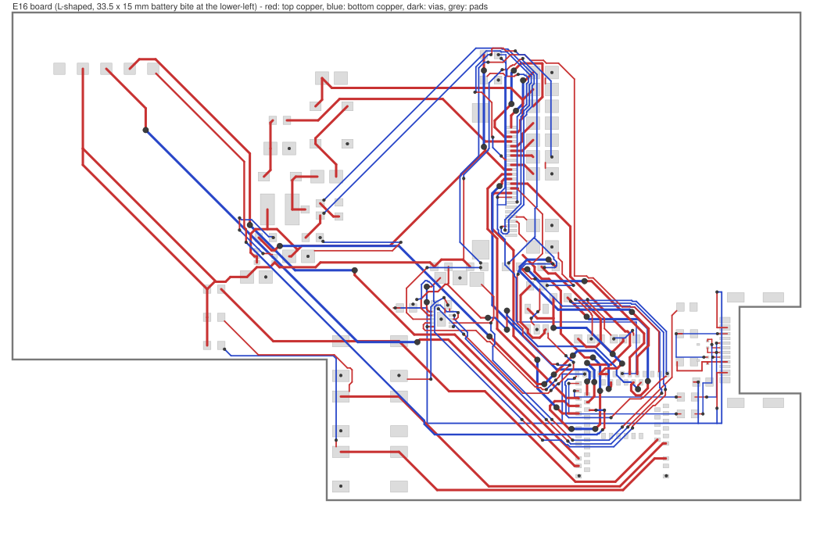
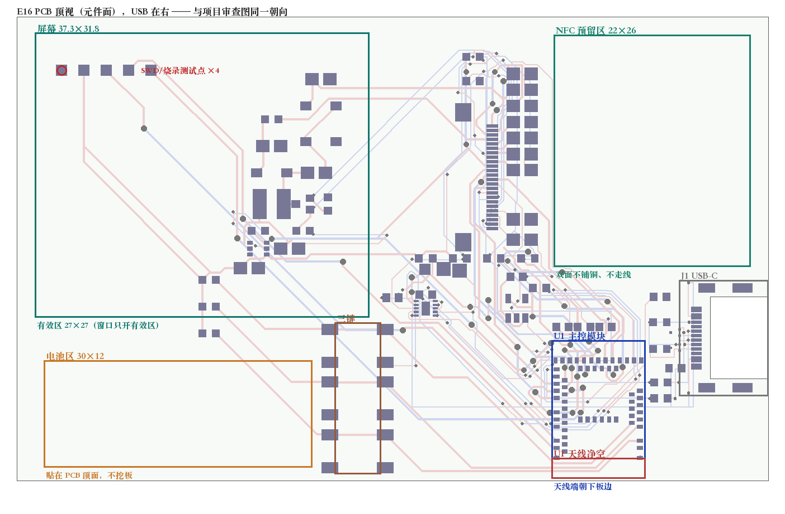
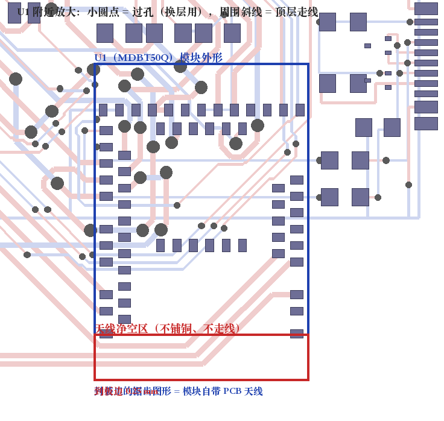

# E16 右侧中部 USB 布局

## 当前确定方案

更新于 **2026-09-23**。用户确认 USB 放到**右边缘中部**更符合卡片形态；本方案已**写入 E16 图页**并通过保存、关闭、重开验证。板框为 84 × 52 mm 的 **L 形**：右边缘中部开 **9.24 × 7.30 mm** 缺口（内缘 x = 76.704 mm，与 J1 封装的板边线一致，2026-09-23 修正），左下角为 **33.5 × 15 mm 电池挖空**；J1 插口朝 **+x**，U1 转 180° 让模块天线端朝下板边。按键为**三颗**：SW1 (38.1, 3.30)、SW3 (38.1, 15.10) 一列不动，SW2 新增在 **(46.3, 8.80)** 组成三角形（见「三键已实施」一节）。**全部网络已布通（含 GND 覆铜）**，原生 DRC 的**连接错误为 0**，只剩 24 项 `Board Outline to SMD Pad`——同一处几何的两种分类，实测 12 个信号焊盘离板边 **7.9 mil = 0.2007 mm**（规则要求 11.8 mil，板厂下限 ≥0.2 mm，见「J1 与板框基准复核」）；**56 个位号**在原理图与 PCB 之间**逐引脚网表一致**（234 项、0 差异）。NFC 馈线也已落铜：`NFC1_TBD` / `NFC2_TBD` 从 U1 pin 52 / 54 并排走到底层两个 1.5 mm 落点焊盘（19 段铜、6 个过孔），落铜后原生 DRC 与制造包都已复跑通过——详见「NFC 天线馈线落铜」。

- 落盘记录：[e16-right-mid-applied.json](e16-right-mid-applied.json)
- 方案数据：[e16-right-mid-plan.json](e16-right-mid-plan.json)
- 审查图：[pcba-e16-right-mid.svg](../enclosure/pcba-e16-right-mid.svg)（L 形板框、三键、双面铜箔、焊盘/过孔实形、位号、禁布区与显示包络）
- E16 实时快照：[e16-right-mid-snapshot.json](e16-right-mid-snapshot.json)
- 外壳剖视图：[nfc-card-e16-v5-stack-section.svg](../enclosure/nfc-card-e16-v5-stack-section.svg)（4.5 mm 叠层：电池袋 / 按键列 / 屏幕 FPC）
- 外壳样件：[nfc-card-e16-enclosure-v7.FCStd](../enclosure/nfc-card-e16-enclosure-v7.FCStd) · [几何报告](../enclosure/nfc-card-e16-enclosure-v7-report.json) · [脚本](../enclosure/e16-enclosure-right-mid-usb-v7.py) · 预览图 `enclosure/renders/e16-enclosure-v7-{iso,top}.png`（V5/V6 见[外壳说明](../enclosure/README.md)）
- 校验脚本：[plan-e16-right-mid.py](../scripts/plan-e16-right-mid.py)
- 外壳与板级校验：[check-e16-board-fit.py](../scripts/check-e16-board-fit.py) · [check-e16-board-clearance.py](../scripts/check-e16-board-clearance.py) · [check-e16-usb-plug.py](../scripts/check-e16-usb-plug.py)
- 铜箔连通性：[check-e16-copper-connectivity.py](../scripts/check-e16-copper-connectivity.py)（原生 DRC 的"连接 0"不能证明连通，动铜箔后必须跑）
- 绘图脚本：[generate-e16-right-mid-svg.py](../scripts/generate-e16-right-mid-svg.py)
- 快照导出：[eda-export-e16-snapshot.js](../scripts/eda-export-e16-snapshot.js) · 网表核对：[eda-export-pcb-pins.js](../scripts/eda-export-pcb-pins.js) + [check-netlist-consistency.py](../scripts/check-netlist-consistency.py)
- 上游基线：[E15 清理版 PCB 开工记录](pcb-e15-clean-layout.md) · 早期试放：[e16-usb-right-mid-study.json](e16-usb-right-mid-study.json)

> **计数以机器为准。** 本文出现过多组图元计数，其中 **781 段铜 / 242 焊盘 / 162 过孔** 是 NFC 馈线落铜**之前**的过程值。当前设计值从[门槛文件](pcb-e14-manufacturing-gates.json)的 `current_snapshot` 读（`copper_lines: 798`、`pad_count: 244`、`vias: 168`），并与[快照](e16-right-mid-snapshot.json)复核；两者冲突时以门槛文件与 `check-e14-gates.py` 为准（见[进度看板](../docs/progress.md)）。手工抄写的数字会漂，这是已发生的事实。

## 方法论检查：EMC / 信号完整性（2026-09-23）

用 [PCB 设计规则索引](../../../docs/pcb-design-rules.md) 的规则集与 [check-e16-emc.py](../scripts/check-e16-emc.py) 对**已提交的快照**跑了一遍 DRC 看不见的检查，不经过客户端。检查器实现了 16 条规则，覆盖声明与实现由 `tools/check-rule-coverage.py` 校验一致。

### 一处同源缺陷：USB/ESD 区域几乎没有地缝合

三条独立规则指向同一处，实测值：

| 规则 | 阈值 | 实测 |
| --- | --- | --- |
| `ES-002` TVS 地过孔 | 3 mm 内 ≥2 个 | U5 (73.10, 16.60)、U6 (73.10, 14.90) 的 GND 焊盘 3 mm 内 **0 个** |
| `RP-001` 换层缺缝合孔 | 1.6 mm（max(2H, 1.0)） | USB 对 8 个换层孔离最近地过孔 **4.27–6.83 mm**；全板 120 个信号过孔中 93 个超阈值，其中 22 个带快速边沿 |
| `BE-003` 连接器区缝合孔 | 2×λ/20 | J1 中心 5 mm 内 **0 个**、10 mm 内 **1 个**（且在 9.08 mm 处，属 U1 区域）；全板仅 48 个地过孔 |

真正要紧的是 `ES-002`：它不是频域问题。按 TI SLVA680，8 kV IEC 61000-4-2 下 dI/dt ≈ 37.5 GA/s，ESD 回路里每 nH 产生约 37.5 V 过冲，而 TVS 的地回路电感是最关键的寄生——这与被保护信号是快是慢无关。`RP-001` / `BE-003` 在全速 USB 的 15 ns 边沿下属于 λ/1000 量级的绕行，不构成辐射问题。

**尚不能判定的是严重程度**：地焊盘究竟是靠覆铜还是靠一条细线接地，决定这条缺陷的实际量级，而覆铜几何不在快照里（见下）。所以处置依据是厂商指引而不是实测缺陷。

### 其余检查结论

| 结论 | 数据 |
| --- | --- |
| USB 全速等长**不是问题** | DP/DM 失配 2.15 mm（11.8 ps）与 3.80 mm（20.8 ps），全速预算 10000 ps，余量约 480 倍 |
| `ML-001` 开关电感远离敏感电路 | L1 到 U1 模块（内含射频、NFC 前端、32 MHz 晶振）**43.14 mm**，阈值 15 mm |
| 开关热回路很小 | `EPD_SW` 铜面积 1.86 mm²、U4→L1→C9 三角 0.85 mm²，阈值 25 mm² |
| U1 去耦合格 | C5/C6/C7 到 U1 的 VDD_3V3 焊盘 4.40 / 3.75 / 4.12 mm，阈值 5 mm |
| `BE-001` 无实质命中 | 798 段中 7 段距板边 <0.8 mm，**全部是直流或按键驱动网络**，0 段带快速边沿 |
| `XT-001` 阈值在本板过宽 | 2 层 0.8 mm 下 3H = 2.4 mm，命中 54 对网络；高重叠对（NRESET↔SWDCLK、SWDCLK↔SWDIO、KEY_*）都是仅烧录/按键时翻转的慢速信号，无实质命中 |
| `C3` 是确定的布局缺陷 | BQ25186 的 BAT 引脚电容距 U2 的 BAT 焊盘 **24.49 mm**（E15 时约 4.7 mm），高于 8 mm 严重阈值 |

### 发现的导出工具缺陷

[eda-export-e16-snapshot.js](../scripts/eda-export-e16-snapshot.js) 读的是 `r.polygon` 与 `r.rule`，而 region 的真实属性名是 **`complexPolygon`**（一个 `IPCB_Polygon` 对象，数据要经 `getSource()` 取）与 **`ruleType`**。两个属性都取到 `undefined`，`JSON.stringify` 静默丢弃——所以提交的快照里 region 只有 `id` 和 `layer`，禁布区轮廓一直是缺的。（polyline 用的是 `polygon`，不同类不同名，这是陷阱所在。）

已改：导出补上正确的 region 字段、`pours`（铜箔边框）与 `poured`（实际填充结果，才是回流路径检查需要的几何）。因为上游**缺 `IPCB_PrimitivePour` / `IPCB_PrimitivePoured` 的接口文档**，字段名不能靠推断，另写了 [eda-probe-copper.js](../scripts/eda-probe-copper.js)：客户端一连上先探测真实对象结构，再据此确认导出。两个脚本已通过按桥接包装方式做的语法校验，但**尚未在客户端上执行过**。

### 覆铜导出已补上，ES-002 已确诊（2026-09-23，需客户端）

客户端冷启动会停在起始页，此时**所有图元 API 返回 null**（`pcb_PrimitiveLine.getAll()` 也报 `Cannot read properties of null (reading 'map')`）。用 `dmt_Project.openProject()` 打开 `NFC-Business-Card-84x52-E14-Battery-Layout` 后恢复；身份**用内容指纹确认**（56 元件 / 244 焊盘 / 798 线 / 168 过孔，与提交快照逐字段一致），不依赖 API 报出的工程名——软件文档警告过 `openProject()` 后标题与 `prjPath` 可能仍指向旧工程。

覆铜对象实测结构（由 [eda-probe-copper.js](../scripts/eda-probe-copper.js) 探测，两处与我的假设不符）：

| 项 | 实测 |
| --- | --- |
| region 几何 | `complexPolygon`（`IPCB_Polygon`，数据要经 `getSource()`）；规则字段是 `ruleType`，实测 `[2,6,5,7]` |
| poured 填充 | 属性是 **`pourFills`**（复数），每条填充的轮廓在 `path.complexPolygon` |
| poured 的 net/layer | **对象本身没有**，只有 `pourPrimitiveId`，要 join 回铜箔边框 |
| 填充坐标单位 | **1 单位 = 0.254 mm**（即 ×10 = mil），与快照其余对象的 mil 不同 |
| `fills[]` 内容 | 混合：≥3 顶点的环是覆铜多边形（首环为外轮廓、后续环为孔），**2 点退化线段是散热辐条** |

这些单位与结构都由 [pour_geometry.py](../scripts/pour_geometry.py) 承载，并带**标定断言**：解析出的覆铜必须落在铜箔边框内 1 mm 内，否则报错并拒绝出结论。第一次解析就是因为没标定而给出"覆铜只占 0.4% 板面"的错误答案。

覆铜实测（[analyze-e16-pour.py](../scripts/analyze-e16-pour.py)）：

| 层 | 铜箔区域 | 散热辐条 | 覆铜面积 | 占板面 |
| --- | --- | --- | --- | --- |
| GND_TOP (1) | 29 | 89 | 1749.2 mm² | **40.0%** |
| GND_BOT (2) | 14 | 8 | 2215.9 mm² | **50.7%** |

`GP-004` 阈值 60%，两层都不到——但在 2 层板双面密集走线下属预期，实际含义是回流通道被压缩，正是 `GP-001` 要查的。板边环（`BE-002`）四边内缩均 0.50 mm，2 mm 判据通过。**这 43 个区域是否全部与 GND 网络连通尚未逐一验证**（见下面的连通性缺口）。

**`ES-002` 从"无法裁决"变成确诊。** 逐个 GND 焊盘追接地路径的结果：

| 器件 | 接地路径 |
| --- | --- |
| U5 的 GND 焊盘 | 自带 **3 根辐条**直连顶层覆铜 ✓ |
| R1 的 GND 焊盘 | 自带 1 根辐条 |
| R2 的 GND 焊盘 | 自带 3 根辐条 |
| J1 的 GND 焊盘与锚脚 | 各 1–3 根辐条 ✓ |
| **U6 的 GND 焊盘** | **自己没有辐条**（最近的辐条 0.447 mm 是 R1 的），与覆铜最近 0.614 mm，同层 GND 铜线最近 3.546 mm，最近 GND 过孔 3.58 mm；只靠**与 R1 的 GND 焊盘重叠**再经 R1 那 1 根辐条入覆铜 |

全板 54 个 GND 焊盘中 43 个自带辐条。所以 **U6 是接地的，但它作为 ESD 钳位器件的接地回路要经过相邻电阻的焊盘和单根辐条**——按 TI SLVA680，这正是 dI/dt 下过冲最大的那类路径。结论从"无法判定"变成"机制清楚、可修"。

### 连通性审计的缺口（已补，但结果尚不可信）

[check-e16-copper-connectivity.py](../scripts/check-e16-copper-connectivity.py) 原本**明确排除 GND**，注释写着"GND 也通过两块地覆铜连接"。这个假设在覆铜几何存在之前无法验证，而它恰好能藏住一个悬空地焊盘。已加 `ground_reach`：把 GND 的焊盘/铜线/过孔/覆铜（含散热辐条）建成图，检查每个 GND 焊盘是否与覆铜同组。

修这个函数时抓到我自己四个 bug：辐条单位换算反向（`pour_geometry.MIL` 是 mm/mil，本模块的 `MIL` 是 mil/mm，**同名互为倒数**）、只看焊盘中心不看焊盘本体、缺"线↔过孔"边、缺"线↔线"边。修完后仍报 2 个 GND 焊盘未到达覆铜（C7 与 R13 的 GND 焊盘），但**两者都与手工验证的事实冲突**：R13 的 GND 焊盘中心 0.050 mm 处就有 GND 过孔，C7 的 1 mm 内有，且原生 DRC 报 0 未布通。因此该项标为 `trusted: false`、**不参与 `ok` 判定**，作为线索而非发现记录，留待下一轮定位第五条缺边。

四个 bug 全部是同一类错误：**单位与格式的假设没被标定**。这是"先验证工具再验证结果"在本项目的第三次实证（前两次是 DRC 计数口径与槽边 24/12 项分类）。

### 待办（按依赖排序）

1. **给 USB/ESD 区域补地缝合孔**（需客户端）：U5/U6 的 GND 焊盘旁各 ≥2 个，用 **0.61/0.305 mm**（不加价档）而不是 0.30/0.198；落铜前用 [check-proposed-route.py](../scripts/check-proposed-route.py) 逐点校验，落铜后重跑原生 DRC、连通性审计与制造包核对。
2. **处置 C3**（需客户端）：搬回 U2 的 BAT 引脚旁。会牵动 `BAT_PACK_TBD`（现 18 段、45.66 mm）约 20 mm 走线的重布。
3. **把 `ground_reach` 修到可信**，再据此检查 43 个覆铜区域与 GND 网络的连通性。
4. **补 `GP-001`（信号跨越覆铜缺口）**：覆铜几何已就位，可按"顶层走线下方底层覆铜的连续覆盖率 <95%"实现，这是"干扰"最核心的一条。
5. **制造包放行前重新点数**并记录过孔数（当前无产物佐证，见本文开头说明）。

## 文档层与 DRC 收尾整理（2026-09-23）

按"不动功能、只让板子和审查图更整齐"的要求做了一轮整理。**器件坐标、网络名与焊盘都没有动**，改的是文档层的说明文字、一颗 GND 过孔的位置、审查图的画法，以及两处死铜。

**1. 层 13 说明文字统一并更新（机械/文档层，不进铜箔与丝印）**

10 条备注原字号是 53 / 43 / 38 / 38 / 38 / 35 / 35 / 32 / 32 / 32，内容还混着过时结论。现在统一成三级字号（标题 53、分区 38、边注 32），并把过时文字换成实测值：

| 位置 (mm) | 旧文字 | 新文字 |
| --- | --- | --- |
| (2.54, 53.34) | `E16 RIGHT-MID USB / 84 x 52 mm / REVIEW ONLY` | `E16 RIGHT-MID USB / L-SHAPE 84 x 52 mm / REVIEW ONLY` |
| (2.54, 51.18) | `56 COMPONENTS / LEGACY MECHANICAL GEOMETRY REMOVED` | `56 COMPONENTS / TOP SIDE ONLY / L-SHAPE OUTLINE` |
| (2.54, 49.02) | `SCREEN / FPC` | `SCREEN / FPC 37.4 x 31.9 mm` |
| (31.75, 6.48) | `301230 CELL TARGET / MAX 32.5 x 14 x 3.4 mm`（上一轮已改） | 同左，字号统一为 38 |
| (35.56, 19.30) | `SW1 / SW2 / SW3` | `SW1 / SW2 / SW3 / KEY PITCH 11.8 - 9.9 - 10.3 mm` |

NFC 保留区与板框两条沿用上一轮已更正的文字、只统一字号；`J1 USB-C / RIGHT EDGE MIDDLE / PCB EDGE DATUM` 与 `U1 PCB ANTENNA / NO GROUND POUR ON ANY LAYER` 文字不变，字号 32。改完之后，板面文字可以直接读出板框形状、USB 基准和电芯上限。

**2. 消掉最后一项可避免的 DRC 条目：孔到孔**

规则集要求孔到孔 ≥0.3 mm，而 `R14.2`（GND 焊盘）上那两颗 GND 过孔（`32.80, 28.00` 与 `33.10, 27.60`）孔边距只有 **0.2968 mm**，差 3 µm。把西侧那颗沿"远离另一颗"的方向挪 **2 mil**，落到焊盘中心 `32.7533, 28.001`：

- 孔边距 **0.3269 mm**（≥0.3），到最近的其他网络铜箔 **0.599 mm**（规则要求 0.152 mm）；
- 过孔仍完全落在 `R14.2` 的焊盘内，仍靠两层 GND 覆铜连通，电气与装配无变化。

重跑原生 DRC（触发 → 等 15 s → 再读）：**24 项，全部是 `Board Outline to SMD Pad`**（7.9 mil / 要求 11.8 mil，即 J1 的 12 个焊盘各判两次），**孔到孔 0、间距 0、连接 0**。

**3. 审查图重画（[pcba-e16-right-mid.svg](../enclosure/pcba-e16-right-mid.svg)）**

旧图只有圆点和硬编码方框，还带着两条过时数字（缺口写 6.5 mm、"J1 包络外缘 x=88.4"）。现在这张图直接画快照里的真实几何：

- 顶层铜（红）/ 底层铜（蓝）、242 个焊盘的实形、162 个过孔的实径；
- 56 个位号，以及板面自带的 10 条层 13 说明文字（按真实坐标绘制）；
- 板框与机械包络取自快照的折线图层；禁布区矩形仍用文档记录的边界（层 12 的多边形不经桥接导出）；
- 右侧面板的数字全部换成当前值（缺口 9.24 × 7.30、内缘 x=76.704、接插面在板边内侧 0.8 mm、可装电芯 ≤32.5 × 14 × 3.4、781 段铜 / 162 过孔等）。

**4. 清掉两处死铜（唯一一处铜箔改动）**

先写了一个几何审计脚本（[check-e16-copper-connectivity.py](../scripts/check-e16-copper-connectivity.py)）：按真实铜箔宽度判断"两块铜是否搭上"，检查①每个网络的焊盘/过孔是否落在同一个铜簇里、②每条铜线的两端是否搭在焊盘、过孔或同网络的另一段铜上。用**已提交快照**跑它作为基线，结果 0 个断网、**2 处死铜端**：

| 位置 (mm) | 网络 | 形态 |
| --- | --- | --- |
| (50.771, 1.479) | `KEY_NEXT_N` | 13.98 mm 的一段线，末端停在板上空白处（另一端接在主路径上） |
| (54.390, 26.138) | `EPD_DC_TBD` | 1.8 mm 的一段线，末端悬空；它的**线身**是 `J2 pin 11 ↔ U1 pin 39` 之间唯一的连接 |

处理：删掉 `KEY_NEXT_N` 那条死走线及其 0.17 mm 转接段；把 `EPD_DC_TBD` 那段从 1.8 mm **缩短成 0.508 mm 的桥接段**（从 0.15 mm 分支的端点 `(55.40, 25.30)` 到 `(55.66, 24.868)`），保留连通、去掉悬空尾巴。

> **这里有个要记住的坑**：第一版我直接把 `EPD_DC_TBD` 整段删了，**原生 DRC 依然报"连接 0"**，是这个几何审计脚本才发现 `J2 pin 11` 已经和网络断开。所以这块板的"连接 0"不能当作连通性证据，每次动铜箔都要跑一遍 `check-e16-copper-connectivity.py`。为验证脚本本身有效，我把桥接段从快照里删掉重跑：脚本正确报出 `EPD_DC_TBD` 断成两组并给出两个死铜端。

**本次没有做的事**：没有移动任何器件、没有改网络名、没有重画任何既有走线路径（只删了两处死铜、缩短一段并补一段桥接）。屏幕后方那片升压器件的"零回归纯外观重排"在三次尝试后已判定不可行（见下文「升压区重排尝试与约束」），保持基线。

**验证证据**

| 检查 | 结果 |
| --- | --- |
| 快照前后对比（本次改动） | 元件 0 差异、焊盘 0 差异、旋转 0 差异；只有 1 颗 GND 过孔移动（`32.80, 28.00` → `32.7533, 28.001`）、10 条层 13 文字变化，以及上面那 3 段死铜的删除/替换 |
| 几何与上一版提交快照的等价性 | 逐段比对：每条新线段都落在对应旧线段上，**最大端点偏差 0.0027 mil = 0.07 µm**（保存时的重新取整）；另有 2 段是同一几何在节点处被拆成两段（拆分点落在原线段上），**铜量不变** |
| 原生 DRC（保存后触发 → 等待 → 再读） | 24 项 `Board Outline to SMD Pad`（0.2007 mm，J1 固有几何）；**孔到孔 0**、间距 0、连接 0 |
| 铜箔连通性 + 死铜审计 | [check-e16-copper-connectivity.py](../scripts/check-e16-copper-connectivity.py)：**48 个网络**（GND 除外，它靠覆铜）全部落在单一铜簇，**死铜端 0**；基线快照是 0 断网 / 2 处死铜端 |
| 制造包重导 + [check-e16-manufacture.py](../scripts/check-e16-manufacture.py) | **ok=true**：16 个 Gerber 成员、板框逐顶点、162 个过孔钻孔、BOM 25 行 / 56 位号、CPL 56 位号、最大贴装偏差 0.0005 mm |
| Gerber 内容差异（与上一版导出逐坐标比较） | 顶层铜里 `Y1478996` / `X64751971`（`KEY_NEXT_N` 死走线）计数归零，桥接段的四个坐标各出现 1 次；两个钻孔文件与上一版**逐孔一致**（166 / 162，位置不变）；文档层 `Gerber_DocumentLayer.GDL` 绘制段数 **3315 → 3597**（层 13 文字）；其余成员的字节差异来自文件头时间戳 |
| 工程文件 | 改前备份 `NFC-Business-Card-84x52-E14-Battery-Layout.before-tidy-20260923.eprj2`；保存后 `sqlite quick_check` ok |

**铜线段数最终仍是 781**：提交时是 781，保存过程中多出 2 段节点拆分（同一几何在节点处被拆开，+2），本次整理删掉 3 段死铜、补回 1 段桥接（−2），781 + 2 − 2 = 781。其余计数不变。

## NFC 天线馈线落铜（2026-09-23）

在天线形式还没定之前，先把**两种方案都要用的那部分**做掉：从主控 NFC 引脚到底层落点的一对馈线，以及两个落点焊盘。线圈/匹配网络的取值仍等 PN532 桌面实验。

**做了什么**

| 项 | 内容 |
| --- | --- |
| 落点焊盘 | `NFC1` (68.00, 23.00)、`NFC2` (71.40, 23.00)，**底层** 1.5 × 1.5 mm 方焊盘，网络 `NFC1_TBD` / `NFC2_TBD`（都在保留区南侧 y < 24 的零铜区里） |
| 馈线 | `NFC1_TBD`：pin 52 → 顶层东行 → 经 1 个过孔下底层 → 沿 x≈70.3 上行 → 落点，11 段 / 1 孔；`NFC2_TBD`：pin 54 → 底层横穿 → 顶层沿 x≈71.9 上行（换层 4 次）→ 落点，8 段 / 5 孔 |
| 线宽 / 过孔 | 0.15 mm 线宽；6 个 0.30 / 0.20 mm 过孔（与板上既有的小孔同族） |
| 走廊依据 | 用几何占用扫描逐条比较 x = 57–77 mm 的可用竖巷：x≈72 这条夹在 R 列（x=71.9）与 ESD 列（x=73.6）之间，顶层只剩 2 处横穿、底层 3 处，是全场最空的一条 |
| 两条并排 | `NFC1` 走 U 形 CC2 走线**内侧**（x≈70.3）绕过两处横穿；`NFC2` 走 R 列焊盘间隙（x≈71.9）用 4 次换层跨过 CC1 与 C3 焊盘。两条线在 y 9–22 段相距 0.4–1.5 mm，不形成大回路 |

**验证**

| 检查 | 结果 |
| --- | --- |
| 逐点间隙核验（离线，含无网络焊盘、焊盘旋转、真实线宽） | **0 处违规**：对既有全部铜线/焊盘/过孔、板框 0.3 mm 与两个禁布区逐点检查 |
| 两条馈线之间 | 同层最小铜边距 **0.40 mm**（规则 0.102） |
| 孔到孔 | 新过孔与既有孔的孔边距最小 **0.80 mm**（规则 0.30） |
| 连通性 | [check-e16-copper-connectivity.py](../scripts/check-e16-copper-connectivity.py)：48 个网络全部单一铜簇、**死铜端 0**（`NFC1_TBD` / `NFC2_TBD` 从"只有焊盘没铜"变成两个完整网络） |
| 覆铜 | 新增铜箔后重铺 `GND_TOP` / `GND_BOT`，填充块 118 / 22（此前 121 / 19），两层重建均返回成功 |

**两个必须记住的坑（都在这次踩到）**

1. **底层圆形自由焊盘会让覆铜重建崩溃。** 落点最初做成 Ø1.5 圆焊盘，`rebuildCopperRegion()` 报 `TypeError: Cannot read properties of undefined (reading 'length')`，两层里只有底层失败。用形状矩阵定位：底层 *圆形* 焊盘必失败（换网络、改直径、去掉网络都一样），**同尺寸方形焊盘正常**，顶层圆形正常。所以落点最终用 1.5 × 1.5 mm 方焊盘；以后往底层加圆形自由焊盘前要先确认这一点。
2. **删除 `GND_BOT` 之后再建会丢填充。** 排查过程中把底层覆铜删掉重建过（用 `pcb_MathPolygon.createPolygon(...)` 构造矩形多边形才能创建成功，直接传 `{polygon:[...]}` 会报"无法创建覆铜边框图元"）。现在这块覆铜是重建出来的（0.4 mm 内缩矩形，GND、优先级 1、0.2 mm 线宽），填充已重铺成功。

**收口验证（2026-09-23 晚，客户端重启后补完）**

落铜当时原生 DRC 与制造包导出都超过客户端 30 s 上限（macOS 锁屏 + 窗口里停着模态框），解锁并重启 EasyEDA 后补齐：

| 检查 | 结果 |
| --- | --- |
| 重启后的状态核对 | 客户端把工程重存了一遍（坐标亚微米级重新取整、2 段 `EPD_VDD` 合并回 1 段），另外**多出一颗 GND 过孔**在 `(32.80, 28.00)`——与已挪到焊盘中心的那颗相距 0.047 mm，**两个孔互相重叠**，属制造缺陷。已删除该多余过孔，剩下两颗热焊盘过孔在 `(33.10, 27.60)` 与 `(32.7533, 28.001)`，孔边距 0.347 mm（规则 0.30） |
| 原生 DRC（触发 → 等待 → 再读） | **24 项，全部是 `Board Outline to SMD Pad`（7.9 mil / 要求 11.8 mil）**；**没有**间距、连接、孔到孔，也没有任何 `Copper Region(Filled)` 项 —— 说明重铺的两层 GND 覆铜正确让开了新馈线、过孔与落点焊盘 |
| 快照复核 | 重导后 56 元件 / 244 焊盘 / 798 段铜 / 168 过孔；连通性审计仍为 **48 网络单一铜簇、死铜端 0**；逐引脚网表复核 **56 位号 / 234 引脚 / 0 处网名差异**（两个落点是自由焊盘、不计入位号，所以不变） |
| 制造包重导 + [check-e16-manufacture.py](../scripts/check-e16-manufacture.py) | **ok=true**：Gerber **17 个成员**（比之前多一个 `Gerber_BottomPasteMaskLayer.GBP` —— 底层落点焊盘带来底层锡膏层，里面正好是 `(68.00, 23.00)` 与 `(71.40, 23.00)` 两个 flash）、过孔钻孔 **168 孔**、板框逐顶点、BOM 25 行 / 56 位号、CPL 56 位号、最大贴装偏差 0.0005 mm |

制造包里的顶层铜可以逐坐标核对到新馈线（x=70.32 / 71.35 / 71.9 三条竖段与 y=23.00 落点行都在），也就是说这一版 Gerber 与馈线落铜后的板子一致。

线圈（5–8 圈、0.25 mm 线宽、17 × 21 mm 可用区）与匹配电容仍按「NFC 馈线预研」一节的计划，等 PN532 实验结论再落铜——落点已经就位，无论最终选板上线圈还是贴纸/FPC 天线都接这两个焊盘。

### 线圈候选设计（已算好并离线校验，等实验拍板）

把上一节"待定"的部分先做成可直接落地的方案。**可用区按实测收窄**：保留区 x 60–82 / y 24–50，但离 J1 金属壳（x 76.704–83.2、y 10.22–21.77）要留 5 mm，于是线圈右边界最多到 x≈71.7；再各留 0.5 mm 余量后，外圈取 **x 60.60–71.00、y 27.60–48.90（10.4 × 21.3 mm）**——比早先估的 17 × 21 小一圈，电感也跟着小一档，所以下面的数字是把 `estimate-nfc-coil.py` 按真实尺寸重算的结果。

| 圈数 | 线宽/间隙 | 电感 | 直流电阻 | 谐振电容 | Q @13.56 MHz | 铜长 |
| ---: | --- | ---: | ---: | ---: | ---: | ---: |
| 5 | 0.25 / 0.15 mm | 0.85 µH | 0.59 Ω | 162 pF | 123 | 300 mm |
| **6** | 0.25 / 0.15 mm | **1.12 µH** | 0.69 Ω | 123 pF | **139** | 329 mm |
| 7 | 0.25 / 0.15 mm | 1.40 µH | 0.78 Ω | 99 pF | 152 | 384 mm |

**选 6 圈**（1.12 µH、Q 139）。外部匹配电容起点随之更新：总谐振电容 123 pF 减去芯片内部与布线寄生（按 ~8 pF）后约 **115 pF**，建议落 **100 pF + 15 pF** 两个并联位（C0G/NP0、≥50 V、0402/0603，换一颗即可重调）。早先按 17 × 21 算出的"82 pF + 10 pF"作废。

几何（矩形螺旋，外圈起、顺时针向内，0.4 mm 节距，24 段 / 329 mm 铜）：

| 端 | 位置 (mm) | 接法 |
| --- | --- | --- |
| 外端 | (68.00, 27.60) | 底层直线向下到 `NFC1` 落点 (68.00, 23.00) |
| 内端 | (69.00, 30.00) | 过孔 → **顶层**跨接段 `(69.00,30.00)→(69.00,25.60)→(70.20,24.40)→(71.40,24.40)` → 过孔 → 底层 `NFC2` 落点 (71.40, 23.00) |

**离线校验结果**（复现：`python3 scripts/plan-nfc-coil.py --write` 生成 [hardware/e16-nfc-coil-plan.json](e16-nfc-coil-plan.json)，再跑 `python3 scripts/check-proposed-route.py --route hardware/e16-nfc-coil-plan.json`，期望 `ok=true`）：线圈 + 两段馈线 + 顶层跨接段 + 2 个过孔，对板上**全部**既有铜线/焊盘/过孔逐点检查 —— **0 处违规**；环间距 0.4 mm 中心距 → 铜边距 **0.15 mm**（规则 0.102）；所有顶点离 J1 金属壳 **≥5 mm**（含铜边距）。也就是说几何已经可以直接落盘。

**落盘前还差两件事（都不是几何问题）**

1. **禁布区规则要先放宽。** 保留区 `9d23f6bb076fa2f0` 现在的规则是 `NO_COMPONENTS + NO_FILLS + NO_WIRES + NO_POURS`（ruleType 2/6/5/7）——**含"禁止走线"**，所以线圈和跨接段现在放进去一定会报错。要按 `U1` 天线禁布区的样子改成 `[2,6,7]`（禁器件、禁填充、禁铺铜，允许走线），保留"不铺铜"这个真正的设计意图。
2. **网表表示方式要选一个**：线圈是 `NFC1_TBD` 与 `NFC2_TBD` 之间的一段连续铜（直流上两个脚本来就是连通的），所以要么
   - (a) **正规做法**：原理图里加一个天线/电感器件（2 脚，分别接两个网络），PCB 里放它的定制封装（螺旋就是封装铜）——需要建库（`LIB_Footprint.create` + 符号）并保持 BOM/CPL 一致；
   - (b) **简化做法**：把 `NFC1_TBD` 与 `NFC2_TBD` 合并成一个网络（例如 `NFC_COIL`），线圈按普通铜线画，网表自然一致、也不进 BOM。

两种都可行；等 PN532 桌面实验确认"板上线圈够用"再选一种落盘。若实验判定必须用贴纸/FPC 天线，则线圈与跨接段都不加，只用已经就位的两个落点焊盘。

## 全板布线完成（2026-09-22 晚）

USB 七网布通后剩 176 项连接错误。自动布线处理了其中 29 条网络，但中段（J2 排针扇出、U2 充电器引脚、EPD 电容列）出现互相堵死的走线，剩余 12 条连接无法靠重跑自动布线解决。这一轮改用**离线迷宫布线器**逐步收口，结果如下。

### 工具与流程

- 新增 [pcb-maze-router.py](../scripts/pcb-maze-router.py)：读取从 EDA 导出的几何快照，按实际设计规则（线-线 0.102 mm、焊盘/过孔-线 0.152 mm、板边 0.300 mm、孔-孔 0.300 mm）把每层栅格化成 0.1 mm 的占用图，用矢量桶队列 Dijkstra 求最短路，输出线段 + 过孔清单；支持拥塞代价（PEN）让多条线并行挤同一走廊，可用 `--width` 调整线宽。
- 快照与写回脚本按需生成在 `/tmp`，不入库；本仓库只保留布线器本身和结论。
- **过孔尺寸必须 ≥ 7.9 mil 内径 / 11.9 mil 外径**：本工程规则 `viaSize` 的下限是 0.20/0.30 mm，写 7.8/11.8 会同时触发物理错误并让连通性判定失效（外形上贴着焊盘也不会被算作连接）。
- **EDA 的 DRC 面板是异步且滞后一轮的**：`pcb_Drc.check()` 读到的是上一次结果，必须「触发检查 → 等待 → 再读」，并且**保存后关闭图页再重开**才会得到真实数字。本轮曾因读到缓存结果误判走线不通，实际几何完全连通。

### 本轮改动

拆掉自动布线在拥挤区放错位置的 18 段走线（SYS 绕 U2 东侧的 6 段、EPD_DC 占住 J2–电容走廊的 2 段、EPD_BUSY 底层 x=53.8 的 2 段、CHG_SCL 旧路径 8 段），再用布线器补 14 条连接：五条 EPD 控制线（SCK/MOSI/CS/DC/RESET 之外的 GDR、RESE、VDDL、VSPL1、BS0）、EPD_DC 与 EPD_BUSY 的重排、充电器五条配置线（CHG_SCL/CE/INT/PG）、SYS、VDD_3V3、BAT_PACK_TBD。合计新增 246 段铜线、45 个过孔，删除 18 段。

关键结论：

| 约束 | 实测结果 |
| --- | --- |
| J2 扇出 | 0.5 mm 排距、焊盘 1.2 × 0.3 mm；焊盘内放 0.3/0.2 mm 过孔合法（到邻焊盘 0.2 mm > 0.152 mm），中间脚（如 U2_4/U2_9）因 0.4 mm 排距无法放孔 |
| 唯一东侧通道 | J2 焊盘与 EPD 电容列之间只有约 1.04 mm，被自动布线的 EPD_DC 竖线占满；拆掉后 VDDL/VSPL1 可直接短接，无需换层 |
| 禁布区 | 板上有一块 **x 60–82、y 24–50 mm 的禁布区**（Layer 12 区域图元），走线必须留 ≥0.3 mm 余量；CHG_SCL 从 U1_16 出线时要沿板边绕行 |
| 覆铜 API | `pcb_PrimitivePour.create()` 只有在多边形**显式闭合**（首点重复）时才成功；不闭合时一律报 `无法创建覆铜边框图元` |

### 当前 DRC（保存、关闭、重开之后）

> 下表是 **2026-09-23 修正缺口基准后**重新跑的结果；改缺口前是"普通间距 0 + 同封装 12"，那 12 项当时只判在封装自带的槽线上。

| 类别 | 数量 | 处理 |
| --- | ---: | --- |
| 普通间距错误 | 12 | 全部是 `Board Outline to SMD Pad`：12 个 J1 信号焊盘离板边 **7.9 mil = 0.2007 mm**（规则 11.8 mil）。这是板边连接器的固有几何——器件壳体的西面只比焊盘外缘远 0.2 mm，板边只能落在壳面，嘉立创允许 ≥0.2 mm |
| 同封装间距错误 | 12 | 同一处几何的另一条分类：同样 7.9 mil，判在封装自带槽线上 |
| 连接错误 | **0** | 全部网络（含 GND）连通 |

连通性交叉复核：用按实际铜宽判重叠的离线检查，**除 GND 外的 45 条网络全部为单一连通体**（含 USB 七网、EPD 十一网、充电五网、三键、SWD、NFC 预留脚）。



> 上面这张是 **2026-09-22 布线完成时**的手绘审查图（当时缺口内缘还是 77.5 mm）；板框基准修正后的当前视图见 [pcba-e16-right-mid.svg](../enclosure/pcba-e16-right-mid.svg)，它由 `generate-e16-right-mid-svg.py` 从快照直接生成。

### 线宽与载流核对（2026-09-22）

从保存后的板面统计每个网络的最细/最宽线段（mm）：

| 网络 | 段数 | 最细 | 最宽 |
| --- | ---: | ---: | ---: |
| USB 数据对（DP/DM） | 8 / 10 | 0.127 | 0.127 |
| USB_VBUS | 21 | 0.152 | 0.152 |
| VDD_3V3 / SYS / BAT_PACK_TBD | 73 / 23 / 18 | 0.150 | 0.254 / 0.254 / 0.150 |
| 充电配置（CHG_*） | 24–42 | 0.150 | 0.254 |
| EPD 控制与电源 | 2–29 | 0.150 | 0.254 |
| 三键 / SWD / NRESET | 7–11 | 0.254 | 0.254 |
| GND | 103 | 0.150 | 0.150 |
| **铺铜** | — | 顶层 + 底层整板 GND | — |

载流估算按 IPC-2221 外层 1 oz 铜、允许 10 °C 温升：0.150 mm ≈ **600 mA**，0.152 mm ≈ 610 mA，0.254 mm ≈ 880 mA。本设计是两层板，所有走线都在外层；电池 40–60 mAh、充电电流几十 mA，墨水屏刷新脉冲与主控峰值合计远低于 300 mA，因此**电源与地网络都有约 2 倍以上裕量**，GND 另有双面铺铜承担回流。

这只是几何与额定电流的估算：压降、去耦回路、升压瞬态和地回流阻抗仍需在实物上测（尤其刷新瞬间的电流脉冲）。USB 连接器标称 5 A 与设计电流无关，本设计只取几十毫安。

### 原理图一致性核对（2026-09-22）

把 `Board1_1/Schematic1` 的四页逐个打开统计，并与导出的贴装坐标对照：

| 图页 | 元件数 |
| --- | ---: |
| 01 USB and Power | 17 |
| 02 MCU and Controls | 10 |
| 03 GDEH0154E01 | 27 |
| 04 USB ESD and assembly interfaces | 2 |
| **合计** | **56** |

- 原理图 **56** 个位号 与 PCB/贴装坐标的 **56** 个位号**完全一致**，双向差集都为空。
- 四页的 `sch_Drc.check(true, true, true)` 都返回 0 项。
- PCB 侧原生 DRC 的连通性检查（连接错误 0）等价于对网表的一致性复核。

**关联已完成（2026-09-23）**：用 `dmt_Board.createBoard('9ae79bee58c7d4fd', '2fe84861daa4cba5')` 把 E16 图页挂成新板 **`Board1_2`**，与 `Schematic1`（四页）正式关联；`Board1` 仍指 E6 试布线板、`Board1_1` 仍指 E15 底边 USB 版，两者未被改动，所以 E15/E6 继续作回退。关联前后 E16 图元计数不变（55 元件 / 238 焊盘 / 778 段铜 / 162 过孔），工程文件另有 `.before-board-link-20260923.eprj2` 备份。关联后重跑原生 DRC：仍只有 12 项 J1 槽边告警，普通间距 0、连接 0。

### 制造可交付性检查（2026-09-22）

用 `pcb_ManufactureData` 把 E16 图页导出到 `artifacts/manufacture/`（**验证用，不是下单文件**；这些产物按仓库约定不入库），核对结果：

| 项目 | 结果 |
| --- | --- |
| Gerber 包 | 16 个文件：顶/底铜、顶/底阻焊、顶锡膏、顶/底丝印、板框、机械、钻孔图、装配图、两个钻孔文件、飞针测试 JSON |
| 板框 | GKO 范围 x 0–84、y 0–52 mm，缺口在内 |
| 钻孔 | 过孔文件 160 孔（0.2 mm + 0.305 mm 刀具）；PTH 文件 164 孔（含 J1 四个 0.6 mm 锚脚槽） |
| 覆铜 | 顶层铜箔含 G36 区域（4 886 行），铺铜已进 Gerber |
| BOM | 26 行、56 个器件；Comment / Designator / Supplier Part **无缺失** |
| 贴装坐标 | 56 个位号全部有坐标，全部在顶层 |

> 上表是 2026-09-22 三键时期的一次导出记录，随后经历过一次“收敛为两颗”再“按方案 B 恢复三键”的反复；**当前**（2026-09-23 三键落盘后）重新导出，BOM 与贴装坐标都是 **56**，见「三键已实施」一节。

注意事项：`getNetlistFile()` 在本机返回 null，网表仍走原理图导出的 enet；导出文件由 `sys_FileSystem.saveFile()` 写到 `~/Downloads` 的隐藏临时名（`.cn.lceda.pro.*`），需要按大小认领。**放行下单仍受 [E14 制造门槛](../hardware/pcb-e14-manufacturing-gates.json) 约束**——电池最大包络和外壳公差未确认前只做验证导出。

### GND 覆铜

用 API 落了两块覆盖整板的 GND 覆铜（`GND_TOP` 顶层、`GND_BOT` 底层，`solid` 填充，多边形 0.4–83.6 / 0.4–51.6 mm，板框外自动裁剪），并逐个 `rebuildCopperRegion()` 生成铺铜区域。这一步把 GND 未连接从 **54 降到 32**。

**重铺后的铜量核对（2026-09-23，缺口基准修正后重铺）**：解析导出 Gerber 的填充区（G36/G37），顶层 29 个区域合计 **1843.7 mm²**、底层 12 个合计 **2367.1 mm²**，分别占板面（含电池挖空与 USB 缺口后 3798.1 mm²）的 **49% / 62%**；板级 DRC 的连接错误为 0，说明覆盖铜与 GND 焊盘连通。这一步是为了确认重铺真的产出了铜——缺少铺铜不会直接报 DRC 错误，只看错误计数会漏。

剩下的 32 个 GND 焊盘被别的网络铜箔切成了孤岛（覆铜的无效孤岛被自动删除）。给每个孤岛焊盘补 **GND 缝合过孔**：先用布线器的过孔合法位置模型在焊盘周边 ±0.5 mm 内搜索既满足间距规则、又仍然搭到焊盘铜的位置，再重铺一次覆铜。GND 未连接进一步降到 **23**，且没有引入新的间距错误（缝合过孔第一版直接放焊盘中心，产生 6 项 Track to Via、6 项 Hole to Track 和 1 项 SMD Pad to Via，重新定位后全部消失）。

再对 15 个仍然孤立的 GND 焊盘，用布线器把它们各自接到最近的已连通 GND 焊盘上（101 段线、22 个过孔），GND 未连接降到 **2**；随后修掉一个重复过孔和 2 处孔-孔间距（0.3 mm 规则在原来的过孔模型里没有覆盖，已补进合法位置检查），再给电池负极测试点补焊盘内过孔、把最后一个悬空过孔接回 C2_2，连接错误归零。最后把 BAT_PACK 测试点（自由焊盘，不属于任何元件）从 (49.799, 23.701) 挪到 (49.5, 23.55)，它到 R6_2 焊盘的距离从 0.05 mm 增加到 0.24 mm，**普通间距错误也归零**；挪动后必须重铺一次覆铜，否则旧填充会贴着新位置的焊盘。

**结论**：`pcb_PrimitivePour.create()` 需要显式闭合的多边形；覆铜不能解决全部 GND 连接，被邻网切碎的孤岛仍需缝合过孔或短走线补齐，且过孔落点必须同时满足间距、孔-孔和"搭到焊盘铜"三个条件。

## 落盘结果

在 E16 图页（PCB UUID `2fe84861daa4cba5`）完成：

| 项目 | 内容 |
| --- | --- |
| 板框 | Layer 11 重建为 84 × 52 mm + 右边缘缺口 x 77.5–84、y 11.38–20.62 mm（**2026-09-23 内缘改为 x = 76.704**，见「J1 与板框基准复核」） |
| J1 | (78.5, 16.0) mm，旋转 90°，插口朝 +x；信号焊盘在 x≈75.95 mm（板内），锚脚在 x≈77.1 / 81.1 mm |
| U1 | (65.0, 8.0) mm，旋转 180°，天线端朝下 |
| U1 天线净空 | x 59.75–70.25、y 0.25–2.55 mm，各层不铺铜；Layer 9 净空框与丝印已同步 |
| USB 小元件 | C5/C6/C7 → 61.0/63.4/65.8, 17.2；U5/U6 → 73.6, 16.6/14.9；R1/R2 → 71.9, 14.75/17.75；C1/C3 → 73.6, 12.6 / 71.9, 20.6 |
| 图元计数 | 56 元件、242 焊盘、0 铜线、0 过孔（与移动前一致） |
| 三键 | x=38.1，y=3.30 / 9.20 / 15.10，等距 5.90 mm，键间隙 0.70 mm |
| 屏幕包络 | 上移到 y 18.3–50.2，避让按键列 |
| C8 | 由 (33.0, 17.8) 移到 (42.0, 20.5) |
| 旋转方向 | 实测为**逆时针为正**：C0603 焊盘由 +x 转到 +y，与方案假设一致 |

保存后关闭并重开，板框多边形、14 个器件坐标与旋转全部保持；丝印已更新为 E16 版本。

> 上表是 2026-09-22 USB 迁移落盘时的状态，当时按键还是三颗、板框还是直边；按键、电池挖空与板框的后续变化见下面两节。

## 原生 DRC 对照

| 类别 | E15 基线 | 移动后 |
| --- | --- | --- |
| 普通间距错误 | 8 | **1** |
| 同封装间距错误 | 12 | 12 |
| 连接错误（未布线） | 200 | 200 |
| 合计 | 220 | **213** |

消失的错误：R1 的 2 项板边到焊盘、J1 锚脚的 2 项板边到通孔焊盘与 2 项板边到孔、C3 的 1 项测试点间距。**没有新增任何间距错误。**

剩下的 1 项普通间距错误是 BAT_PACK_TBD 测试点与 R6_2 的既有冲突；12 项同封装错误是连接器封装内槽线到信号焊盘的 0.20 mm 名义间隙，按嘉立创更新的 ≥0.20 mm 内槽要求保留，仍属下单前工艺确认项。

## 缺口宽度的取舍

先按底边旧缺口宽度（13 mm）落盘时，DRC 剩 5 项间距错误：连接器前侧锚脚仍落在缺口里（与 E15 底边版本相同的既有问题）。改成 **9.24 mm** 后这 4 项全部消失。

9.24 mm 取自 GCT 推荐 PCB 布局图（[原厂图纸](../downloads/usb4500-drawing.pdf) 顶部视图）中的焊接区宽度：该处板边为直线，两侧留给锚脚，缺口只需要容纳连接器本体。这也解释了底边旧缺口的 13 mm 是估值，而不是原厂尺寸。

## 三键排布与显示包络

用户要求从美学角度重新看待三键位置；核查时发现问题：原三键 x=38.1、pitch 6.3 mm，其中 **SW3（y 15.0–20.2）压进屏幕包络（y 自 17.0 起）**，按键会被屏体挡住。

调整为：

| 项目 | 原值 | 现值 |
| --- | --- | --- |
| 三键中心 | (38.1, 5.0 / 11.3 / 17.6) | (38.1, 3.30 / 9.20 / 15.10) |
| 键距 / 键间隙 | 6.30 / 1.10 mm | **5.90 / 0.70 mm**（等距） |
| 距下板边 | 2.40 mm | **0.70 mm** |
| 屏幕包络 | y 17.0–48.9 | y **18.3–50.2**（上移 1.30 mm） |
| C8（4.7 µF VBUS） | (33.0, 17.8) | **(42.0, 20.5)**，靠充电器输入 |

三键现在是一列等距、等间隙的按键，整列落在屏幕包络下方 0.6 mm 外，视觉上与电池右缘（x=33）和屏幕右缘（x=39.42）之间的窄带对齐。C8 原来被 SW3 的新位置压到，移到充电器 U2 输入侧更符合电路位置。

当前三键在 52 mm 高度里已经用满可用带（0.70 上/下边距 + 0.70 键间隙）；若外壳工艺需要更大边距，只能减小键距或把按键移到屏幕右侧，需重新评估。

## 天线方向依据

Raytac MDBT50Q Rev L（[本地 PDF](../downloads/raytac_mdbt50q_rev_l.pdf) 第 8 页，已渲染核对）指出模块为 15.5 × 10.5 × 2.0 mm，**天线在无引脚的一端**；2.3 节要求天线对应位置**各层都不得铺地**，并建议模块靠板边布置。

- 快照里 U1 的引脚排布与图纸一致：引脚 1 在左列顶端、55 在右列顶端、15–33 在底边，因此封装局部 **+y 即天线端**。
- 转 180° 后天线朝下，距下板边 0.25 mm，附近 8 mm 内没有连接器金属壳；若朝右则会正对 USB 金属壳，因此不采用。

## USB 布线：CC 已完成

2026-09-22 在 E16 上布通 **USB_CC1 / USB_CC2**：13 段 6 mil 顶层走线、共 17.1 mm、**0 个过孔**。两个网络都已从连接错误列表消失，连接错误 200 → 194。

- 拓扑：CC1 从 J1 的 A5 焊盘**端部**（x≈75.4 内侧）引出，向下绕过 R1 的 GND 焊盘，经 U6 钳位脚接到 R1；CC2 从 B5 引出，经 x≈74.6 的竖向通道接 U6 钳位脚，再从上方绕到 R2。
- 两个要点：**从焊盘端部引出**，不在 0.5 mm 焊盘之间穿线；CC 电阻的 GND 焊盘会挡住直线路径，必须绕行。
- 验证：保存、关闭、重开保持 13 段线与 0 过孔；原生 DRC 为 1 项普通间距（既有 BAT_PACK 测试点冲突）+ 12 项同封装槽边 + 194 项未连接，**没有新增间距错误**。
- 这与 E9 当年的"CC 受控试线可过"结论一致，说明 CC 支路已经不是问题。

## 数据通路的布局准备

2026-09-22：USB 串联电阻 **R3/R4 已从 x≈53 挪到主控与连接器之间**（R3 (72.0, 11.0)、R4 (72.0, 9.2)，旋转 180° 让连接器侧焊盘朝右）。原先它们在充电器群里，数据线要绕到左侧再折回主控，路径多出约 40 mm；现在 DP/DM 的连接器侧与主控侧焊盘都在 x 71–76、y 9–17 的局部范围内。位移只改坐标不改网络，DRC 保持 1 + 12 + 194，无新增错误。

## 小孔扇出成功（2026-09-22）

用户在设计规则对话框里把当前图页切到 **嘉立创工艺(多层板)**；API 回读确认 `JLCPCB Capability(Multiple Layers Board)`，过孔外径下限 0.3 mm、孔径下限 0.2 mm。

随后用 **0.3 / 0.2 mm** 过孔完成 J1 数据扇出的第一段，原生 DRC 只剩 1 项普通间距错误，而且那一项是既有的 BAT_PACK 测试点冲突：

| 项目 | 值 |
| --- | --- |
| DM 过孔 | (74.65, 15.25)、(74.55, 16.60) —— 错开到 ESD 焊盘行之间的空档 |
| DP 过孔 | (75.05, 15.75)、(75.05, 16.75) |
| CC2 换层孔 | (75.15, 17.75)、(73.70, 15.25)；CC2 走底层主干到 R2 |
| 图元 | 18 段线、6 个过孔 |
| DRC | 普通间距 **1**（既有）、同封装 12、未连接 199 |

关键结论：E7（两次布线 +121/+90 条错误）和 E11（两轮错开通孔）都失败的 USB-C 数据扇出，在 **多层板规则 + 0.3/0.2 mm 小孔 + 焊盘端部错列** 这套组合下已经通过。旧结论"两层布局做不出数据扇出"作废。

## DP/DM 完整通路（2026-09-22）

在第一段扇出通过后继续布完数据对：

- **U5 侧在顶层直连**：DP 从 U5 的 DP 焊盘 (74.10, 16.25) 先上到 y 15.75 再右接到既有 DP 过孔；DM 从 (74.10, 16.95) 下到 y 17.15 再右接既有 DM 过孔——两条都不再新增过孔，也没有交叉。
- **底层主干**：DP 在 x=75.05 下行到 y 11.0 接 R3 的连接器侧（过孔 (74.00, 11.00)）；DM 在 x=74.55 下行到 y 12.5、左移到 x=73.60 再下行到 y 9.2 接 R4（过孔 (73.60, 9.20)）。DM 特意绕到 x<74.0，避免与 DP 在 y 11.0 的横段交叉。
- **主控侧**：R3/R4 的主控侧焊盘经过孔 (70.75, 11.00)/(70.75, 9.20) 下底层，分别沿 y 11.0 和 y 9.2 到模块左侧，再用 (59.90, 11.65)/(59.30, 12.45) 换回顶层接 U1 的 USB 引脚；两条底层横线的 x 端点错开 0.6 mm，避免交叉。
- 结果：`USB_DP_CONN / USB_DM_CONN / USB_DP_MCU / USB_DM_MCU` **全部连通**，连接错误 200 → 184；普通间距错误仍是 1 项（既有 BAT_PACK 测试点冲突），无新增。当前板上有 39 段线、13 个 0.3/0.2 mm 过孔。
- 仍待处理：`USB_CC2` 还有 2 项连接错误（R2/U6 侧的接触需要再核一次），以及 `USB_VBUS` 的 6 项（VBUS 与地回流尚未布线）。

## 五条 EPD 的通道约束（2026-09-22 计算）

SCK/MOSI/CS/DC/RESET 的 U1 侧焊盘在 y 9.3–11.3（x 60.4 / 61.3），而**已经布好的 USB 数据对占住了左侧逃生通道**：DM_MCU 竖段 x=59.3（y 9.2–12.45）、DP_MCU 横段 y=11.0（x 59.9–70.75）、以及两个换层孔 (59.3,12.45)、(59.9,11.65)。因此这五条不能像 BUSY 那样从左侧平着引出。

可用解法（下一轮实施）：**先在同一层向下逃到 y≈8.8，再横向引出**——顶层在模块下方（x 59.75–70.25）没有铜且 DRC 只查铜间距，所以从各焊盘沿顶层下探到 y=8.8 是合法的；五个换层孔需要在 x 59.6–61.6 之间**交错排布（间距 ≥0.5 mm）**，然后底层再按嵌套车道（RESET→54.6、DC→55.4、CS→56.2、MOSI→57.8）上行；SCK 与 MOSI 在两端顺序相反，**SCK 需在 y≈11.3 处用一对过孔做顶层短跳**（跳点选 x=58.8/57.0，避让 DM_MCU 竖段 0.5 mm 以上）。J2 侧五条统一用 x≈51.4 的过孔 + 顶层短桩（与 BUSY 的 51.7 错开 0.3）。

同时确认：**J2 侧不能再用焊盘内过孔**（0.5 mm 排距下只剩 0.2 mm），这条规则对全部 EPD 网络有效。

**进一步计算后的修正结论（2026-09-22）**：先前设想的「下探到 y≈8.8 再引出」行不通——VBUS 主干（y=8.2）与 DM_MCU 横段（y=9.2）之间只剩 1.0 mm，放不下五条并行横线（0.3 mm 净距下最多三条）。真正可用的解法是**先把 USB 数据对的模块侧入口改成焊盘内过孔**：

1. 把 DP_MCU / DM_MCU 现有的模块侧过孔 (59.9, 11.65)、(59.3, 12.45) 与短桩改为**焊盘内过孔**（直接打在 U1 的 (60.35, 11.65) / (60.35, 12.45) 焊盘上），底层从焊盘下方绕出，不再占用 x 59.3–59.9 这段左侧走廊；
2. 腾出走廊后，五条 EPD 才能像 BUSY 一样从左侧引出（顶层下探 + 交错过孔 + 底层嵌套车道）；
3. 若不动 USB，则五条 EPD 只能走模块右侧绕行，但 x≥60 且 y≥24 是 NFC 禁布区，必须先在 y<24 内跨到 x<60——正是被堵住的那段，等于绕不开。

**下一步顺序据此调整：先重排 USB 数据对的模块侧入口（焊盘内过孔）→ 复跑 DRC 确认 USB 仍全通且无新增错误 → 再做五条 EPD。**这属于布局级调整，不动网络与器件位置。
## BUSY 已按修正走廊布通（2026-09-22）

修正后的走法一次通过，**没有新增任何间距错误**，连接错误 176 → 173，`EPD_BUSY_TBD` 完全连通：

- U1 侧：焊盘内过孔 (65.0, 13.5)。
- 底层主干：**y=19.0** 横穿（避开 R9 上拉焊盘 y 20.84–22.34 与 NFC 禁布区 y≥24），经 x=66.5 的上行从 U1 引出，再沿 x=53.8 上行到 y=31.5。
- J2 侧：**不用焊盘内过孔**（J2 是 0.5 mm 间距的 FPC 排，0.3 mm 过孔到相邻焊盘只剩 0.2 mm，会被规则拦）。改为过孔 (51.7, 32.3) + 顶层短桩 (51.7,32.3)→(53.2,32.3)。
- R18 支路：从 (53.8,31.5) 分叉经 x=52.6 上行到 (51.8,47.5) 的焊盘内过孔（x=52.6 与 R17/R18 右侧焊盘保持约 0.31 mm）。
- 教训固化：**EPD 的 J2 侧连接一律用"过孔+顶层短桩"，不要焊盘内过孔**；底层横向走廊可用 **y=19**，不可用 y=22（R9 挡）。

## EPD 布线第一次尝试（2026-09-22）

先做 BUSY 一条作为模式验证：两端焊盘内过孔（0.3/0.2 mm）+ 底层走廊 + 绕过 NFC 禁布区，一度布成完全连通（连接错误里 EPD_BUSY_TBD 归零），间距错误只剩既有的 BAT_PACK 测试点与 J2_10 到过孔的最小间距。

随后想把 y=22 的横线抬到顶层让出底层车道，踩到 R9 上拉焊盘（58.42, 21.59 的焊盘纵向跨 y 20.84–22.34），出现 2 项间距 + 1 项物理错误且 BUSY 不再完全连通。结论：y=22 走廊不可用，BUSY 及其余 EPD 网络应改在 y 20 以下 / y 23 以上，或走底层 y=19 的空档。

撤回过程中 EasyEDA 客户端重启，清理调用出现 EDA 侧报错（最小脚本也复现 Cannot read properties of null (reading map)），说明客户端/扩展尚未完全就绪。**板上可能残留 EPD_BUSY 的部分铜线与 1 项物理错误；下一次第一件事是删除 net=EPD_BUSY_TBD 的全部线/过孔并复跑 DRC**，恢复到 60 段线 / 19 过孔 / DRC 1+12+176 基线，再按修正后的走廊重做。

## 剩余网络的走线计划（2026-09-22）

USB 接口七个网络布通后，连接错误剩 176 项。按已读到的焊盘坐标分组，并标出各自的空间障碍：

| 网络族 | 焊盘分布 | 主要障碍 |
| --- | --- | --- |
| GND（54 项） | 全板 | 用铺铜解决，不是逐条布线 |
| EPD 六条 SPI/控制（SCK/MOSI/CS/DC/RESET/BUSY） | U1 左下 (60.4–65, 9.3–13.5) ↔ J2 (53.2, 32.3–34.7)，BUSY 还要到 (51.8, 47.5) | 中段被 **R5–R9 的 y≈24.9 一排**、**EPD 电容列 x≈56.5 (y 27–45.6)** 和 **J2 本体包络 (47.5–55.5, y 24–41)** 挡住，顶层没有连续走廊 |
| 三键 KEY_PREV/NEXT/OK（每条 4 个焊盘） | 上拉电阻 x≈22.3 ↔ 按键 (35–41.2) ↔ U1 (68.8–69.7, 4.5–6.5) | 要横穿板子中部，与 EPD 电容列、J2 包络竞争 |
| 充电配置 CHG_SDA/SCL/CE/INT/PG（每条 3 个焊盘） | U1 (65.8–69, 12.6–13.5) ↔ 上拉排 (44.7–59.2, 18.9–24.9) ↔ 充电器 U2 (44.7–46.8, 18.9–19.7) | 同样要穿过 R5–R9 与 J2 之间 |

**结论**：剩下这些不是"随手连线"，而是需要先决定**中段走廊**——可选做法是 (a) 主要走**底层**（EPD 电容、J2、上拉排都是顶层贴装，底层在那段基本空闲，只有 VBUS 主干 y=8.2 与 DP/DM 的 y 9.2–12.5 两条已占用），或 (b) 把 EPD 电容列 (C14–C22) 从 x=56.5 稍作左右移动腾出顶层走廊。推荐 **(a) 底层走廊**：先布 EPD 六条到 J2，再布充电五条到 U2，最后三键绕底层左侧；每步保存重开并跑 DRC，确认没有新的交叉。

## 铺铜 API 未通过（2026-09-22，**结论已作废**）

> **后续更正：**下面的失败不是接口限制。真正原因有两个：多边形点串**必须首尾闭合**，以及调用必须写成 `eda.pcb_PrimitivePour.create(...)`。补上闭合点后同一接口一次成功，两层整板 GND 覆铜就是用它落的；GUI 步骤不再需要。区域图元 `pcb_PrimitiveRegion.create()` 有完全一样的闭合要求。

下一步计划是铺地一次性解决 GND 的 54 项未连接，但 `EDA.pcb_PrimitivePour.create()` 三次都被拒（返回"无法创建覆铜边框图元，可能是传入的参数不正确"）：

1. `create("GND", 1, createPolygon(板框), undefined, false, "GND_TOP", 1, 6, false)` —— 完整 84×52 带缺口板框；
2. `create("GND", 1, createPolygon(内缩矩形), 0, false, "GND_TOP", 1, 6, false)` 以及最简 `create("GND", 1, polygon)`；
3. `create("GND", 1, createComplexPolygon(内缩矩形), 0, ...)`。

后来又试了两种：把原始点数组直接传入、以及包成数组传入，仍然同样报错——**累计五种入参形态全部被拒**，可以判定是本机 3.2.203 上这个 beta 接口本身的限制。

**GUI 铺铜步骤**（约 30 秒，做完我可用 API 复核 DRC 与连接数）：

1. 图页里选 **放置 → 覆铜**（或工具栏的覆铜按钮），图层选**顶层**；
2. 沿板框拉一个覆盖整板的矩形（缺口处会自动避开，覆铜会按板框裁剪）；
3. 在属性面板把网络设为 **GND**，铺铜方式保持默认（实心/网格都行），点确定/应用；
4. 重复一次，图层换**底层**；
5. 保存。之后我用 `pcb_Drc.check()` 复核：预期 GND 的 54 项未连接会大幅下降，同时要看有没有新增间距错误。

说明这个 beta 接口在本机 3.2.203 上不是文档里的入参形态（也可能需要网络对象/不同坐标基准）。**三次尝试都没有改动工程**——DRC 仍是 1（既有）+ 12 + 176，GND 54 项未连接不变。下一轮先查 `references/classes/PCB_PrimitivePour.md` 的参数细节或改用客户端 GUI 铺铜（GUI 里设置一次即可，随后仍可用 API 复核 DRC）。

## USB 接口全部布通（2026-09-22）

用连通分量脚本定位到 VBUS 最后一处断点：B4A9 那支的底层竖线停在 **(75.6, 8.2)**，而主横线只到 **(75.1, 8.2)**——差 0.5 mm 没接上。补一段 0.5 mm 的连线后：

- **`USB_VBUS` 完全连通**，USB 侧七个网络（CC1、CC2、DP_CONN、DM_CONN、DP_MCU、DM_MCU、VBUS）**全部布通**，连接错误从 200 一路降到 **176**。
- 普通间距错误仍然只有 **1 项**（既有 BAT_PACK 测试点冲突），同封装 12 项不变，**整个 USB 布线过程没有引入任何新的间距错误**。
- 当前板面：**60 段铜线、19 个 0.3/0.2 mm 过孔**。
- 经验写入记录：遇到"孤立图元"不要按分支猜，直接跑连通分量脚本打印成员端点坐标——这次一眼就看到是 0.5 mm 的间隙。

## VBUS 主体走通（2026-09-22）

按走廊表（换层孔全部放在连接器本体之外、主横线走 y=8.2）一次落盘成功：**间距错误仍然只有 1 项既有的 BAT_PACK 测试点冲突，没有新增**；连接错误 182 → 178。布线结构：

- J1 的两个 VBUS 焊盘分别从内侧引出到 (75.10, 9.80) 和 (75.10, 22.20) 两个换层孔（都在连接器本体外形之外，避开锚脚 x=77.1 与外形线 e62）。
- 底层主横线走 y=8.20，从 x=75.10 一直到 x=44.20，再沿 x=44.20 上行到充电器输入 U2_10；C8 用 (40.80, 20.50) 换层后在 y=20.50 汇入。
- U1 的 VBUS 脚（61.0, 13.45）用焊盘内过孔换层，下行选在 x=58.60（避开 DM_MCU 的竖段 x=59.3）；C1 用 (73.10, 12.60) 焊盘内过孔下到底层汇入主横线。
- 当前板面：**59 段线、19 个 0.3/0.2 mm 过孔**，DRC = 1 + 12 + 178。
- 仍未闭合：USB_VBUS 还有 **2 个孤立图元**（4 个焊盘已连通），下一次先查这两段的端点是否与相邻线段/过孔重合，再决定补线或改走法。

## CC2 连通与 VBUS 试布（2026-09-22）

- **USB_CC2 已完全连通**：R2 侧顶层短桩延长到 x=71.40 后，连接错误 184 → 182，两个 CC 网络都从列表消失。
- **USB_VBUS 试布两轮均撤回**：x=77.0 的换层孔落在连接器本体外形内，触发 5 项板框到走线/过孔错误（规则 0.3 mm）；改走 y<10.38 / y>21.62 的板外空档反而升到 29 项。已删除 20 段线 + 6 个孔，板面回到 39 段线、13 个过孔、DRC 1 + 12 + 182。
- 第三轮改走 y=8.2 主横线仍然失败（13 项）：**x=77 这条右侧走廊不可用**——连接器的两个锚脚焊盘就在 (77.1, 10.38) 和 (77.1, 21.62)，还叠加封装外形线 e62。结论更新：VBUS 必须**完全避开 x>76.4 的右侧走廊**，换层孔只能放在 x<74 的内侧空档（例如 (74.95, 9.8) 一带）或 y<10.38 的板外带，主横线走 y=8.2 时还要避开 DM_MCU 的竖段 x=59.3 与 R4 焊盘；U1_32 的下行要走在 x<59.3。下一轮按这个走廊表一次做完。

## 小孔被设计规则拦住（2026-09-22）

把 CC2 改到底层时用了 0.15/0.25 mm 小孔，原生 DRC 报了 **3 条 "Via Diameter" 物理错误**：本工程的制造规则里 **过孔外径下限高于 0.25 mm**，所以这个尺寸在当前规则下不合法。这与上一轮"规则写入未成功"的记录一致——之前用 API 改规则返回 false，说明**必须在客户端 GUI 里下调过孔下限**（设计 → 制造规则），否则小孔方案在 DRC 上永远过不去。

同时暴露第二个问题：CC2 从底层走时，连接 U6 钳位脚的顶层短桩与 **CC1 的顶层走线**挤在一起（Track/Via/Hole 三类冲突）。所以要动 CC2，得连 CC1 的分支一起重排，不能只改一条。

本次试验已完整撤回，E16 回到已验证状态：13 段 CC 走线、0 过孔、DRC 1 + 12 + 194。

## 数据扇出的历史结论（会话检索）

用户提示此前讨论过同一硬约束；检索 2026-09-17 起的会话后确认，E7/E9/E10/E11 已做过系统对照，结论是：**USB-C 数据扇出是与连接器位置无关的局部瓶颈**。

| 轮次 | 做法 | 结果 |
| --- | --- | --- |
| E7 | 两次整块 USB 布线 | 分别新增 121 / 90 条间距错误，集中在 A/B 数据焊盘扇出、U5 的 GND 焊盘、U2 入口和主控逃线交汇处 |
| E9 | 只恢复 CC1/CC2 受控试线 | 8 段线 + 4 过孔，DRC 224 → 218，无新增错误（与本次 E16 CC 结果一致） |
| E10 | 三键右移 | 对 USB 通道无收益；按键并未阻挡扇出（本次三键调整是解决屏幕包络冲突，与此无关） |
| E11 | 两轮错开通孔的数据扇出 | DP/DM 未闭合，仍与 CC1、彼此及 U5/C1 入口冲突；试验已清除 |

几何依据：J1 相邻信号焊盘中心距 **0.50 mm**、宽 **0.30 mm**、净空 **0.20 mm**；8 mil 线宽加两侧 6 mil 间距需要约 **0.508 mm**，无法穿过相邻焊盘间隙；**0.61 mm 外径通孔不能按 0.50 mm 间距并排**。因此必须从焊盘端部引出，并用小得多的过孔换层。

本次 E16 复核到同一结论：只布数据对（33 段 + 4 个 12/24 mil 过孔）时，1.2 mm 的扇出带里放不下两条通道加过孔，产生 16 条 track-to-track 错误，已撤回。

**下一步方向（按优先级）**：

1. **小孔 + 四层。** 嘉立创公布的多层能力可到 0.15 mm 孔径 / 0.25 mm 焊盘、最小线宽线距 0.09/0.09 mm。换成 0.15/0.25 mm 过孔后，数据对的微孔可以按 0.5 mm 间距错位排布——这是此前没真正试过的参数组合，也是本次失败的直接原因（12/24 mil 过孔太大）。
2. **ESD 换面。** 把 U5/U6 放到连接器另一面（底层），让顶层从焊盘端部直接展开，不用在小孔上纠缠。
3. **更换带内部过渡的 USB 封装。**

在 1 或 2 落地前不再尝试数据对布线，避免重复 E7/E11 的失败路径。

## 小孔试验结果（2026-09-22）

按历史结论试了 **0.15 mm 孔径 / 0.25 mm 焊盘**（5.9 / 9.84 mil）的过孔：在 J1 四个数据焊盘端部（x 74.5 / 74.9，y 15.25–16.75，间距 0.5 mm）排 4 个孔并加 4 段 5 mil 短桩。结果出现 16 项普通间距错误 + 4 项物理错误，**全部来自与已布 CC2 顶层走线的冲突**：CC2 的竖向通道在 x≈74.6、y 15.25–17.75，正好横穿数据过孔列，并与 U6/U5 的焊盘一起把 1.2 mm 扇出带占满。试验已完整撤回，恢复 13 段 CC 线、0 过孔、DRC 1 + 12 + 194。

**结论**：小孔尺寸本身够小（0.5 mm 间距下 4 个孔并排没有互相冲突），真正的阻塞是**通道占用**而不是线宽/孔径。下一步顺序应为：

1. 把 CC1/CC2 改到底层（或移出 x 73.6–75.4、y 15–19 这条带），让顶层从 J1 焊盘端部到 ESD 之间空出连续通道；
2. 再用 0.25 mm 小孔做数据对的换层与扇出；
3. 最后接 VBUS 与地回流。

## USB 布线通道分析（实测）

2026-09-22 实际试布了 CC1、CC2、DP、DM 四条网络（33 段线、4 个 12/24 mil 过孔），原生 DRC 出现 16 项 track-to-track 间距错误，说明**当前右侧元件排布不足以支持干净的 USB 扇出**；已把这次试布完整撤回，布局回到本章上面那组已验证坐标（213 项 DRC、0 铜线、0 过孔）。

实测约束：

| 项目 | 实测值 |
| --- | --- |
| J1 信号焊盘 | 0.30 × 1.10 mm，0.50 mm 间距，板内侧端点在 x≈75.4 mm |
| 扇出带宽 | U5/U6 焊盘外缘（x≈74.2）到 J1 焊盘内端（x≈75.4）只有 **约 1.2 mm** |
| 两条数据通道 | 按 x=74.5 / 74.9 布两条 6 mil 通道（0.4 mm 间距）→ 间距不足 |
| CC 与数据交叉 | CC1（y 14.75）与 CC2（y 17.75）横向走进内区时必然横穿数据通道 |
| 过孔占用 | 12/24 mil 过孔外径 0.61 mm，加上间距需要约 0.9 mm 净空，1.2 mm 带内放不下 |

结论：数据对必须**分层**（一条走顶层、另一条先过孔走底层），或者先把 U5/U6 往左挪、腾出 ≥2 条通道加过孔的位置。下一步按下面任一方案先改布局再布线：

1. U5/U6 左移到 x≈72.3–73.0，J1 到 ESD 之间留出 74.3–75.4 的两通道带，数据对分层后各自的过孔也放得下。
2. 保持现位置，数据对全部走底层：在 J1 焊盘内端就近打孔，顶层只留短桩，代价是过孔靠近 0.5 mm 焊盘，需要 5 mil 线宽配合。
3. 若两者都不满足，才考虑把 USB 小组整体再排一次（这会改动已落盘的 E16 坐标，需要重新走校验流程）。

本次撤回保留了完整数据：试布前后的 DRC 分类、失败原因和这组尺寸都记录在本节，下次不必重新试错。

## 区域说明图（给非专业阅读）



- 电池区在**左下**（x 3–33、y 1.5–13.5），是**参考轮廓**，不是板框缺口；电芯贴在 PCB 顶面，靠外壳顶腔的 3.0 mm 空间容纳，**不需要在板上挖洞**。
- 屏幕在左上（37.3 × 31.8），窗口只开有效区 27 × 27；屏幕下方那片 x 5–12.5、y 46 的四个圆焊盘是 SWD/烧录测试点 TP1–TP4（GND、3V3、SWDCLK、SWDIO），是无孔的 SMD 焊盘，留给工厂用 4 针探针做首次烧录，装配后再烧走 USB-C。
- NFC 预留区在右上（22 × 26），双面不铺铜不走线。
- U1 主控在右下，天线端朝下板边，见下图。



U1 是 MDBT50Q 模块：矩形是模块外形，封装里那段锯齿图形是**模块自带的 PCB 天线**，不是额外的机械突出物；它下方 x 59.75–70.25、y 0.25–2.55 是天线净空区（不许铺铜和走线，离板边 0.25 mm）。周围密集的小圆点是**过孔**：模块引脚 0.8 mm 间距，信号必须就近换到底层才能出来。

## U1 天线禁布区（2026-09-22 晚补，已落盘）

U1 是 MDBT50Q 模块，它自带的 PCB 天线必须朝板边、周围不能有铜。此前这一点只体现在封装图形和一条装配层轮廓（59.75–70.25 / 0.25–2.55），**铺铜会直接盖过去**。这次补成真正的**区域图元**：

| 项目 | 内容 |
| --- | --- |
| 图元 | `U1_ANTENNA_KEEP_OUT`，primitiveId `d49ece88915402a1` |
| 图层 / 规则 | 多层；禁止规则 = 禁止填充区域 + 禁止铺铜（`ruleType [6,7]`）；线宽 0.2；已锁定 |
| 范围 | x 59.7–70.3、y 0.2–2.5 mm（比原丝印净空框四周各放大 0.05 mm） |
| 覆铜 | 重建 `GND_TOP`(layer 1, `05ebb00dfb91977a`) 与 `GND_BOT`(layer 2, `e40835a2d50dc458`) |
| 工程内区域图元 | 由 1 个（NFC 保留区 `9d23f6bb076fa2f0`）变 2 个 |

复核证据（2026-09-23 由主会话独立跑一遍）：

| 检查 | 结果 |
| --- | --- |
| 原生 DRC（触发→等待→再读） | 仍只有既有 12 项 J1 槽边告警；无禁布区违规、无间距/连接错误 |
| 禁布区内铺铜采样（41 × 41 = 1681 点，严格取区内 59.75–70.25 / 0.25–2.45，逐点落在填充多边形内判定） | 顶层 **0/1681**、底层 **0/1681** 点有铜 |
| 上方 2 mm 对照带（同一采样方法） | 底层 **1681/1681** 满铜、顶层 90/1681（顶层该处本来就有模块焊盘和净空）——证明方法本身能检出铜 |
| Gerber 复核（重导出） | 顶层铜箔落在禁布区框内的 24 个坐标全部是**沿禁布区外沿的铺铜边界**（x 59.596 / 70.404、y 0.502 / 2.604，与区界留 0.1 mm 余量），区内没有铜面 |
| 持久化 | 保存后关闭图页再重开：区域仍是 2 个（含 `d49ece88915402a1`），两层覆铜填充 121 / 19 块，DRC 仍是 12 项既有槽边告警 |

**接口经验（两条都踩过）：**

1. **多边形必须首尾闭合**。文档写"不闭合会自动闭合"，实际不闭合一律报"无法创建区域/覆铜边框图元"；把首点再写一遍即可。
2. **调用要带 `eda.` 前缀**（`eda.pcb_PrimitiveRegion.create(...)`），直接写类名会报未定义。
3. 覆铜填充坐标单位是 **10 mil**：`pcb_PrimitivePour.getAll()` 的边框坐标是 mil，但 `pcb_PrimitivePoured.getState_PourFills() → path.getSource()` 里 1 单位 = 0.254 mm。
4. Computer Use 在本机可用；此前 `-10005 noWindowsAvailable` 是窗口不在前台导致的，不是权限问题。

## 按键收敛为两颗（2026-09-23）

用户反馈三键"有点紧凑"。实测确认：三颗 `KEY-SMD_4P-L5.2-W5.2` 排在 x=38.1 一列，间距 **5.9 mm**，而开关本体宽 5.2 mm——**相邻只剩 0.7 mm 缝**，外壳孔之间也只有 1.3 mm。

选择**保留上下两颗、删掉中间那颗（SW2）**：

| 项目 | 改前 | 改后 |
| --- | --- | --- |
| 按键数 | 3（SW1 3.3 / SW2 9.2 / SW3 15.1 mm） | **2（SW1 3.3 / SW3 15.1 mm）** |
| 中心距 | 5.9 mm | **11.8 mm** |
| 本体间隙 | 0.7 mm | **6.6 mm** |
| 外壳开孔 | 3 孔 | 2 孔（孔径不变） |

做法与影响：

- 板面：删除 SW2，`KEY_NEXT_N` 原来只服务 SW2 的 9 段铜线一并拆掉，重新把 R11（10 kΩ 上拉，21.5/19.5）接到主控 U1 的 **pin 4（P1.11）**，18 段新线走缺口上方 y≈16 的带子；SW1、SW3 的位置和走线完全不动。
- 原理图：`Schematic1` 第 02 页删除 SW2，元件数 56 → **55**，四页 DRC 仍为 0 项。
- 制造数据重导核对：贴装坐标 **55 个位号**、BOM **55 件**、板框仍是 L 形（缺口 x 0–33.5 / y 0–15 在 Gerber 里可见）。
- 外壳重新生成，只开 y=3.30 / 15.10 两个孔；当时落盘的 V3 后来发现电池袋上下都没有板（见「电池挖空与 L 形板框」的 V4 修正），现以 V4 为准。
- DRC：保存、关闭、重开后仍是既有的 12 项 J1 槽边告警，普通间距 0、连接 0。
- 网表核对（2026-09-23）：原理图导出的 netlist 与 PCB 逐引脚对照，**55 位号 / 230 引脚 / 0 处网名差异**，双向差集为空（`eda-export-pcb-pins.js` + `check-netlist-consistency.py`）。
- 原理图 DRC 复验（2026-09-23）：`sch_Drc.check(true, false, true)` 逐页跑四页（01 USB and Power / 02 MCU and Controls / 03 GDEH0154E01 / 04 USB ESD and assembly），四页返回的都是 1 个空分组、**0 项问题**。

两颗键的电气落点**已冻结**：SW1（y=3.30）→ U1 pin 3（P1.10）`KEY_PREV_N` = **键 1（一级栏目轮换）**；SW3（y=15.10）→ U1 pin 5（P1.12）`KEY_OK_N` = **键 2（二级选项轮换）**；原中间键的 U1 pin 4（P1.11）`KEY_NEXT_N` 当时保留为带上拉的备用输入；**2026-09-23 三键方案 B 又把第三颗 SW2 接回该网络**（(46.3, 8.80)，见「三键已实施」）。映射写进[交互架构](../docs/architecture.md)的输入表；若以后想改成“上一项/下一项”，只需改固件语义，不必改板。

为什么不选 2×2：四个开关排成方块会向西更宽（同样受按键列 x 坐标限制），而且要把那一带 8 条走线全部重排；交互设计本身按两键定义（键一换一级栏目、键二换二级选项），第三颗原本只是待定功能。现在空出的中间位置留给后续改版更灵活。

**排布余量**：可用的键列空间是 y ≈ 0.7–18.3（下板边到屏幕包络），纵向共 17.6 mm；两颗 5.2 mm 本体按等边距排布，上限约 12.4 mm 中心距，现在的 **11.80 mm** 已经接近上限。因此“太紧凑”的问题在改两颗时已经解决：中心距 5.90 → 11.80 mm，本体间隙 0.70 → **6.60 mm**，外壳开孔之间也从 1.3 mm 变成 6.6 mm。再想拉开只能把键列移到屏幕右侧（x ≥ 39.5），那会与 NFC/U1 天线净空、USB 扇出走廊冲突，收益不大。

## 三键已实施（2026-09-23，方案 B）

按方案 B 落盘：**SW1 (38.1, 3.30) 与 SW3 (38.1, 15.10) 原地不动，新增 SW2 (46.3, 8.80)**（Unique ID `gge28`）。

**原理图**：`sch_PrimitiveComponent.create()` 与 `placeComponentWithMouse()` 在客户端 3.2.203 上均 30 s 超时（设备引用也一样），改用图页源数据接口：`sys_FileManager.getDocumentSource()` 取页面源文本（530 行，`COMPONENT` + `ATTR` 行式格式），把 SW1 的 1 行 COMPONENT + 30 行 ATTR 复制成 SW2（新 uuid、新 ticket、designator 改 SW2、Unique ID 取未用值 `gge28`、坐标 y 按 -440 写），`setDocumentSource()` → **true** → **保存** → 关页重开验证：SW2 @ (930, 440)，四脚正好落在旧 SW2 遗留的四根 stub 上（`KEY_NEXT_N` ×2、`GND` ×2）。元件数 55 → **56**，**四页 DRC 全 0**。（第一次没保存就关页，改动丢失；`setDocumentSource` 之后必须 `sch_Document.save()`。）

**板面**：`pcb_Document.importChanges('9ae79bee58c7d4fd')` 返回 true 但**异步生效**（第一次读还是 55 件，稍后再读变 56）；把 SW2 移到 (46.3, 8.8) 后四脚网络自动为 1/2 = `KEY_NEXT_N`、3/4 = `GND`。补两段 0.2 mm 铜：上排焊盘互连 (43.2,10.65)→(49.4,10.65)、从现有 y=11.2 走线下引 (49.4,11.2)→(49.4,10.65)；GND 两脚靠重铺覆铜。**原生 DRC：普通间距 0、连接 0、无物理错误，只剩 12 项既有 J1 槽边告警。**

**验证**：逐引脚网表 **56 位号 / 234 引脚 / 0 处网名差异**；外壳 V7（三个 Ø4.6 孔 + 三个齐平键帽）几何检查全绿、与这块板子一致；制造包重导后 `check-e16-manufacture.py` **ok=true**（Gerber 16 文件、板框逐顶点、BOM 25 行/56 位号、CPL 56 位号、最大坐标偏差 0.0005 mm）。

> **制造包的过孔数缺少产物佐证。** 上文的 162 过孔与当前设计值 168 不一致，而门槛文件的制造包记录里没有过孔数，因此无法判定它指的是馈线落铜之前还是之后。`release_artifacts` 全为 `false`，放行前必须重导并重新点数。

## 三键排布：两套方案对比（2026-09-23）

用户先给出 A 组坐标并要求评估，如果塞不下就退回两键"靠中间一点"。实测（同层精确距离，规则 0.152 mm）结果是**两组都能放，但布线代价差一个量级**：

**A（用户坐标，成本高）**：SW1 (38.1, 3.20)、SW3 (38.1, 9.50)、新键 (46.3, 6.35) → **9 处冲突**：

- `KEY_PREV_N` 斜线 (41.2,5.1)→(45.3,1.1) 压新键左下焊盘 **−0.127 mm**；
- SW1/SW3 移动后自身旧连线各 **−0.127 mm**（要跟着挪）；
- 两列焊盘只剩 **0.200 mm**（过规则、过嘉立创 0.15 mm 下限，但属连锡风险档，建议 x≈46.55）；
- 关键问题：SW3 上移 5.6 mm 后，`KEY_OK_N` 要从 R12 拉链 (22.25,22.5)→(27.8,16.95) 走到新键位 (35.0,11.35)，中间被 `KEY_NEXT_N` 的走线束（(25.1,19.1)→(27.6,16.6)→(33.4,16.6)→(36.5,16.0)→(40.1,12.4)）横向挡死。试过的 5 条候选路径（绕北、贴 x=35 下行、绕南、走底层两条）分别在 **−0.100 / −0.100 / −0.100 / −0.076 mm** 处与 `KEY_NEXT_N` 或底层 `USB_VBUS` 竖段相交 → 必须给 `KEY_OK_N` 加一对换层过孔，或在 y 11–17 那条密集带拆 5–10 段重布。

**B（建议，成本≈0）**：SW1 (38.1, 3.3)、SW3 (38.1, 15.10) **保持不动**，第三颗放 **(46.3, 8.8)** → **0 冲突**：

- 现有铜**一段都不用动**（B 在 y=9.2 时有 2 处冲突：新键上排焊盘顶到 `KEY_OK_N` 的 y=11.6 走线；降到 8.8 全清）；
- 只需从 y≈11.2 的 `KEY_NEXT_N` 拉一段 **0.75 mm** 短桩进新键上排焊盘，下排两脚吃 GND 覆铜；
- 到另外两颗各 ≈9.9 / 10.3 mm（比 A 的 8.4 mm 更舒展），两列焊盘间隙 ≈1.0 mm（A 只有 0.20 mm）；
- 走廊 x 50.4–59 完整保留，上半带（y 9–18.3）不动。

两套方案的电气接法相同：第三颗接 `KEY_NEXT_N`（U1 pin 4 / P1.11，R11 上拉已在），另一脚 GND，不改主控引脚。

**原理图侧（两方案通用）**：第 02 页已有旧 SW2 留下的四根 stub（`KEY_NEXT_N` ×2、`GND` ×2，停在 (910/950, 450/430)），在 **(930, 440)** 放一颗 SKQGABE010 即自动接上。`sch_PrimitiveComponent.create()` 与 `placeComponentWithMouse()` 在 3.2.203 上均 30 s 超时，所以这一步需要 GUI 放置（或 Computer Use）。

## 三键三角形方案评估（2026-09-23）

用户要求把两颗键改成三颗三角形排布，用按键列右侧到 U1 之间的空地。按最新快照实测（`/tmp/keyfit.py` 同层精确距离算法）：

| 项 | 结果 |
| --- | --- |
| 键位 | SW1 (38.1, 3.20)、SW3 (38.1, 9.50)、新增 SW2 (46.3, 6.35) |
| 新键 4 个焊盘与现有顶层铜 | 只有左下焊盘 (43.2, 4.5) 被 `KEY_PREV_N` 斜线压到 **−0.127 mm**，其余 3 个焊盘清白 |
| SW3 新位置 | 4 个焊盘全清白（(35.0, 7.40) 有个 GND 过孔正好同网） |
| 两列焊盘间距 | **0.200 mm**（不是 1.4 mm）→ 过 0.152 mm 规则与嘉立创 0.15 mm 下限，但接近连锡风险；建议第三颗移到 x≈46.55（0.45 mm 缝，走廊仍留 8.3 mm） |
| 三键互距 | 8.20 / 8.20 / 6.30 mm（中心距），最小本体缝 1.10 mm |
| 需重布的铜 | `KEY_PREV_N` 斜线改道 ~0.3 mm；`KEY_OK_N` 随 SW3 上移重布 2–3 段；新增 `KEY_NEXT_N` 从 y≈11.2 下 3 mm 进新键上排焊盘；清掉旧 SW3 位置铜 |

电气：第三颗直接接现有 `KEY_NEXT_N`（U1 pin 4 / P1.11，已有 R11 上拉），另一脚 GND，不需要改主控引脚；原理图第 02 页**已有 SW2 的四根 stub 连线**（`KEY_NEXT_N` ×2 + `GND` ×2，停在 (910/950, 450/430)），只要在 (930, 440) 放一颗 SKQGABE010 就自动接上。

**当前阻塞**：`sch_PrimitiveComponent.create()` 与 `placeComponentWithMouse()` 在客户端 3.2.203 上均 30 s 超时（`Request ... timed out after 30000ms`），无法用 API 把开关放进原理图；需要一次 GUI 放置（或由我用 Computer Use 操作）。外壳 V6 已按三键生成（见[外壳说明](../enclosure/README.md)），PCB 重排与验证等原理图补上后一次做完。

## 电池挖空与 L 形板框（2026-09-23）

按用户要求把左下角整块清出来给电芯，并留出余量：

| 项目 | 内容 |
| --- | --- |
| 缺口 | **x 0–33.5、y 0–15 mm** 整块挖掉，板框变成 L 形（右边缘 USB 缺口保留） |
| 余量 | 对 30 × 12 mm 电芯：左右各 1.75 / 0.5–3.5 mm，上下 1.5 / 3 mm（比电芯外形大 3.5 × 3 mm） |
| 穿过该区的铜 | 只有 5 段：`KEY_PREV_N`、`KEY_NEXT_N`（顶层）和 `NRESET`（底层一条长对角线） |
| 处理 | 拆掉这 5 段，用布线器绕缺口重布：三键走 y≈15.4 的窄带，NRESET 折到 x=43.9 再斜下，末端经 TP5 |
| DRC | 保存、关闭、重开后仍只有既有 12 项 J1 槽边告警；普通间距 0、连接 0 |
| 收益 | 电芯改坐外壳底板（不再压在 PCB 上），整机 5.0 → **4.5 mm**；外壳按 L 形板框更新并通过几何检查（当前版本见上节 V5） |

**V4 修正（2026-09-23）**：V3 把两块打印板也按 L 形板框生成，电池袋上下都没有板（33.5 × 15 mm 通孔），跨在电池袋上的加强筋因而悬空——上壳实为 2 个实体。V4 让打印板按**整卡轮廓减 USB 缺口**生成、只让 1.0 mm 台阶跟随 L 形板框，电池袋重新封闭：底板 201 mm³ 托住电芯、上盖 251.25 mm³ 封口，几何报告把这两项体积写成回归检查，上壳恢复单一实体。

**V5 按键帽（2026-09-23）**：SKQGABE010 按原厂图纸（Drawing No.1）本体 5.2 × 5.2 × **1.5 mm**、行程 **0.25 mm**、操作力 1.57 N，所以自由状态下按键顶面在 z≈3.0 mm，距 0.5 mm 上盖的下表面还有 **1.0 mm**——手指够不到键帽柱。V5 增加两个**齐平键帽**（Ø4.2 × 0.5 圆片骑在 Ø4.6 孔里、下接 Ø3.2 × 0.95 的行程柱，总高 1.45 mm）：不按下时顶面与上盖齐平（z=4.5），按下 0.25 mm 刚好走完开关行程。之所以不做常见的下翻法兰：法兰（半径 ≥2.6）会撞上 y 16.4–17.2 的加强筋；改用孔定位后键帽不需要机械卡扣，装配时从壳内放入即可。

为避开键帽的按压行程，**加强筋 #1 的西端从 x=34.5 收到 x=41.0**（y 16.4–17.2 不变），与键帽外缘留 0.8 mm；数据与检查见下节。

### 制造包自动核对（2026-09-23）

之前的制造数据核对是人工数文件。现在有 `eda-export-e16-manufacture.js`（一次导出 Gerber/BOM/CPL/装配 PDF）和 `check-e16-manufacture.py`（自动比对当前快照并写 `manifest.json`）：

```sh
node projects/nfc-business-card/scripts/eda-exec-wait.mjs projects/nfc-business-card/scripts/eda-export-e16-manufacture.js 120000
# 把 ~/Downloads 里最新的 4 个隐藏临时文件按扩展名拷成 NFC-E16-{gerber.zip,bom.xlsx,cpl.xlsx,board-pdf.pdf}
python3 projects/nfc-business-card/scripts/check-e16-manufacture.py
```

结果（脚本 `ok=true`、`problems` 为空；下表是 **2026-09-23 三键板**的现场重跑值，早期两键版是 55 个位号）：

| 检查 | 结果 |
| --- | --- |
| Gerber 包 | 16 个文件，GTL/GBL/GTS/GBS/GTO/GKO/GTP/DRL 齐全 |
| 板框 GKO | 逐点解析后 bbox = 0/0/84/52 mm，且 **10 个 L 形 + USB 缺口顶点全部命中**（33.5/0、33.5/15、0/15、0/52、84/52、84/20.62、**76.704/20.62**、**76.704/11.38**、84/11.38、84/0）；检查脚本同时做**负向**核对——旧的 77.5 缺口顶点一旦回来就报错（已用还原旧边缘的包验证过会失败） |
| 过孔钻孔文件 | **162 孔**，与快照的 162 个过孔一致（另加 J1 四个锚脚，PTH 文件 166 孔） |
| BOM | 25 行、**56 个位号**，与快照位号集合完全一致 |
| 贴装坐标 | **56 个位号**，与快照逐件比对最大偏差 **0.0005 mm**（J1） |
| 装配 PDF | 801 849 B（约 802 kB），未截断 |
| 文件哈希（SHA-256） | Gerber `2276d58e…`、BOM `df4306f0…`、CPL `e9719434…`、PDF `57ff6f60…`（完整值见 `artifacts/manufacture/manifest.json`） |

同一天还从**当前保存的工程**重跑了一遍完整链路作为收口证据：快照导出与提交的 `e16-right-mid-snapshot.json` 逐字段 **0 差异**（56 元件 / 242 焊盘 / 781 段铜 / 162 过孔 / 2 区域 / 9 折线 / 10 文字）、板级 DRC 只有 12 项 `Board Outline to SMD Pad`（J1 槽边类）、逐引脚网表 56 位号 / 234 引脚 / 0 差异、制造包重导后 `ok=true` 且上表数值不变。

### J1 与板框基准复核（2026-09-23，已修正并复验）

新增 [check-e16-board-clearance.py](../scripts/check-e16-board-clearance.py)：把真实元件 STEP 里的每个实体与**板子材料体**（按当前板框拉 0.8 mm）求交，专门抓"器件插进板子里"这类外壳干涉检查看不到的问题。**修正前**结果是（下表就是当时的证据）：

| 实体 | 与板子的相交体积 | 相交范围 |
| --- | --- | --- |
| J1 本体实体（62.16 mm³，导出里各有重份） | 4.64 mm³ ×2 | 西段 x 76.00–77.50，y 11.85–20.14，z 0.02–0.80 |
| J1 包络实体（35.90 mm³，各有重份） | 0.76 mm³ ×2 | x 76.70–81.70，y 10.22–21.77，z 0–0.80 |
| 名为 `Board` 的标记条（5.68 mm³，各有重份） | 5.68 mm³ ×3 | x 76.72–77.49，y 11.39–20.61，z 0–0.80 |

**板边基准有三种读法**（现状：缺口内缘画在 x = 77.50）：

1. **封装自带的板边线 76.704。** J1 封装在板框层画了一条槽线 x=76.704（y 11.379–20.619），EDA 的 DRC 就是拿它当板框判距——12 项 `Board Outline to SMD Pad` 正是 12 个信号焊盘外缘（x=76.504）到这条线的 **0.20 mm**，也就是封装给"铜到板边"留的补偿。
2. **原厂图纸的推荐布局 76.504。** GCT 图纸第 1 页推荐 PCB 布局的 PCB Edge 线穿在信号焊盘外缘上。把图上 4.00 / 4.60 / 5.70 三个尺寸与我们的封装逐一对：4.00 = 两排壳脚焊盘间距（77.104 → 81.105，实测正好 4.00）；5.70 = 外排壳脚到信号焊盘内缘（81.105 − 5.70 = 75.405，实测 75.404）；4.60 = 外排壳脚到 PCB Edge → **76.504**。三个尺寸全部复现，说明这个读法没错。
3. **模型里的 `Board` 条 77.487。** 导出的 STEP 里有一条名为 `Board` 的 0.77 × 9.22 × 0.80 实体，东端 77.487 与现在的缺口边 77.50 只差 13 µm；但它同时与主板实体**重叠**（那里本来就是板料），所以更像装配示意或切割余量标记，不是独立板件。

三条读法里有两条（封装板边线 76.704、原厂图纸 76.504）比现在的 77.50 靠西 **0.80–1.00 mm**，而 J1 本体（西面 76.704）与板子相交的正是这段 0.80 mm 条带。**也就是说当前板框在 USB 缺口处多留了约 0.8 mm 板料。** 模型另有一处 0.70 mm 的壳脚特征（x 76.00–76.70，对应图纸 Section A-A 的 0.70 尺寸）；如果它确实落在板厚平面内，板边还要再退 0.70 mm 到 76.00。

**为什么取 76.704 而不是 76.00。** 两条约束把取值夹死了：板边再往西（小于 76.704）会切到 12 个信号焊盘的铜（焊盘外缘在 76.504），再往东（大于 76.704）连接器本体会压进板料。**76.704 是唯一同时满足"焊盘留 0.2 mm 铜到板边"和"本体不压板"的位置**，这也解释了封装为什么把板边线画在这里。

**模型里那处 0.70 mm 壳脚**（x 76.00–76.70）经板厚平面切片确认**不在板厚内**：在连接器口部范围内（y 12–20），板厚高度上 x 76.70 以西完全空，只有 z 0.796–0.800 mm 处 4 µm 的贴面接触（合计 0.02 mm³），属于模型精度而不是装配关系。所以板边不需要退到 76.00。

**已落盘（2026-09-23）**：把板框层 `c84e1edb0cfe96f2` 的两个顶点从 (77.5, 11.38)/(77.5, 20.62) 移到 **(76.704165, 11.38)/(76.704165, 20.62)**，重铺 `GND_TOP`/`GND_BOT` 两层覆铜并保存。这段条带本来就没有走线、没有过孔、没有焊盘，所以不需要重布线；改动前先备份了工程（`.before-usb-notch-datum-20260923.eprj2`）。

**修正后复验**：

| 检查 | 结果 |
| --- | --- |
| 器件 vs 板子（`check-e16-board-clearance.py`） | **通过**（`real_intrusions: 0`）；修正前是 7 段相交、合计约 11 mm³ |
| 板级 DRC（保存后重跑） | **24 项，全部 `Board Outline to SMD Pad`**：12 项判在板框上、12 项判在封装自带槽线上，实测都是 **7.9 mil = 0.2007 mm**（规则要求 11.8 mil）。这 12 个焊盘离板边 0.2 mm 是板边连接器的固有几何：嘉立创允许 ≥0.2 mm，原厂推荐布局本身就是焊盘贴边 |
| 制造包（重导后 `check-e16-manufacture.py`） | `ok=true`，16 个 Gerber、板框逐顶点含新缺口、162 过孔、BOM/CPL 各 56、最大偏差 0.0005 mm；新增负向核对，旧 77.5 边缘回来就报错 |
| 网表 | 56 位号 / 234 引脚 / 0 差异（不受影响） |
| 外壳 V7 | **不需要改**：该处 1.0 mm 台阶早已按 USB 让位切掉（x 76.0–84.5、y 10.12–21.87），上盖内表面到 J1 顶面仍余 0.13 mm |

只剩一条实物确认：连接器到手后核对壳脚与板边的实际关系；按上面的切片证据，板边停在封装板边线即可。

### 升压区重排尝试与约束（2026-09-23，已回退）

用户要求把屏幕后方那片升压器件（`C9`–`C13`、`D1`–`D3`、`L1`、`Q1`、`R13`–`R16`、`U4` 共 15 颗）在不动功能、不引入 DRC/网表/制造包回归的前提下重排得更规整。**做了一轮完整的落位 + 重布后回退**，结论如下，供下次评估直接用：

**能做到的部分。** 15 颗器件按 50 mil 栅格落成了三列 + 一条链，几何上成立：列 `x=25.4`（C9 / U4 / R13）、`x=27.94`（L1 / D1 / C12 / R16）、`x=32.385`（C10? → 见下 / R14 / Q1 / R15）、`x=34.925`（C11 / D2 / D3 / C13）；器件彼此间距 ≥0.448 mm。两条硬约束：**L1 的焊盘是 1.501 × 3.320 mm 的大焊盘**，`L1.2` 东缘到 `Q1.3` 西缘必须留出 ≥0.558 mm 才能过 EPD_SW（实测 0.53 mm 时布线器直接判死），所以 Q1 所在的列必须落到 `x ≥ 32.0`；C10 又不能落在保留的 VDD_3V3 长线（x ≥ 32.3）上。

**卡住的部分（回退原因）。** 三处约束叠在一起，使"只重排这 15 颗 + 重画它们自己的连线"做不到零回归：

1. **U4 与 R13 之间只有一条 1.34 mm 高的走廊**（U4 焊盘下沿 y≈26.25、R13 焊盘上沿 y≈27.59），却要同时通过 `EPD_VDD` 和 `EPD_EN_TBD` 两条网络——两条 0.254 mm 线加两侧 0.152 mm 间距刚好放得下，但它们的**拓扑要求交叉**（EN 从 U4.3 出、要去东侧的既有过孔；VDD 要去西侧 U4.5/U4.6 与 L1.1）。
2. 唯一能用来跨线的**第二层在那条走廊里已经被 SWDIO / SWDCLK 两条斜线占用**（`30.13,24.52 → 25.3,29.34` 一带），所以交叉无法靠换层解决，除非**把 SWDIO/SWDCLK 那一段一起重布**——它们是通到 TP3–TP5 的功能网络，属于功能相关的改动，不是纯外观整理。
3. **VGH / VGL 两条长线从东侧进来**，内端分别停在 x 34.87 / 34.04；这决定 D 列（C11 / D2 / D3 / C13）必须整体待在 x ≲ 33.9 之内，否则长线会压到 C13 的焊盘（试排时实测 0 mm 间距），而 x 33.9 以内又要和 C 列抢位置。

**第二次尝试（同日，也回退）。** 先纠正第一次的一个判断：那条走廊的 L2 **不是整段被占**——SWDIO 的斜线只经过 x 27.05–28.4，x≈25.5 处本来是空的。但把 EPD_EN 的换层做到那里以后仍然不成立，原因逐条查清：

| 约束 | 实测 |
| --- | --- |
| EPD_EN 的换层过孔无处可放 | U4 焊盘下沿 y=26.25 与 EPD_VDD 走线 y=26.55 之间只有 0.30 mm，而一个 0.3/0.2 mm 过孔到走线要 0.28 mm 净距，放不下 |
| 还有一条 SWDCLK 横穿走廊 | 在 (26.35, 27.25) 附近。第一次扫描没发现它，是因为**它两端都在扫描窗口外**——那次扫描只按端点过滤，会漏掉整段横穿的线（后续排查要注意） |
| R13 并入 B 列会撞既有过孔 | R13 放到 (27.94, 27.94) 时，其 GND 焊盘与 EPD_EN 的既有过孔（28.50, 27.11，24 mil 外径）只剩 0.045 mm 净距；把 R13 挪到 28.575 又会把 EPD_VDD 南侧走廊压到 0.125 mm |
| VGH 与 VGL 必然交叉 | 两条长线从东侧进来、内端分别在 x 34.87 / 34.04，而 EPD_VGL 的 D3.2→C13.1 连线与 VGH 的必经路径在同一层交叉，只能再加一次换层（2 个过孔） |

因此这一片"零回归纯外观重排"的代价是：**动 EPD_EN 的既有过孔、重画 SWDCLK 的横穿段、再给 VGH/VGL 加一次换层**——三项都落在功能网络上（几何等价，但不是纯外观改动）。已再次回退并复核（元件 0 差异、过孔 0 差异、线段只差 1 µm 级取整；DRC 回到基线 24 项 + 那 1 项既有 Hole to Hole）。

**第三次尝试（同日，也回退）。** 在认为"不动功能"的授权已覆盖功能网的几何改动之后，又按上面的栅格完整做了一遍，并一并处理了 EPD_EN 既有过孔东移、VGH 换层跨过 VGL、GND 绕线清理。结果是修好一处就撞下一处：

- R13 的 GND 焊盘与 EPD_EN 的既有过孔互斥——24 mil 外径的过孔需要约 0.46 mm 净距，而两者在重排后只剩 0.36 mm；
- EPD_VDD 主干（x 29.48 的南向段）与 EPD_EN 通往过孔的东行段在 (29.5, 26.6) 交叉，同层无解；
- VGH 与 VGL 仍必须在同一层交叉。

**结论（三次尝试的总结论）：这一片的布线拓扑与当前器件位置是耦合的**——L1 的 1.5 × 3.3 mm 大焊盘、U4↔R13 那条 1.34 mm 走廊、SWDIO/SWDCLK/NRESET 的横穿段、VGH/VGL 的内端位置，四组约束互相咬合；重排这 15 颗器件等于重做整片拓扑，不是"顺便整理"的量级。**这个可选的纯外观项就此停止迭代**，状态保持在已验证基线（元件 0 差异、过孔 0 差异、DRC 与基线一致）。

**结论**：这次回退到已验证状态（工程文件与提交一致、`sqlite quick_check` ok、门槛检查通过）。要继续做这件事，需要先把 **SWDIO / SWDCLK / NRESET 在升压区内的那几段纳入同一次重布**（几何等价、功能不变），再按上面的栅格落位；否则只动那 15 颗器件一定会在这条走廊上产生冲突。

**顺带发现（与本次改动无关，早于它存在）**：当前规则集（`JLCPCB Capability(Multiple Layers Board)`）要求孔到孔 ≥0.3 mm，而板上一对 GND 过孔（`32.80, 28.00` 与 `33.10, 27.60`）的孔边距是 **0.2968 mm**，差 3 µm，会报 1 项 `Hole to Hole`。这一对在已提交快照里就是这个数值，属既有几何。**已在同日的「文档层与 DRC 收尾整理」中修掉**（西侧那颗挪到 `R14.2` 焊盘中心，孔边距 0.3269 mm）。

### 下单通道选择（2026-09-23 查嘉立创 PCBA 能力页）

嘉立创 PCBA 分**经济型**与**标准型**两条通道，能力差异直接决定这块板能不能单板下单（下表取自其 PCBA 能力页 2026-09-23 抓取的现行文字）：

| 项 | 经济型 PCBA | 标准型 PCBA | 本设计 |
| --- | --- | --- | --- |
| 单板尺寸 | 10 × 10 – 470 × 500 mm | 70 × 70 – 460 × 500 mm | 84 × 52 mm → **只有经济型能单板下单** |
| 拼板尺寸 | 10 × 10 – 250 × 250 mm | 70 × 70 – 250 × 250 mm | 不需要拼板 |
| 层数 | 2 / 4 / 6 | 1–32 | **2 层**（Gerber 只有 GTL/GBL，无内层） |
| 板厚 | 0.8–1.6 mm | 不限 | 0.8 mm（GCT USB4500 的硬要求） |
| 贴装面 | 单面 | 单面 / 双面 | **56 个位号全在顶层**，单面即可 |
| 工艺边 | 不需要 | 必须 | 经济型不需要 |
| 定位点 | 不需要 | 必须 | 经济型不需要 |
| 最小封装 | 0402 | 0201 | 最小 C0603 / R0603 |
| 最小 IC 引脚间距 | 0.4 mm | 0.35 mm | **0.3988 mm**（U2 BQ25186，WSON-10） |
| 数量 | 2–50 pcs | 2–80000 pcs | 首批按 3 片 |

小 IC 的引脚间距按**板上真实焊盘**量，不按封装名：U2（WSON-10）最小中心距 **0.3988 mm**；U4（SC-70-6）0.650 mm；U5/U6 的封装名写着 `P0.35`，但实际只有 3 个焊盘、最小中心距 **0.701 mm**，不构成约束；J2（FPC 24P）0.498 mm；U1 模块 0.798 mm。

结论：**84 × 52 mm 的 2 层板可以走经济型 PCBA 单板下单，不需要拼板、工艺边或定位点**，交付可选单板或"邮票孔拼板"（经济型不支持 V-cut）。代价是经济型在 0.8 mm 厚度上只提供**绿色板 + HASL 喷锡**（数量 2–30 片）、只用标准叠层、回流温度固定 255 ± 5 °C、不提供 SPI；都不影响本设计的器件和工艺。风险项只有一个：U2 的 0.4 mm 间距正好压在经济型下限（我们的焊盘实测 0.3988 mm），若厂家 DFM 判退就退回标准型——标准型要求单板 ≥70 × 70 mm，届时**必须拼板**（≥70 × 70 面板 + 工艺边 + 定位点），同时放开黑色板、ENIG 等选择。

（此前记录里"最小板尺寸 70 × 70 mm，小卡片可能需要拼板"说的是标准型通道；经济型没有这条限制。）制造包本身已带 `FlyingProbeTesting.json` 飞针测试数据，板厂可直接做电测。

### NFC 馈线预研（2026-09-23）

U1 的 NFC 引脚**目前完全没有走线**（快照里 `NFC1_TBD`/`NFC2_TBD` 各 0 段铜）：pin 52 在 (61.25, 4.05)、pin 54 在 (61.25, 3.25)，都是顶层 0.6 × 0.4 mm 焊盘。要接天线（板上线圈或外接贴纸/FPC）必须补三样东西：两条馈线、匹配网络、天线落点。这一轮把**能先量清的落点和走廊**量出来了：

| 项 | 实测 |
| --- | --- |
| 天线落点候选区 | 禁布区（x 60–82、y 24–50）南侧，底层 **x 61.8–71.9、y 21.7–25.9 有 42.4 mm² 空铜区**；落点必须放在 y < 24 的禁布区外 |
| 馈线走廊（底层） | x 58.4–61.1 / y 16.8–18.1（3.5 mm²）与 x 58.8–60.5 / y 23.8–25.9（3.6 mm²）两段可直接借用，中间需要绕开 U1 模块本体（x 59.75–70.25、y 0.25–15.75）与右侧电容列 |
| 单条馈线长度 | 从 U1 引脚到 y≈23 的落点约 **19 mm** |

**电感量估算（2026-09-23，`estimate-nfc-coil.py`）**：手机端 NFC 天线一般取 **1–2 µH**、用 30–100 pF 并联电容谐振到 13.56 MHz。按改良 Wheeler 公式估算我们把可用区（当时按 17 × 21 mm 估）用满时的螺旋（**实际可用区后来收窄到 10.4 × 21.3 mm，重算结果见「NFC 天线馈线落铜 → 线圈候选设计」，以那一节为准**）：

| 圈数 | 线宽/间隙 | 电感 | 直流电阻 | 谐振电容 | Q @13.56 MHz |
| ---: | --- | ---: | ---: | ---: | ---: |
| 4 | 0.25 / 0.15 mm | 0.71 µH | 0.56 Ω | 195 pF | 108 |
| 5 | 0.25 / 0.15 mm | **1.02 µH** | 0.68 Ω | 135 pF | 127 |
| 6 | 0.25 / 0.15 mm | **1.36 µH** | 0.80 Ω | 101 pF | 144 |
| 8 | 0.25 / 0.15 mm | **2.07 µH** | 1.02 Ω | 67 pF | 173 |
| 5 | 0.15 / 0.15 mm | 1.10 µH | 1.17 Ω | 125 pF | 81 |

**匹配网络起始值（等实验定天线形式后直接落铜）**：13.56 MHz 谐振要求的总并联电容 `C = 1/((2πf)²L)`，扣掉芯片内部与走线/焊盘寄生（按 nRF52840 NFCT 内部 4 pF 加布线约 4 pF 估）后，外部电容的起始组合如下。数值是**起点**而不是最终值——线圈电感本身有 ±10–20% 误差，最后要在台面上用实际线圈微调。

| 线圈 | 总谐振电容 | 外部电容起始值 | 建议落两个并联焊盘 |
| --- | ---: | --- | --- |
| 5 圈 / 1.02 µH | 135 pF | 100 pF + 27 pF = 127 pF | 是（换一颗即可重调） |
| 6 圈 / 1.36 µH | 101 pF | 82 pF + 10 pF = 92 pF | 是 |
| 8 圈 / 2.07 µH | 67 pF | 56 pF + 2.7 pF = 58.7 pF | 是 |

电容选 **C0G/NP0、≥50 V、0402 或 0603**（NFC 场下电容两端会有十几到几十伏，不能用 X7R/低耐压）。如果最终选外接贴纸或 FPC 天线，则匹配网络随天线自带，本板只保留两个馈线落点，不装这组电容。

**线圈放哪一层**：V5 叠层里 PCB 顶层铜在 z=1.5、底层铜在 z=0.7，卡前面（上盖外表面）在 4.5、背面在 0。所以**顶层线圈离正面 3.0 mm、离背面 1.5 mm；底层线圈离背面只有 0.7 mm**（离正面 3.8 mm）。同一块线圈换个层，离最近那张脸就差了 0.8 mm，这对读距比多绕一圈更管用——预研倾向于**底层线圈**，除非实验表明必须从正面读。

结论：**预留的 17 × 21 mm 面积足够做到 1–2 µH**（5–8 圈、0.25 mm 线宽，填充比只有 9–17%，Q 127–173），所以桌面实验要回答的不是"这么小的线圈能不能达到目标电感"，而是**读距与金属负载**——外壳厚度、USB 金属壳（离保留区右下角 2.2 mm）和电芯金属箔的影响，以及是否需要铁氧体。作为对照，整卡尺寸（60 × 40 mm）的线圈能到 2–3 µH、Q 最高约 219，但要把铜铺到屏幕和主控下方，和现在的"右上角禁布区"策略冲突，留作实验结论不利时的退路。

**馈线可行性实测（2026-09-23，用 `pcb-maze-router.py` 试布）**：把两个候选落点（NFC1 @(62.0, 22.5)、NFC2 @(64.5, 22.5)，Ø1.5，底层）喂给布线器，两条网都能布通：

| 网络 | 结果 | 绕行 |
| --- | --- | --- |
| `NFC1_TBD`（U1 pin 52） | 18 段 + 1 个过孔 | bbox x 61.5–71.2、y 4.2–23.5（向东绕 U1 东侧再北上） |
| `NFC2_TBD`（U1 pin 54） | 12 段 + 5 个过孔 | bbox x 61.5–71.9、y 3.4–22.3 |

也就是说**"能不能布通"不是问题**，问题是质量：两条馈线被拥挤区逼得各走一边，形成一个从 U1 一直到 y≈23 的大回路（NFC2 还要换 5 次层）。13.56 MHz 的馈线是谐振回路的一部分，大回路面积会引入额外电感和损耗、更容易被附近金属/地平面带偏，所以**不建议直接采用这条迷宫路线**。

挡住直连通道的是 U1 与保留区之间那条"互联带"（x 59.5–68、y 14–24）：顶层 13 段 VDD_3V3 + 13 段 GND + EPD_CS_N 7 段 + CHG_SCL 7 段 + CHG_CE_N 5 段 + CHG_INT_N 4 段，底层 10 段 GND + CHG_PG_N 9 段 + CHG_CE_N 5 段 + EPD_EN 4 段 + CHG_SDA/VDD_3V3/SYS 各 3 段，另外还有 C5/C6/C7 三个 VDD_3V3 去耦（61.0/63.4/65.8, y=17.2）正好拦在中间。

**因此 NFC 天线那一轮除了画线圈/焊盘，还要顺带腾一条 1.0–1.5 mm 宽的成对馈线走廊**：把这条带里几百微米级别的几段线用布线器重排（`--rip` + 重布），必要时把 C5–C7 三颗去耦整体挪 2–3 mm。已经量好：走廊腾出来后两条馈线可以并排（0.15 mm 线宽 / 0.3 mm 中心距）从 U1 一直走到落点，不需要过孔。

仍然等 PN532 桌面实验拍板**天线形式**：板上线圈的馈点在其绕线外缘，FPC/贴纸天线的焊盘要按它的尾巴做，所以现在只记录走廊，不落铜——避免先画错再拆。

### 供电与接口器件值复核（2026-09-23）

网表、DRC、DFM 都验证过了，但**器件值**从未逐项对过原厂参考。这一轮把每个电源/接口节点与其手册的推荐值比了一遍：

| 节点 | 原厂建议（出处） | 设计值 | 结论 |
| --- | --- | --- | --- |
| U1 VDD/VDDH | 10 µF 去耦（Raytac MDBT50Q Rev L 参考电路 8.1，C11） | C5 2.2 µF + C6 10 µF + C7 100 nF = 12.1 µF | ✓ 高于建议 |
| U1 32.768 kHz | "用内部 RC 时移除 X2/C12/C13"；LDO 模式需外置晶振的说法来自同节注记 | 无外置晶振，用内部 RC | ✓ 与注记一致 |
| U1 DCCH (pin 31) | 走 DC/DC 模式才需要外置 **10 µH / Idc ≥80 mA / ±20%** 电感（L4） | 不接（LDO 模式：VDD = VDDH = 3.3 V） | ✓ 省掉 L4，代价是活动态效率略低（本机以睡眠为主，可接受） |
| U1 VBUS (pin 32) | 10 µF（同图 C25） | C1 2.2 µF + C8 4.7 µF = 6.9 µF 标称 | ✓ 接近建议值且**低于 USB 2.0 设备 10 µF 浪涌上限**，属更安全一侧 |
| U2 IN / SYS / BAT | 1 µF / 10 µF / 1 µF（TI BQ25186 典型应用，第 42 页） | C8 4.7 µF / C2 10 µF / C3 2.2 µF | ✓ 全部 ≥ 建议 |
| U3 TPS7A02 IN / OUT | CIN 1 µF、COUT 1–22 µF（推荐工作条件） | C4 2.2 µF / C5 2.2 µF | ✓ |
| J1 CC1 / CC2 | USB-C 设备（UFP）需 5.1 kΩ ±5% 下拉 | R1/R2 = 5.1 kΩ ±1% | ✓ |
| DP/DM 串阻 | USB 2.0 全速常用 0–33 Ω | R3/R4 = 27 Ω ±1% | ✓ 在常用区间；若 EMC 复测不过优先动这两个值 |
| I2C 上拉（充电器 SDA/SCL） | 手册允许 1–20 kΩ | R5–R8 = 10 kΩ | ✓ |
| 按键上拉 | — | R10–R12 = 10 kΩ | ✓ |

### 电池接口与 NTC（2026-09-23 核对）

板上已经有三个独立焊盘作为电池落点（自由焊盘，不属于任何元件封装）：

| 焊盘 | 网络 | 位置 | 尺寸 |
| --- | --- | --- | --- |
| `BP` | `BAT_PACK_TBD` | (49.5, 23.55) | Ø1.5 mm |
| `BN` | `GND` | (47.7, 23.70) | Ø1.5 mm |
| `NTC` | `BAT_NTC_TBD` | (45.60, 23.70) | Ø1.2 mm |

三个焊盘挨在一起、就在充电器 U2 旁边，所以"电池引线焊到哪里"不是待定项，只有**电芯最大包络与出线方向**待实物确认。电芯在下壳电池袋（x 0–33.5、y 0–15），引线要走到 (47–50, 23.6)：推荐走**两个按键中间那段没有铜的空带**——实测顶层最大空矩形是 **x 35.5–45.9、y 6.0–11.2（54.1 mm²）**，底层更大的一块是 **x 35.5–45.9、y 0.2–6.7（67.6 mm²）**（`scripts/report-free-space.py` 栅格检查，0.1 mm 网格），再从 x≈44–45 折向北到焊盘，避开 SW3 本体（x 35.5–40.7、y 12.5–17.7）。

**充电电流的默认值（2026-09-23 查原厂手册 6.5.1.5/6.5.1.6）**：BQ25186 的充电电流**全部由 I2C 设定**（5–1000 mA，>40 mA 后按 10 mA 步进），没有硬件设定电阻，所以首板行为完全取决于寄存器默认值：

| 寄存器 | 复位值 | 实际含义 |
| --- | --- | --- |
| `ICHG_CTRL` (0x4) | `0x05` | `CHG_DIS = 0`（上电即允许充电）＋ `ICHG = 5 + 5 = ` **10 mA** |
| `CHARGECTRL0` (0x5) | `0x24` | `ITERM = 10% of ICHG`、`IPRECHG = 2×ITERM`、`VINDPM = 0b01`、`THERM_REG = 100 °C` |

也就是说**样板上电后默认 10 mA 充电**——对 40–60 mAh 电芯是 ≈0.2C，安全但慢（充满要 5 h 左右）。固件初始化时把 `ICHGCODE` 设到 **15–20（即 20–25 mA，≈0.5C）** 就够；终止电流按默认 10% 即 2–2.5 mA，对这么小的电芯合适。**不要**去 `0x20` 以上（40 mA+ 档），那对 45 mAh 电芯接近 0.9C。

**NTC 的处理**：BQ25186 的 TS/MR 引脚（U2 pin 6）现在只连到 `NTC` 焊盘，没有假负载电阻。按原厂手册 6.3.15.1 节，TS 的充电控制功能可以用 **`TS_EN` 位关掉**（"faults are still reported based on the TS voltage"）；所以两条路都能通：

- 电芯自带 NTC → 把 NTC 引线焊到 `NTC`（对 `BN`），固件正常读温度；
- 电芯没有 NTC → **固件初始化时清 `TS_EN`**，或临时在 `NTC`–`BN` 之间焊一个 10 kΩ 假负载（等效约 25 °C）。不处理会让 TS 电压落在有效窗口之外，快充与涓流都会被挂起。

### 屏幕 FPC 走线核对（2026-09-23，按原厂图纸）

GDEH0154E01 机械图（[本地 PDF](../downloads/gdeh0154e01.pdf) 第 5 页，400 dpi 复核）给出：

| 项 | 图纸 | 模型 |
| --- | --- | --- |
| 模块外形 | 37.32 × 31.8 × 0.85 mm | SCREEN = (2.0, 18.3, 37.32, 31.8)，厚 0.85 ✓ |
| 有效区 | 27 × 27，右边/下边各留 2.4 | active (4.4, 20.7, 27, 27) ✓ |
| FPC 侧边框 | 37.32 − 27 − 2.4 = **7.92** | 模块东侧 39.32 − 31.4 = 7.92 ✓（FPC 朝 +x，正对 J2） |
| FPC 尾巴 | 从模块边缘到插接端 **14.3 ± 0.3 mm**，弯曲区紧贴模块边缘；24 pin | 未建模 |

走线核对：模块东缘 x=39.32、背面 z=3.05 → J2 排线口 x≈48.0（水平 8.7 mm）+ 落到 J2 插接高度（约 1.5 mm），实际路径约 **10.5–11 mm**，即 14.3 mm 的尾巴有 **3–4 mm 余量**可以自然地拱起，正好落在板面 z=1.5 与模块背面 z=3.05 之间的 1.55 mm 间隙里。通道本身也已量过：x 39.5–48、y 25–40 内最高元件顶面 **z=1.95**，到上盖内表面 4.0 还有 **2.05 mm**，排线从元件上方通过没有干涉（`check-e16-board-fit.py` 的 `fpc_corridor`）。

仍需实物确认的只有排线自身的折痕与松紧：图纸把弯曲区画在模块边缘，所以折叠应发生在那一段，不能用插接端附近硬折。

### 三键板的外壳干涉复检（2026-09-23）

加回第三颗 SW2 后重新导出板级 STEP（918 个实体，468 → **474 个落在板上**，含 SW2 及其模型），对 **V7** 外壳复检：

| 检查 | 结果 |
| --- | --- |
| 上/下壳与实物元件 | **0 干涉** |
| 三条加强筋（z 3.6–4.0） | **0 干涉** |
| 三个齐平键帽（含 (46.3, 8.80) 的新帽） | **0 干涉**（静置与按下 0.25 mm 后都清） |
| 最高元件 | J1 3.87 mm，到上盖内表面余量 **0.13 mm**（位置在 USB 缺口内） |
| 屏幕 FPC 通道 | x 39.5–48、y 25–40 最高件 z=1.95，余量 2.05 mm |

命令：`node scripts/eda-exec-wait.mjs scripts/eda-export-e16-3d.js 120000` → 复制 STEP → `freecadcmd scripts/check-e16-board-fit.py`（默认模型已指向 V7）。

### 外壳与实物元件干涉检查（2026-09-23）

之前的几何报告只用简化参考盒（屏幕、连接器、FPC、按键、电芯）检查干涉。这一轮改用**从 EDA 导出的真实元件 3D 模型**，并对齐平键帽一起做干涉检查（下表是 2026-09-23 对 **V7 + 三键板**重跑后的值）：

```sh
node projects/nfc-business-card/scripts/eda-exec-wait.mjs projects/nfc-business-card/scripts/eda-export-e16-3d.js 120000
# 等 ~/Downloads/.cn.lceda.pro.* 的字节数不再增长后
cp ~/Downloads/.cn.lceda.pro.XXXXXX /tmp/e16-board.step
/Applications/FreeCAD.app/Contents/Resources/bin/freecadcmd projects/nfc-business-card/scripts/check-e16-board-fit.py
```

结果（`check-e16-board-fit.py`，坐标已按"底板 0.4 + 板下间隙 0.3"把 PCB 底面移到 z=0.7）：

| 检查 | 结果 |
| --- | --- |
| 导出实体 | 918 个（含未放置的库模型），其中 **474 个落在板上** |
| 上/下壳与实物元件干涉 | **0**（唯一相交是 PCB 侧面搭在 1.0 mm 台阶上的面接触，0.0048 mm³，属接触面数值噪声） |
| 三条加强筋（z 3.6–4.0）与元件 | **0 干涉**，屏幕 FPC 座、U1 都在筋带以下 |
| 三个键帽与实物元件 / 壳体 | **0 干涉**（含按下 0.25 mm 后的位置）；键帽彼此 0 干涉 |
| 最高元件（上盖内表面 z=4.0） | **J1 顶面 3.87 → 余量 0.13 mm**；U1 3.53（0.47）；J2 3.51（0.49） |

结论：上盖 2.5 mm 腔高与 V7 的三个齐平键帽对**真实元件包络**成立。最紧的是 J1 上方的 0.13 mm，但那一条正好在右边缘缺口里、上盖在该处已被裁掉，实际装配余量更大；按压键（SKQGABE010，本体高 1.5 mm）顶面在 z≈3.0，由 V7 齐平键帽传递行程；加强筋 #1 已收到键帽东侧 0.8 mm 外；`check-e16-board-fit.py` 的 `real_shell_collisions` / `rib_collisions` / `cap_collisions` 三项均为 0。

**嘉立创工艺核对**（[能力表](https://jlcpcb.com/capabilities/pcb-capabilities) 2026-09-23 查）：Outline → Routed 支持锣边与锣槽，铜到锣边/槽边 **≥0.2 mm**，普通公差 **±0.2 mm**；非金属化内槽最小宽度 **1.0 mm**，槽轮廓画在机械层 GM1/GKO。L 形外形和 33.5 × 15 的缺口都远在能力范围内。

**插头侧复核（2026-09-23，[check-e16-usb-plug.py](../scripts/check-e16-usb-plug.py)）**：GCT 图纸的 mating view 给出插头横截面 **8.34 / 2.56 mm**（USB-C 标准插头 8.25 × 2.4 的同类数值）。把插头实体按 V7 报告量到的 J1 包络（x 76.7–83.2、y 10.22–21.77、z 0.7–3.87）在 y、z 两个方向对中后插到底，结果如下。

| 检查 | 结果 |
| --- | --- |
| 金属壳 vs 上壳 / 下壳 | **0 / 0 mm³**，插入路径无遮挡（缺口 9.24 mm 对插头 8.34 mm，单边 0.45 mm） |
| 能插到接插面的最大注塑头宽度 | **9.20 mm**（= 缺口 9.24 减去内侧台阶与圆角 0.04），6 mm 高时验证 |
| 宽 10.5 × 6 mm 注塑头推到接插面 | 会顶到上壳 / 下壳（0.30 / 0.71 mm³），即**过宽的头插不到底** |
| 宽 11 mm 注塑头停在卡边 x=84 | 与壳体 **0 干涉**，代价是插入量少 **0.8 mm** |

结论：接插面在卡边内侧 0.8 mm（原厂封装推荐布局与板框的差值），因此**注塑头 ≤9.2 mm 可插到底；更宽的头会停在卡边、少插 0.8 mm**。J1 本体长 6.5 mm，少 0.8 mm 后仍有约 5.7 mm 插合量，是否影响可靠识别需在样件阶段用实际线缆试插一次确认。

**缺口宽度的上限来自按键**：三键焊盘最左缘在 x=34.1，所以缺口右边界最多到约 33.8（留 0.3 mm 铜边距）。把三键右移理论上能再放宽约 2–3 mm，但那一带已有三键、SWDIO/SWDCLK、NRESET、VBUS 竖段和 C8 共约 8 条走线，属于连锁改动；**按键数量（2 个还是 3 个）本身不影响这个上限**，因为三个开关用的是同一列 x 坐标。当前 1.5–1.75 mm 的余量已能吸收 PCB ±0.2 mm 的外形公差与电芯自身公差，故先不动。

**电芯包络灵敏度（2026-09-23 从快照量的硬边界）**：现在的挖空已经贴着两侧的铜：

| 边界 | 最近铜 | 挖空最多能到 | 现状余量 |
| --- | --- | --- | --- |
| 东侧（x） | SW1/SW3 焊盘最左缘 **34.10 mm**（焊盘 1.80 × 1.20 @ x=35.00；铜到板边要 0.3） | **33.80 mm** | +0.30 mm |
| 北侧（y） | 底层 `KEY_PREV_N` 走线 **y = 15.40 mm**（0.15 mm 宽，从 x 23.3 到 34.2 贴边） | **≈15.02 mm** | **+0.02 mm，实际为零** |
| 高度（z） | 电池袋净高 = 底板 0.4 → 上盖内表面 4.0 | **3.6 mm** | +0.6 mm（胶带/鼓胀/引线） |

对照电芯实测结果：

- **≤32.5 × 14 × 3.4**：直接可用，四面仍留 0.5–1 mm 装配余量。
- **33.5 × 15 × 3.6**：等于把挖空占满，没有装配余量，不推荐。
- **宽 > 33.8 mm**：必须把挖空东边界推过按键焊盘 → **按键列整体右移**，约 8 条走线（KEY_PREV/KEY_NEXT/KEY_OK、SWDIO/SWDCLK、NRESET、VBUS 竖段、C8）重排，外壳 V5 的两个键孔也要跟着移（等于 V6）。
- **高 > 15.02 mm**：会切到底层那条贴边的 `KEY_PREV_N`，同属上述重排范围。
- **厚 > 3.6 mm**：电池袋净高不够；要么把上盖从 0.5 减薄、要么整机从 4.5 mm 加高（外壳同样要出新版本）。

**SWD 救援入口的位置限制（2026-09-23）。** 板上有三个专用测试焊盘，都在**顶层**：`TP3 SWDCLK` (10.00, 46.00)、`TP4 SWDIO` (12.50, 46.00)、`TP5 NRESET` (15.00, 46.00)，Ø1.2 mm、间距 2.5 mm；主控侧另有 U1 的 pin 51/53/40。问题是这三个焊盘落在屏幕模块包络内（屏幕 x 2–39.32、y 18.3–50.1），**装壳后既在屏幕下、又在点胶合拢的壳内**，所以要靠它们救援就得拆壳并取出屏幕。

结论与选项：**裸板/半成品（工厂首烧、台架调试）用 SWD 没问题；装壳后的现场救援必须只依赖 USB-C 的 bootloader/DFU 路径。** 若希望装壳后仍可救援，最小改动是在**底层镜像三个同位置焊盘**（各加一个 0.3/0.2 mm 过孔即可，SWD 是低速信号）并在下壳对应位置开三个 Ø1.2 mm 的探针孔——厚度和叠层都不变（下壳 0.4 mm，开孔不加厚），代价是底面多三个小孔的外观。这一步属于外观取舍，留给用户决定。

**电芯包络决策表（2026-09-23）。** 把"能不能放进左下"按三个区间算清，回答的是取样清单里那个矛盾——早期取样记的是 **302030 / 150 mAh（标称 32 × 20 × 3 mm）**，而当前布局按 **301230 类（30 × 12 × 3 mm）** 做。原因是 302030 装不进这套架构，具体如下：

| 电芯区域（x 0–33.8 内） | 深度上限（y） | 厚度上限（z） | 代价 |
| --- | --- | --- | --- |
| 现挖空内 | 0–15.0 mm | **3.6 mm**（袋净高） | 无，当前状态；实用值 ≤14 × 3.4 |
| 往北吃到 y 15–18.3 | 18.3 mm | **3.6 mm** | 要移走 `R10`/`R11`/`R12`（10 kΩ 0603，都在 x=21.5、y 16.5/19.5/22.5）并重排各自网络 + 出新外壳 |
| 往北进入屏幕下方（y > 18.3） | 到屏幕包络 | **2.65 mm** | 屏幕背面在 z=3.05、电池坐在底板内面 z=0.4，差值就是 2.65 mm；再厚就顶到屏 |

由此得到结论：**深（y 向）超过 18.3 mm 的电芯必须 ≤2.65 mm 厚**，而 302030 是 20 mm 深、3 mm 厚——两个方向都超，任何摆放方式都装不进现在的架构（旋转只会让 30 mm 落在 y 向，更糟）。所以要继续用 302030，就得改屏幕/布局；否则应选 301230/301225 这一类窄电芯（12–14 mm 宽、≤3.4 mm 厚），这正是当前布局的目标。

屏幕后方只有 R10–R12 三颗 0603（升压与屏幕外围都在 x>40），所以"往北扩挖空"的板级代价比想象小——真正卡住的是屏幕下方的厚度只有 2.65 mm。

**布线器补充**：新增"孔到孔 ≥0.3 mm"约束（同网络也适用）；此前把新过孔放在旧过孔 0.14 mm 处触发过 Hole to Hole。

## 制造放行门槛核对（2026-09-23 复核，E16 图页）

沿用 [E14 门槛文件](pcb-e14-manufacturing-gates.json)的六项分类，逐项对当前 E16 设计给出状态与证据：

| 门槛 | E16 状态 | 证据 |
| --- | --- | --- |
| 电池交付包络 | **待输入** | 需要电芯实物最大外形、保护板、出线折弯、胶带与鼓胀余量；V7 外壳把电芯放在封闭电池袋的底板上（不压板）。挖空 33.5 × 15 mm 已贴到硬边界（东 33.80、北 ~15.02、高 3.6 mm）；≤32.5 × 14 × 3.4 的电芯仍留 0.5–1 mm 装配余量 |
| 板框与 USB 开口 | **已闭合（2026-09-23 修正缺口基准）** | 84 × 52 板框 + 右边缘缺口 9.24 × **7.30**（内缘 x=76.704，与 J1 封装板边线一致）+ 左下 33.5 × 15 电池挖空；导出 STEP 量到板体厚 **0.8 mm**（满足 GCT 要求的 0.80 mm 板厚）、连接器本体 x 76.7–83.2、y 10.22–21.77，接插面在板边内侧 0.8 mm；制造核对逐顶点一致（最大偏差 0.0005 mm），外壳两块壳按缺口裁剪，不需要壁槽；插头复核 0 干涉、≤9.20 mm 注塑头可插到底 |
| 网表与电源布线 | **已完成** | 原理图四页 56 位号 = PCB 56 位号，**逐引脚比对 234 个引脚 0 处网名差异**（双向差集为空），四页 DRC 0；PCB **798** 段铜、**244** 焊盘、**168** 过孔、2 块 GND 覆铜（取自[门槛文件](pcb-e14-manufacturing-gates.json)的 `current_snapshot`，与[快照](e16-right-mid-snapshot.json)一致），原生 DRC 间距 0 + 连接 0 + 孔到孔 0（仅 24 项同封装槽边告警）；电源网络最细 0.15 mm ≈ 600 mA @10 °C 温升 |
| NFC RF 与铜箔净空 | **馈线与落点已落铜，线圈待定** | 预留区 x 60–82、y 24–50 实测**双面零铜**（无走线、无过孔、无焊盘，铺铜被禁布区裁掉），扣除 USB 屏蔽净空后可用线圈区约 **17 × 21 mm**（5 圈 1.02 µH / 8 圈 2.07 µH）；U1 天线禁布区 `d49ece88915402a1` 已落盘；**底层两个 1.5 mm 落点焊盘 + 一对馈线已落铜**（见「NFC 天线馈线落铜」：离线逐点 0 违规、连通性 0 断网，原生 DRC 待客户端恢复复跑）；线圈形式与匹配电容仍等 PN532 桌面实验结论 |
| CAD 可打印外壳 | **样件完成，待实物** | [外壳 V7](../enclosure/nfc-card-e16-enclosure-v7.FCStd) 几何检查通过（上下壳各一实体、无相交、连接器零接触、电池袋底板 201 mm³ / 上盖 251.25 mm³ 符合预期、**三个**齐平键帽 0 干涉且按下 0.25 mm 不越行程），对真实元件 STEP 的干涉 0/0/0，总高 4.5 mm；屏幕窗口按 GDEH0154E01 图纸压在有效区上；屏幕需架空 1.51 mm 并用垫片压紧；壁厚（0.4/0.5 mm 低于嘉立创 3DP 推荐 0.8 mm）、粘接、公差待样件 |
| 供应商制造包 | **未放行** | Gerber（16 文件）/钻孔（2）/BOM（25 行 56 位号）/贴装坐标（56 位号，最大偏差 0.0005 mm）/生产 STEP/V7 STL 已能干净导出并逐项核对（见上节），但按门槛要求，电池、天线与外壳确认前只做验证导出，不作为下单文件 |

## 2026-09-22 复核结论（保留作记录）

1. **连接器外壳与缺口法兰（已用实体模型核对）。** 从已保存的板导出 STEP 装配体（`pcb_ManufactureData.get3DFile('name','step',['Component Model'],'Outfit',true)` 后 `sys_FileSystem.saveFile()`，文件会以隐藏临时名落在 `~/Downloads`），量到 J1 实体：**本体西面 x 76.704 → 东面 83.2 mm、y 10.22 → 21.77 mm、高出板面 0 → 3.17 mm**。缺口 9.24 mm 宽、四个锚脚焊盘都在板上（y 10.378/21.62，都在缺口两侧的板料上）。
2. **PCB 边与封装槽线基准（2026-09-23 已修正）。** 原判断把 0.8 mm 差值当成安全侧；用真实元件 STEP 与板子材料求交后确认 J1 本体（西面 x=76.704）与板子相交的正是这段条带，封装板边线与原厂图纸推荐布局也都指向 76.504–76.704。已在 2026-09-23 把缺口内缘改到 **76.704**，改后器件与板子不再相交、DRC 只剩焊盘到板边 0.2007 mm 这一固有几何。
3. ~~外壳右壁开孔。~~ **已定：**外壳改叠层式（[V2 样件](../enclosure/nfc-card-e16-enclosure-v2.FCStd)），整机外缘 = 板框 84 × 52 mm，PCB 侧边外露，两块壳按板框缺口裁剪，不需要在壁上开 USB 槽。**接插面在板边内侧 0.8 mm，连接器不外伸，整机长度就是 84 mm**；V1 的 x=88.45 mm 是估算、按图纸读出的 x=85.3 mm 也偏大，两者都已废弃。
4. **NFC 馈线（预留下方已确认无铜，可用面积已量化）。** U1 的 NFC1/NFC2 到右上保留区约 25 mm，需与匹配网络一起规划。保留区 x 60–82、y 24–50（22 × 26 mm）实测双面零铜；但 J1 的金属壳体（x 76.7–83.2、y 10.22–21.77、高 3.17）就在保留区右下角外约 2.2 mm，按线圈外缘离大块金属 ≥5 mm 的经验余量，真正可用的线圈区约 **x 60–71.7、y 29–50（约 17 × 21 mm）**，比名义 22 × 26 小。天线形式与匹配网络等 PN532 桌面实验后再定；届时把这个缩小的可用区作为约束。
5. ~~网表关联。~~ **已完成（2026-09-23）**：E16 挂成 `Board1_2` 并关联 `Schematic1`（见「落盘结果」一节）；`Board1_1`/`Board1` 未动，留作回退。

其中第 1–3 项已在 2026-09-22/23 完成（布线收口、外壳 V4、USB 缺口与壳体核对），第 4 项等 PN532 桌面实验，第 5 项待客户端 GUI 操作。

## 制造能力对照（嘉立创 2 层，2026-09-23 查能力表）

工程里的 DRC 规则集就是 EDA 自带的 **`JLCPCB Capability(Multiple Layers Board)`**（1 oz 档，`pcb_Drc.getCurrentRuleConfiguration()` 读出）：线-线 0.102 mm、焊盘/过孔-线 0.152 mm、铜到板框 0.300 mm、孔-孔 0.176 mm。用这套偏保守的（多层档）规则跑原生 DRC，只剩 12 项 J1 沉板槽边告警，说明当前几何已经满足这家板厂的下限。下面的表同时对照[嘉立创公开能力表](https://jlcpcb.com/capabilities/pcb-capabilities)（1–2 层、1 oz）的实际数字：

| 设计值 | 嘉立创能力 | 结论 |
| --- | --- | --- |
| 最细线宽/间距 **0.127 / 0.127 mm**（USB 数据对 40 段） | 1–2 层 0.10 / 0.10 mm | **通过**，留 0.027 mm |
| 过孔最大族 **0.61 / 0.305 mm**（41 个） | 最小孔径/盘径 0.15 / 0.25 mm | 通过，标准工艺 |
| 过孔最小族 **0.30 / 0.198 mm**（121 个，孔径 − 盘径 = 0.102 mm） | 盘径需比孔径大 ≥0.1 mm（建议 0.15）；**孔径 0.2 mm 且盘径 <0.45 mm 属加价项** | 可做，但是**付费选项**（见下） |
| 孔到孔 **≥0.30 mm** | 0.20 mm | 通过（布线器按 0.30 mm 约束） |
| 过孔盘到走线 **≥0.152 mm**（按规则集判定，实际最小值由 DRC 检查） | 公开表列的是**过孔孔壁**到走线 0.20 mm | 通过：盘比孔大 0.05 mm（半径），0.152 + 0.05 = **0.202 mm** ≥ 0.20 mm，且 DRC 报 0 项 |
| 铜到锣边 **≥0.30 mm**（J1 槽边焊盘 0.20 mm） | 锣边/锣槽 ≥0.20 mm，公差 ±0.2 mm | 通过但贴边；这正是 12 项 `Board Outline to SMD Pad` 告警的来源 |
| 非金属化内槽（电池挖空 33.5 × 15 mm） | 内槽宽 ≥1.0 mm | 通过 |
| 板厚 0.8 mm | 最小 0.6 mm | 通过（连接器本来要求 0.80） |

**唯一需要留意的成本项**：121 个 `0.30 / 0.198 mm` 过孔属于"孔径 0.2 mm + 盘径 <0.45 mm"的加价档。它们集中在 J2 的 0.5 mm 排距扇出和密集去耦区，那里放不下更大的盘；其余位置若想省掉这项费用，可以把过孔放大到 **≥0.45 mm 盘径**（间距允许时），这属于下单前的成本优化，不影响电气与装配。

## 未完成项与下一步（2026-09-23）

1. **电池交付包络（门槛 blocker）。** 需要电芯实物最大外形（含保护板、出线、胶带、鼓胀）。若超过 30.5 × 12.5 mm，按键列要右移，牵动约 8 条走线；外壳电池袋同步调整。当前挖空 33.5 × 15 mm 的余量见「电池挖空与 L 形板框」。
2. ~~两键功能命名。~~ **已冻结（2026-09-23）**：SW1 → U1 pin 3（P1.10）= 键 1（一级栏目轮换），SW3 → U1 pin 5（P1.12）= 键 2（二级选项轮换），U1 pin 4 保留上拉备用；映射写进[交互架构](../docs/architecture.md)。
3. **NFC 天线形式与线圈（唯一还没落铜的功能项）。** 馈线与底层落点已完成并验证（见「NFC 天线馈线落铜」）；剩下线圈本身与匹配电容：板上 PCB 线圈 or 外接 FPC/贴纸天线，等 PN532 桌面实验结论。板上线圈的几何、电感（1.12 µH / Q 139）与匹配电容起点（100 pF + 15 pF）见[线圈候选设计](#线圈候选设计已算好并离线校验等实验拍板)；落盘前只需放宽保留区的禁走线规则，并选一种网表表示（加天线器件+定制封装，或把两个 NFC 网络合并）。
4. ~~E16 转正。~~ **已完成**：E16 = `Board1_2`（关联 `Schematic1`），制造导出可以直接从这块板走；放行与否仍看下面的门槛。
5. **样件验证。** 打印 V5（下壳、上壳、两个键帽）验证键帽行程与手感、屏幕贴合、壁厚与打印公差；同时复核电芯装入电池袋后的实际间隙。键帽目前靠孔定位 + 键帽柱压在开关上，没有机械卡扣，样件阶段若松动可加一滴胶。
6. **制造包放行。** 上述确认后导出 Gerber/BOM/CPL 作为下单文件；当前导出只作验证，`ordered_next_actions` 见[门槛文件](../hardware/pcb-e14-manufacturing-gates.json)。
