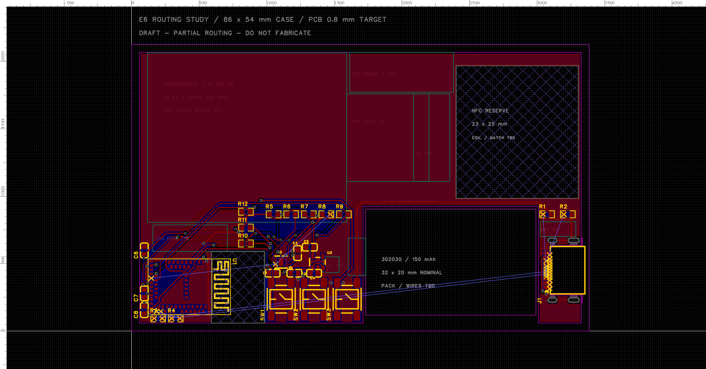

# 六色屏 / 302030 PCB 试布线

更新：2026-09-20。源工程：[NFC-Business-Card.eprj2](../../../eda/NFC-Business-Card.eprj2)，打开 **Board1 → E6-302030 试布线 - 未完成**。已从[预布局](pcb-prelayout.md)进入实际铜线设计，**仍有断点，DRC 未通过，不能生产或按此通电**。



## 本轮结果

- 保留 27 个元件、145 个焊盘和原理图网络；当前为 **304 段铜线、45 个过孔及双面 GND 铺铜**。第一轮为 265 段、30 个过孔和 53 条 DRC；第二轮降至 **41 条**。走线约 740.7 mm，仍有绕行和多次换层，不是最终优化结果。
- 第二轮消除 GND、USB_VBUS、VDD_3V3 和 CHG_CE_N 的连接性错误；三个按键、充电 SDA/SCL/PG、SYS 和电池引脚到 C3 的局部网络也无连接性错误。电池接口仍未加入，不能把局部 BAT 网络连通理解为电池电路完成。
- 第一轮调整 C1–C5、C8 和 U3；第二轮将 C6（10 µF）移到 (2.4, 15.2) mm，C7（100 nF）移到 (2.4, 7.1) mm，均保持 90°，腾出主控左侧出线空间。补地过孔并局部重布电源和使能线。仍需核算线宽、压降、去耦回路、散热和地回流，DRC 连通不等于供电质量通过。
- NFC 预留区增加跨层禁止导线；BLE 示意预留区也禁止导线、填充和铺铜。新增铜线/过孔检查未侵入这两处；预留区仍不是经过原厂完整审核或实测的 RF 设计，未来 NFC 线圈须专门处理规则。
- 没有新增屏幕 FPC、升压电路、NTC、ESD 或 SWD 焊盘，也没有开始 USB 数据线和 NFC 天线设计。没有放宽 DRC 规则或修改 USB 槽口来消除告警。

## DRC 与剩余工作

| 类别 | 预布局 | 第一轮 | 当前 | 处理方向 |
| --- | ---: | ---: | ---: | --- |
| 连接性错误 | 98 | 29 | 17 | 充电中断线；整体排布复评后处理 CC、ESD 与 USB 数据线 |
| 板框到 USB 贴片焊盘间距 | 12 | 12 | 12 | 对照原厂沉板槽图、加工公差与板厂能力 |
| USB 封装内板框到焊盘间距 | 12 | 12 | 12 | 同步核对封装内的槽参考 |
| 合计 | 122 | 53 | **41** | **未通过** |

17 条连接性错误分布：CHG_INT_N 3、USB_CC1/USB_CC2 各 2，以及 USB 数据线四个网络合计 10。计数是 DRC 项目数，不等于还需画的线段数。没有保留本轮未成功接通的中断线试探支线。

自动布线接口的成功数量与最终 DRC 并不完全一致，本次以保存重开后的 DRC 为准。离线网格路径只用于生成候选线，边界近似不能代替原生 DRC；不满足间距的候选已撤回。地网络当前连通，但密集走线仍会切割地铜，回流质量尚未验证。

## 电池与 USB 排布复评

当前电池本体参考为 32 × 20 mm，板框为它让出约 33 × 22 mm 的右下缺口，以减少电池与 PCB 叠加厚度。缺口右边界 x = 76.5 mm，沉板 USB 槽内边界 x = 78.7 mm，两者之间只剩 **2.2 mm 板桥**；USB 焊盘还会占据其中一部分。电池缺口上边界 y = 23.5 mm 与 NFC 预留区下边界 y = 25 mm 之间也只有 **1.5 mm 通道**。

因此，电池当前位置与右侧沉板 USB 的组合是主要布局约束之一；仅把大件包络放得下，并不能保证焊盘出线、地回流和装配空间足够。现阶段不据此判定电池型号不可用，也不将缩小设计规则作为解决方案。

下一轮先保留当前工程作对照，比较以下空间方案，再继续 USB 布线：

1. USB 移至有连续板材的外边缘，靠近主控/充电电路；同时检查插拔方向、按键和外壳开口。
2. 同一块 302030 电池旋转或平移，给 USB 留出更宽通道；检查屏幕、FPC、NFC 预留区及电池出线，不能只移动二维矩形。
3. 若两者都无法满足装配与厚度，再比较较窄电池或其他结构预算；暂不要求重新采购。

以上是待比较方案，尚未修改板框、电池、屏幕或 FreeCAD 模型。

## 电池位置与 FreeCAD 版本

| 文件 | 电池尺寸与位置 |
| --- | --- |
| 旧 [pcba-layout.FCStd](../enclosure/pcba-layout.FCStd) | 窄电池目标 34 × 12 × 2.6 mm；左下角坐标 (3, 3) mm |
| 新 [pcba-e6-302030.FCStd](../enclosure/pcba-e6-302030.FCStd) | 302030 标称 32 × 20 × 3 mm；左下角坐标 (44, 3) mm，位于卡片右下 |
| 当前 EDA | 电池参考区同新版 FreeCAD，位于右下 PCB 缺口；本轮没有移动 |

换较宽、较厚的电池时将它移入 PCB 缺口，以减少叠加厚度；这不是本轮布线造成的移动。屏幕、排线路径、插座参考区及板框也与本轮开始前一致。FreeCAD 未自动同步早先按键/USB 和本轮电源小元件调整；机械源文件没有覆盖或重新生成。

## 验证范围

- 保存、关闭 PCB 图页并重开后，元件、焊盘网络、铜线、过孔、板框、区域、铺铜边界、规则与层叠源数据一致；网表文本一致。
- 145 个焊盘网络仍与原理图匹配，既有网表脚本的 **108 项关键引脚检查通过**；这只验证网络分配，连通性以 DRC 为准。
- 补充检查了走线中心线/过孔中心位于板材内、铜线和过孔未侵入两处 RF 预留区；原生 DRC 未出现新增间距类别或数量。没有把抽样几何检查等同于制造验证。
- SQLite `quick_check` 为 `ok`；已查看保存重开后的 EDA 预览。没有进行 FreeCAD 几何/视觉复验，也没有硬件实测或制造导出。

复核本轮网表快照：

```sh
python3 projects/nfc-business-card/scripts/check-schematic-netlist.py projects/nfc-business-card/artifacts/eda-routing-refine/pcb.enet
```

[检查摘要](pcb-routing.json)随文归档。第一轮快照保留在 `artifacts/eda-routing/`；第二轮在线数据库备份、API 脚本、源数据、完整 DRC、网表及复核脚本 `verify.py` 位于被忽略的 `artifacts/eda-routing-refine/`。后续修改后应重新导出检查，不能沿用本次结果。
