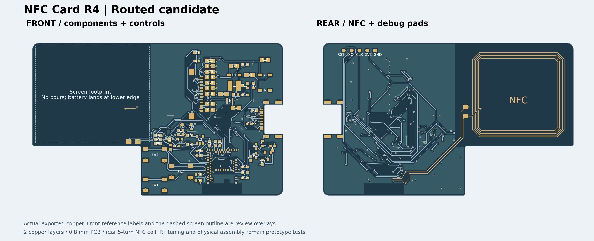

# R4：功能区重排与局部重布候选

## 当前确定方案

[R4 原生工程](../../../../../eda/NFC-Card-R1-Layout-Reset-R4.eprj2)从 R2 新建为独立项目，保留 R2 作为比较基线。将显示供电区 15 个器件成组移至右侧，并重布受影响的供电、接地和信号铜箔；其余 51 个器件、屏幕与 NFC 净空、USB-C、保护器件及板框未移动。保留可关断电池电压采样。**2026-09-25 线上 PCB/SMT DFM 已返回多类危险，尚无工厂审核接受，不能下单。**尤其新增 C9 焊脚到孔 0 mm、盘到线与 PTH 孔到线危险，须在独立下一版局部修正。

## 同版交付文件

- [Gerber 与钻孔 ZIP](NFC-Card-R1-Layout-Reset-R4-gerber.zip)：PCB 制板与 DFM 输入；SHA-256 `a656f896d573b5f1091106111843e068c2f9194cc786d3668d8743d79a87e981`。
- [BOM](NFC-Card-R1-Layout-Reset-R4-bom.csv) 与 [CPL](NFC-Card-R1-Layout-Reset-R4-cpl.csv)：同版贴片预览输入，66 个器件、29 组 BOM。
- [嘉立创线上检查记录](vendor-dfm-2026-09-24.md)：已上传并匹配 BOM；刷新重跑后 PCB/SMT 危险明细已返回，含本版新增 C9 孔位和铜间距风险。

## 本地验证

[完整检查记录](../../records/r1-layout-reset-r4-validation.json)与[复核脚本](../../../scripts/check-r1-layout-r4.py)对应保存重开的工程和上述制造包。

| 项目 | R4 结果 |
| --- | --- |
| 原生 DRC、独立铜箔连通、原理图／PCB 引脚映射 | 0 错误；66 个位号、256 个引脚一致 |
| NFC、屏幕净空、板框与 USB-C 四个镀铜槽 | 本地几何检查通过；槽宽仍为 0.60 mm |
| 过孔 | 167 个；最小实际钻孔约 0.30 mm，最小径向孔环 0.1016 mm；孔间最小净距 0.304 mm |
| 异网走线／焊盘／过孔铜间距 | 独立对象审计无小于 0.15 mm 的配对；不代替阻焊和供应商 DFM |
| 同网过孔孔壁到焊盘铜 | 36 对小于 0.15 mm，需结合阻焊、锡膏和贴片工艺判断 |
| USB CC2 保护 | 修正 R2 继承的前级分支；断开 U6 保护端后的连通性分组检查通过 |

供电器件的命名去耦距离与原板规则相符；C9 到 U4 供电脚中心约 1.55 mm，C10 到 U4 约 2.85 mm。[布局评审](../../records/r1-layout-reset-r4-layout-review.json)还记录了回流过孔与 USB 信号换层位置。这些是几何证据，不代表通电、USB 信号或 NFC 调谐实测。

## 下单前仍需完成

1. 在新的独立候选中先移开 C9 焊盘内的过孔，定位并处理 R4 新增的盘到线 2 条、PTH 孔到线 2 条危险；重跑本地全套检查并上传同版 Gerber/BOM/CPL 复验 PCB/SMT DFM。
2. 逐点核对孔环、同网过孔到焊盘、阻焊桥和开窗；请工厂按 J1 实物图纸确认 0.60 mm 镀铜槽及焊脚/焊盘模型，按 U1 实物尺寸与拼板工艺边确认板边和附近过孔。核对 BOM 匹配的封装、旋转、库存及替代料。
3. 根据确认的 0.8 mm 板厚、表面处理、阻焊颜色、拼板、SMT、钢网和运费取得分项报价，再由用户决定费用、替代和下单。网站默认有铅喷锡设置不代表用户选定 OSP 或沉金。
4. 到板后验证 USB、充电、电池采样、屏幕和 NFC；NFC 匹配电容仍需带屏幕、外壳和磁片实测调谐。

在供应商确认前，R4 是可用于工程审核的完整文件包，**尚非投产批准版**；未下单或付款。
