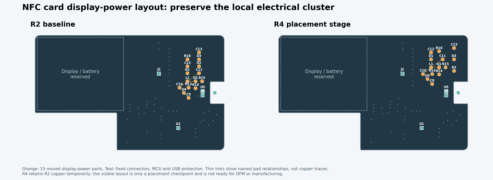

# R4：先摆位的独立布局候选

## 当前确定方案

[R4 原生工程](../../../../../eda/NFC-Card-R1-Layout-Reset-R4.eprj2)从 R2 导入为独立项目，保留 R2 作为当前低成本制造候选。R4 目前只完成显示供电区的**元件摆位检查点**，旧走线、过孔及覆铜仍在原位置，**不可制板、贴片或下单**。本目录没有 Gerber、BOM 或 CPL。

## 已完成的摆位

- 将 U4、C9、C10、L1、Q1、D1–D3、C11–C13、R13–R16 共 15 个显示供电器件作为一组移至板右侧；其余 51 个器件未移动。屏幕、NFC 天线区、USB-C、保护器件、主控去耦、板框与开槽均未改。
- 相对位置沿用 R2 的敏感供电组。命名焊盘中心距：C9-1/U4-1 为 1.550→1.553 mm，L1-1/C10-1 为 3.036→3.034 mm，L1-2/Q1-3 为 1.372→1.372 mm；其余四对亦在 0.02 mm 内。此项只量了位置，尚未证明重新布线后的开关回路与回流路径。
- 移动器件涉及的异网**元件焊盘铜**最小几何间距为 0.636 mm（C12-2 与 R16-1）。此项不覆盖旧走线、过孔、覆铜、阻焊、实际器件本体或 SMT 装配边界。
- 工程过孔规则已保存并重开核对：内孔最小／默认约 0.30 mm，外径最小／默认约 0.50／0.55 mm。这是后续布线的目标规则；旧铜仍有 169 个过孔。

## 当前检查与阻塞

- R4 从磁盘重开后，66 个器件、266 个焊盘、925 条旧走线、169 个旧过孔、2 个覆铜区以及 15 个目标器件坐标，与保存前快照逐项一致；SQLite `PRAGMA quick_check` 为 `ok`。
- 原生 DRC 报 **62 条 Clearance Error、36 条 Connection Error**，由移动元件后尚未拆除／重连的旧铜及覆铜造成；分类见[重开检查记录](../../records/r1-layout-reset-r4-reopen-check.json)。这不是可忽略的旧版告警。
- [摆位独立检查](../../records/r1-layout-reset-r4-placement-check.json)与[检查脚本](../../../scripts/check-r1-layout-r4-placement.py)只证明此次改变对象和上述焊盘几何范围，不代表整板 DRC、连通、板框或供应商 DFM 通过。

## 后续顺序

1. 对照实际封装与装配模型复核器件本体、丝印和贴片余量；尤其检查移至右侧的显示供电器件与 USB/充电区是否仍能分区布线。
2. 在 R4 中仅拆除受影响的旧显示供电走线和局部覆铜，按已保存的 0.30 mm 钻孔、约 0.55 mm 外径和 0.15 mm 异网铜间距目标重新布线；不要为了外观移远 USB 保护、供电去耦或进入天线净空。
3. 再跑保存重开的原生 DRC、独立连通与敏感回路检查、板框／天线检查、Gerber 钻孔与孔环计算；在这之后才生成同版 BOM/CPL 并送供应商 PCB/SMT DFM。R2 尚存的 J1 镀铜槽和贴片模型、U1 装配边界风险需另向供应商按实物核对。
