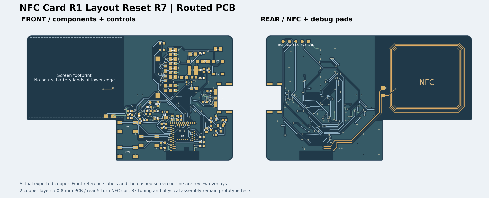

# R7：U1 接地过孔局部修正候选

## 当前确定方案

[R7 独立工程](../../../../../eda/NFC-Card-R1-Layout-Reset-R7.eprj2)从 R6 派生，只将 U1-33 GND 焊盘附近的过孔从 `(58.025,16.55)` 移至 `(58.00,16.80)` mm，重接原有顶、底层 GND 短线并重铺铜。新孔到 U1-33 焊盘铜边的本地计算孔壁净距约 **0.282 mm**，原位置约 0.032 mm。未移动器件、保护件、去耦、USB-C、板框或天线。初始试孔与 USB_VBUS 线／C1 焊盘冲突，最终孔位经保存重开的原生 DRC 验证为 0 错误。独立铜箔连通与 CC2 保护断线、NFC、板框／四槽检查通过；最小实际钻孔约 0.30 mm、最小径向孔环 0.1016 mm、异网铜对象无小于 0.15 mm 的配对。过孔数仍为 167。

[嘉立创 R7 线上 PCB/SMT DFM](vendor-dfm-2026-09-25.md)证实 U1“焊脚到孔”危险从 R6 的 2 降到 **0**，PCB“VIA 孔到焊盘”危险从 32 降到 **30**；但孔环、USB 镀铜槽、阻焊、J1/U1 贴片模型等危险仍在，**R7 不能下单或称为供应商接受的投产版**。

## 同版文件与验证

- [Gerber 与钻孔 ZIP](NFC-Card-R1-Layout-Reset-R7-gerber.zip)，SHA-256 `c4986d31f9e1c58b8dc8466f91925f2aa1f760b64ff2654fd00fb0f7bcc49a15`。
- [BOM](NFC-Card-R1-Layout-Reset-R7-bom.csv) 与 [CPL](NFC-Card-R1-Layout-Reset-R7-cpl.csv)：66 个器件、29 个 BOM 组，来自同一工程。
- [完整本地验证](../../records/r1-layout-reset-r7-validation.json)、[PCB 快照](../../records/r1-layout-reset-r7-routed-snapshot.json)及[复核脚本](../../../scripts/check-r1-layout-r4.py)。

## 下单前优先事项

1. 逐个定位剩余 30 条“VIA 孔到焊盘”危险。[本地审计](../../records/r1-layout-reset-r7-clearance-audit.json)已缩小为 13 个同网过孔孔壁到焊盘 <0.10 mm 的不同位置，包含 4 个贴入同网焊盘；网页计数可能按层或焊盘重复。先判断锡膏流失和实物贴装影响，再局部改孔改线，不能为消除站点计数破坏地回流、去耦或保护拓扑。
2. 请嘉立创 PCB 工程师按 **0.30 mm 钻孔／约 0.10 mm 径向孔环**的实际 Gerber 和公差解释孔环危险 100 条，以及四个 0.60 mm 镀铜槽、阻焊桥 43 条、开窗露线 3 条的制造要求。线上计数不等于独立物理缺陷数，也不等于审核接受。
3. 请 SMT 工程师结合 J1、U1 实物资料和拼板工艺边核对 J1 焊脚重叠 12 条、U1 板边 0.07 mm 及 PIN 边界多条危险；确认封装模型、坐标方向、工艺边及是否需改板形／器件。
4. 核实 0.8 mm 板厚、表面处理、阻焊色、器件库存／替代、SMT、钢网、拼板及运输分项报价，再由用户决定是否接受和下单。网页默认有铅喷锡不是最终的 OSP／沉金选择。

R7 可供工程审核和下一轮局部修改；没有下单或付款，也没有实物电气、NFC 调谐或装配验证。
