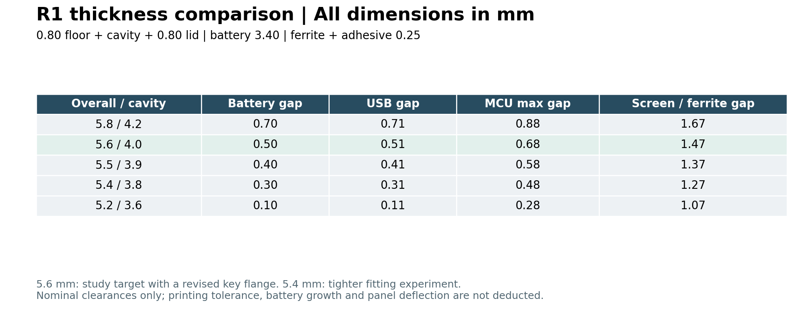
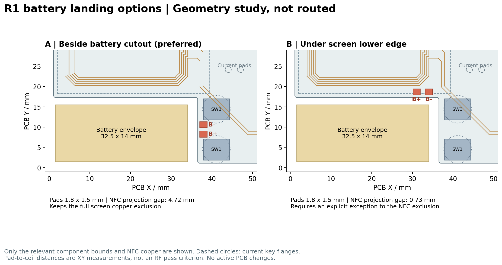

# R1 thickness and battery landing study

## Superseding decision

The user selected **option B, screen lower-edge battery pads**. That PCB change is now applied and verified; [route plan](records/r1-battery-b-plan.json), [checks](records/r1-battery-b-check.json), and [updated PCB review](pcb-r1-review.md). The battery lead exit is at the upper right. **Thickness and button manufacturing are deferred; retain the current 5.8 mm case.** Regional heights and mechanical follow-up are recorded in the [height handoff](../enclosure/r1-height-handoff.md).

The comparison below is the earlier study, tied to its recorded pre-change snapshot. Its A recommendation was superseded by the user's B selection. Pad-only distances below do not include the implemented routes. The historical A/B image is not the current PCB.

## Earlier proposal (historical)

Discussion study, 2026-09-24. **No active PCB, enclosure or manufacturing export is changed by this study.** All work remains uncommitted. The user accepted a **3.4 mm battery maximum** and **0.25 mm ferrite sheet** for calculations; these are design inputs, not measurements. The ferrite allocation includes adhesive; separate tape must be added if necessary.

- Preferred next mechanical candidate: **5.6 mm overall / 4.0 mm cavity**, with a revised 0.8 mm key flange.
- 5.4 mm overall / 3.8 mm cavity is a tighter fitting experiment requiring further key design or measured fit.
- Preferred battery landings: **beside the vertical battery cutout, between SW1 and SW3**. Keep the full screen/NFC copper exclusion.

Evidence: [computed study](records/r1-packaging-study.json), [reproduction script](../scripts/study-r1-packaging.py). Dimensions below come from the active CAD and PCB snapshot. Component library models are nominal; maximum MCU and screen heights come from the design inputs.

## Thickness by region

Retain the 0.8 mm floor and lid. The 0.32 mm PCB support is a physical stack of 0.20 mm PET and two 0.06 mm adhesive layers, not unused air. The PCB is 0.8 mm thick. Take the **maximum regional stack**, not the sum of all regions.

| Region | Occupied height above the inner floor | Treatment |
| --- | --- | --- |
| Battery | 0.10 adhesive + 3.40 pack = **3.50 mm** | The old 0.40 mm allowance above a nominal 3 mm cell is already included in the accepted maximum; do not recover it a second time |
| Recessed USB | 0.32 support + 3.170 model = **3.490 mm** | The connector shares the PCB height; do not add another 0.8 mm |
| MCU | 0.32 support + 0.80 PCB + 2.20 maximum = **3.32 mm** | Includes the model-to-maximum allowance |
| FPC socket | 0.32 + 0.80 + 2.010 model = **3.130 mm** | Flex bend is checked separately; the open-lid service volume is not a closed-flex envelope |
| Screen | 0.32 + 0.80 + 0.10 sheet spacing + 0.25 ferrite + 1.00 screen + 0.06 adhesive = **2.53 mm** | The remaining cavity height is the gap between ferrite and screen; the active area remains open |

The [GCT USB4500](https://gct.co/connector/usb4500) specifies a 3.16 mm profile and 0.80 mm offset. The actual imported model is slightly taller, so the study uses its 3.170 mm extent.



At **5.6 mm**, nominal upper gaps are: battery **0.50**, USB **0.51**, MCU maximum **0.68**, FPC socket **0.87**, and ferrite-to-screen **1.47 mm**. At **5.4 mm**, these become **0.30 / 0.31 / 0.48 / 0.67 / 1.27 mm**.

Battery and USB alone suggest roughly 5.4 mm overall with a 0.3 mm nominal gap. That gap is a design allocation, not a supplier tolerance guarantee. At 5.2 mm only 0.10/0.11 mm remain above the battery/USB, and the proposed key already collides. A 5.0 mm enclosure has a 3.4 mm cavity, less than the battery-plus-adhesive stack even before clearance.

The screen has enough vertical space in every candidate. Its XY aperture registration stays unchanged; lowering the lid changes the flex bend, which still needs a fully inserted sample check. A hypothetical 1.0 mm solder/wire envelope above the PCB would leave 0.62 mm below the maximum screen at 5.4 mm if no ferrite covers that local envelope; this does not establish the wire diameter or actual solder height.

Reducing the PET support could recover some PCB/component height, but cannot reduce the battery's 3.50 mm requirement. Keep the existing support until rear solder protrusions, insulation and floor deflection are checked.

## Keys: a real constraint and a manufacturing item

There are two different parts:

1. **Electrical switches SW1/SW2/SW3:** purchased ALPS SKQGABE010 components, already in the PCB BOM; soldered during assembly.
2. **Visible keycaps:** three separate transparent printed parts, captured under the lid. They can be ordered with the shell; no separate stock keycap purchase is required. They cannot be fused to the rigid case if they are to move.

The old CAD check only moved the key 0.30 mm. The [ALPS specification, section 7.2](https://tech.alpsalpine.com/cms.media/SKQGAB_KQG_719_EN_cc4e10226e.pdf#page=3) gives travel **0.25 +0.20/-0.10 mm** under its test load. The study checks 0.45 mm plus the model's approximately 0.05 mm contact gap. This is a clearance envelope, not a command to force every switch through 0.45 mm. The moving actuator is excluded from the fixed-body collision check.

| Overall / flange | Clearance at the maximum travel envelope | Result |
| --- | --- | --- |
| 5.8 / 1.0 mm, existing geometry | 0.28 mm | Revised check of the existing design |
| **5.6 / 0.8 mm** | **0.28 mm** | Recovers 0.2 mm overall while retaining the current plunger length and motion space |
| 5.5 / 0.8 mm | 0.18 mm | More sensitive to printing and assembly variation |
| 5.4 / 0.8 mm | 0.08 mm | Static fit is insufficient evidence for release |
| 5.2 / 0.8 mm | -0.12 mm | Collision detected |
| 5.4 / 1.0 mm, unchanged flange | -0.12 mm | Simply lowering the existing lid fails the expanded motion check |

All three switches were checked using FreeCAD solid intersections. The failing cases intersect the fixed switch model by approximately 0.535 mm³ per key; passing rows have zero intersection. These are nominal geometry results, not tolerance or fatigue tests.

Keep the existing 0.6 mm nominal radial gap between the 4.0 mm head and 5.2 mm lid hole. The depicted 0.05 mm axial gap is not a controlled bearing: the cap floats and settles against the actuator. Plunger height, lack of resting preload and full return need actual fitting. The thinner flange also needs a strength/print check. Small keycaps may need a removable carrier for the printing supplier's handling/minimum-size rules; the carrier must avoid the plunger and sliding surfaces.

The user's resin sheet gives 0.8 mm wall and ±0.2 mm accuracy. Those values do not establish the flatness or accumulated tolerance of this assembly. [JLC's design guide](https://jlc3dp.com/help/article/3d-printing-design-guideline) increases recommended wall thickness with part size and lists minimum part sizes. The broad 0.8 mm shell panels and the separate small keys still need supplier review; this study retains the user's thickness choice rather than declaring it qualified.

## Battery pads: compare location before routing



Both studies use **1.8 × 1.5 mm top-side solder landings**. Coordinates are in the PCB's native XY frame.

| Item | A: beside cutout, preferred | B: screen lower edge |
| --- | --- | --- |
| B+ / B− centers | (37.9, 8.3) / (37.9, 10.6) | (31.0, 18.7) / (34.0, 18.7) |
| Minimum copper-to-outline | 0.50 mm | 0.65 mm |
| Minimum XY distance to NFC copper | **4.72 mm** | **0.73 mm** |
| Nearest component model bounds | 0.45 mm to SW1/SW3 | No component within 2 mm |
| Top tracks within 0.2 mm of the proposed pads | None | None |
| Existing top pads or vias within 0.2 mm | None | None |
| Existing full-screen copper exclusion | Preserved | Requires two pad and route exceptions |

These distances are geometric comparisons, **not RF clearance thresholds**. At the time of this comparison neither option had been routed or passed native DRC; B has since been implemented as linked above. The side option also has a nominal 0.8 mm gap between solder lands and 0.424 mm XY clearance from the nearest key flange. Pad corners should be rounded in implementation, with solder-mask openings and clear polarity marks.

The assumed lead exit reference is (34, 8.5), still unmeasured. From there the preferred centers are only about 3.9–4.4 mm away in XY, before bends and soldering slack. This avoids the previous wire detour up to the pads at Y=24.2. Do not specify cut-to-length wires until the actual protection board/lead exit is known.

Implementation should move the BAT_PACK_TBD and GND landings, route power and return together through the right-hand electronics area, and retain the charger-local battery decoupling capacitor. Size trace widths for the actual peak current and voltage drop; the existing narrow battery route is not a requirement to preserve. Rebuild pours, check edge/mask clearance, route continuity and solder access, then update the wire service envelope and exports. Keep solder and strain relief clear of both moving key flanges. Do not restore a ground rim around the NFC coil. If a real battery temperature sensor is used, its NTC connection needs a separate lead plan; do not silently tie it to B−.

## Ferrite placement

Back-to-front stack: **phone → rear cover → rear coil → PCB → ferrite → screen**. Use a low-loss magnetic sheet specified for 13.56 MHz, not an arbitrary conductive metal foil. A [TDK NFC sheet example](https://product.tdk.com/en/search/noise_magnet-sheet/noise_magnet-sheet/charge-nfc-low/info?part_no=IFL04-200ND300X200) has 0.20 mm magnetic material and 0.24 mm total thickness including adhesive, making the accepted 0.25 mm allocation plausible without selecting that part.

[NXP AN11564 sections 2.2 and 3.2](https://www.nxp.com/docs/en/application-note/AN11564.pdf) support placing ferrite between antenna and metal, covering the antenna, and measuring/tuning in the final stack. Only those physical principles are used here; PN7120-specific matching values do not apply to this nRF52840 design.

If a front PCB solder pad is below the sheet, it is on the same side of the ferrite as the rear coil. The sheet does not isolate those two PCB conductors from each other. Thus the screen-edge option still creates an antenna-neighbour change despite generous vertical space. The side location avoids that tradeoff. The final ferrite, display, battery and case must be included in NFC tuning; shielding is not proof of working read range.

## Reproduce and remaining work

From the repository root:

```sh
python3 projects/nfc-business-card/scripts/study-r1-packaging.py
```

This reads the saved FCStd through FreeCAD, computes the key motion cases, audits candidate pad geometry with Shapely, and renders the comparison images. It does not save the FCStd or write to EDA. The saved comparison is historical. Re-running against the current PCB replaces its baseline; current B-route verification is in the linked battery and PCB review records.

For the next mechanical revision: discuss the cap/flange process, update B-pad wire/solder and ferrite relief, and retain the before-order C1 input-decoupling correction from the [PCB review](pcb-r1-review.md). Printing, battery growth allowance and final NFC tests remain physical validation tasks.
