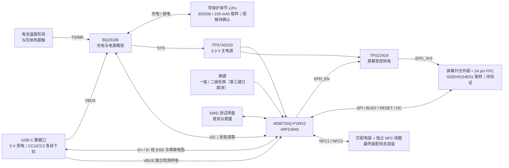

# 电子名片系统设计草案

更新：2026-09-20。范围：功能框图、供电边界与原理图输入；已形成 [EDA 原理图草案](schematic-draft.md)，尚未完成制造设计或验证实物。对应 [候选 BOM](candidate-bom.md) 和[六色屏/302030 空间研究](../enclosure/pcba-e6-302030.svg)。框图反映当前选样方向，EDA 的屏幕电路尚未迁移。

2026-09-21 按键需求更新：至少两颗分别轮换一级栏目、二级选项，二级选到即自动应用；第三颗在空间与装配允许时保留，功能待定。现有三颗开关及 GPIO/网络保留，逻辑角色与具体位号的映射待后续固件/原理图同步，详见[交互架构](../docs/architecture.md)。

## V1 功能框图

箭头表示功能关系，不是可直接接线的引脚图。全部低压电路共地；充电器 SYS、USB VBUS、主 3.3 V 和屏幕受控 3.3 V 分开命名。不引入 Wi-Fi、独立 NFC 标签芯片或常亮指示灯。

## 已核对的接口边界

| 接口 | 原厂事实 | 本项目安排 |
| --- | --- | --- |
| 主控正常电压模式 | Raytac Rev L 第 40 页将模块 VDD pin 28、VDDH pin 30 接同一正常电压电源 | 使用 LDO 3.3 V；DCCH pin 31 按该模式处理，不能随意接 SYS |
| 原生 USB | 模块 pin 32 为 VBUS，34 为 D−，35 为 D+；参考图为数据线各串 27 Ω | VBUS 接 USB 5 V 路径；数据线另接 USB 座；不以 SYS 替代 VBUS 检测 |
| NFC | 模块 pin 52 = P0.09/NFC1，54 = P0.10/NFC2 | 保留专用功能，外接线圈和可调匹配；模块上的 2.4 GHz 天线不能代替 NFC 线圈 |
| 调试 | 模块 pin 51 = SWDIO，53 = SWDCLK，40 = P0.18/nRESET | 加 GND、VTref 共五个测试点；VTref 是电平参考，避免两路电源互相供电 |
| 晶振与启动 | 模块已有 32 MHz 晶振及 REG1 电感；原厂出厂测试代码与最终应用不同 | 首烧用 SWD；应用可选择内部低频 RC，预留低频晶体焊盘是否必要待固件路线确定 |
| 屏幕逻辑 | GDEH0154E01 使用 SPI，VDD 2.4–3.6 V；仍需要外部升压电路 | 按[六色屏资料](../docs/gdeh0154e01-evaluation.md)及样品验证 BUSY、FPC 和外围，再集成到主板；不沿用黑白驱动配置 |

来源：[Raytac 产品](https://www.raytac.com/product/ins.php?index_id=47)、本地 Rev L 第 14–17、35、40 页；[Good Display 产品](https://www.good-display.com/product/388.html)及已下载图纸第 7、8、33 页。引脚号专指 MDBT50Q 系列模块，不是 nRF52840 芯片封装脚号。

USB-C 作为固定 5 V 受电设备：CC1、CC2 分别通过 5.1 kΩ 下拉到地，不能短接两条 CC。A6/B6 汇合为 D+，A7/B7 汇合为 D−；不使用的 SBU 按连接器/USB 2.0 设计处理。输入电流限制、VBUS 电容总量、插入浪涌及 USB 枚举前后功耗仍需整体验证。依据：[TI USB-C 设计说明](https://www.ti.com/jp/lit/wp/slyy105/slyy105.pdf)、[USB4500 原厂图纸镜像](https://datasheet.lcsc.com/datasheet/pdf/d3e0ccfd370d5b8c3f9893bc8d4bf9a5.pdf?productCode=C5354966)。

## 电源启动与低功耗约束

- BQ25186 复位默认：充电使能、10 mA、4.2 V、SYS 4.5 V；这些默认值也必须满足所选电池规格，不能只依赖 MCU 启动后改寄存器。电池尚未确认前，调试先使用限流 USB 供电且不接电池。
- 看门狗可将寄存器恢复默认值；固件必须明确处理启动、休眠和超时，并读回设置。TS/MR 默认参与温度保护，不能将它当普通按键输入随意复用或悬空。本版三个交互按键直接接 MCU。
- TPS7A0233 的输入范围可覆盖所选 SYS 设置，额定输出 200 mA。仍需测量屏幕升压启动峰值；电池接近输出电压时 LDO 进入压差区，不能把全部标称电池容量计为可用。
- TPS22919 用于整体切断屏幕逻辑与升压输入。断电前完成屏幕关机流程，并将相连 GPIO 置低或高阻，防止从 SPI/控制线反向供电。开关不能保证任意断电时屏幕画面完整。
- 充电电流先按原厂默认 10 mA 作为待核对起点；不将其标成电池允许值。电池保护、温度检测及充电管理分别保留。

来源：[BQ25186 数据手册](https://www.ti.com/lit/ds/symlink/bq25186.pdf)第 19、32–36、39 页；[TPS7A02](https://www.ti.com/product/TPS7A02)；[TPS22919](https://www.ti.com/product/TPS22919/part-details/TPS22919DCKT)。固件行为及测试顺序为本项目设计安排，尚未实现。

## 本轮发现与进入原理图的条件

1. **主控供货未解决。** LCSC 国际站的 MDBT50Q-P1MV2 页面显示缺货；保留作设计候选，需确认其他渠道与嘉立创来料贴装，或完成替代模块评审。
2. **屏幕选型变更尚未迁移电路。** 用户当前取样 GDEH0154E01 六色屏及 DESPI-E01；已取得原厂资料，但 BUSY 极性、部分引脚和外围存在版本差异，刷新耗时与功耗仍需确认。FPC 接触方向也需重选，不能直接沿用黑白草案。见[六色屏评估](../docs/gdeh0154e01-evaluation.md)。GDEY0154D67 保留为备选，其旧图引脚标签差异仍未解决。
3. **电池交付尺寸待确认。** 用户当前取样 302030 / 150 mAh，商家标称 32 × 20 × 3 mm；完整包体公差、允许充放电电流和温度检测仍待确认。已在独立模型中移到右下缺口，简化几何检查通过；2.5 mm PCB 窄桥、完整引线和实物装配仍待验证。见[结构研究](../enclosure/README.md)；模型不代表样品的交付上界，LP201230 等窄电池保留作备选。
4. **5 mm 尚未闭合。** 沉板 USB-C 的完整高度仍为 3.16 mm。双 0.8 mm 壁加上下各 0.1 mm 间隙后已达 4.96 mm，尚无足够公差余量；比较薄片前盖，但不自动改变用户的外壳选择。

原理图可以先推进已确认的主控、USB 与电源页；屏幕页及电池参数保持待确认标记。完成符号/封装逐脚复核后再布板，制造前仍须做 NFC、刷新峰值、充电及装配实测。
