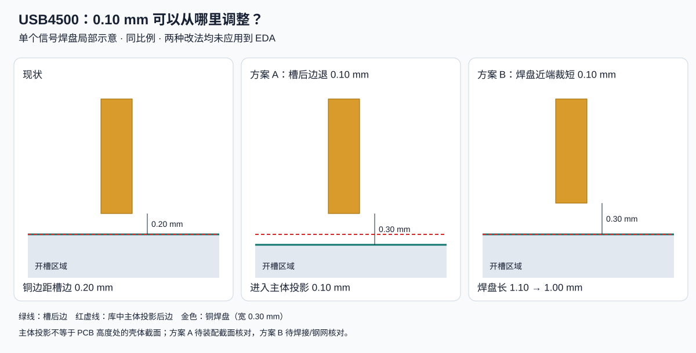

# USB4500 槽边距尺寸复核

## 当前确定方案

2026-09-21 更新：**保留原 USB4500 焊盘与开槽，停止为满足 0.30 mm 而裁焊盘或缩槽。** 嘉立创国内[《下单前技术员必看》](https://member.jlc.com/portal/server_guide_4110.html)更新于 2026-08-15，第三部分明确规定内槽、CNC 板边到铜不小于 **0.20 mm**。此前使用的 0.30 mm 说明仍在线，但不应再作为唯一适用依据。

本轮重新运行原生 DRC，24 条槽边距告警全部来自 J1，实际距离为 **0.2000377–0.20005294 mm**，满足新版公开的名义最小值。检查结果见 [JSON](usb4500-process-check.json)。这不代表完整装配或生产稿已验收，尺寸处于工艺下限，不能把计算中的尾数当成装配余量。

已尝试通过 `overwriteCurrentRuleConfiguration` 仅把“Board Outline → SMD Pad”从约 0.30 改为 0.20 mm，API 返回 false；随后读取确认配置完全未变。原生界面仍为 **58 条（34 条连接、24 条旧阈值下的槽边距告警）**，不声称已消除告警。修改前数据库与规则已备份；本次没有改动几何、网络或布线，也未继续尝试不明确的配置格式。此规则更新不再阻塞后续布局设计。

国际站 [JLCPCB 能力表](https://jlcpcb.com/capabilities/Capab)的 Outline / Routed 栏也明确支持锣边、锣槽到铜 ≥0.20 mm，作为交叉核对；国内决策以上述国内更新文档为依据。FPC 的 0.20 mm 说明不用于代替本项目 FR-4 工艺。

以下保留此前按 0.30 mm 评估的测量与候选改法，**均未采用**。工艺确认问题也改为下单前确认原封装与生产稿，不再优先申请裁焊盘。

已从运行中的 EDA 读取 PCB，除文档/画布元数据外，图元与此前保存快照完全一致。测量使用该板框、J1 原点和项目缓存的 J1 封装，结合已存档 GCT A1 图（2023-05-31）。[精确测量值](usb4500-clearance-review.json) · [调整对照图](usb4500-clearance-review.svg)。

## 测量结果

J1 原点 y=5.475 mm，以下 y 为 PCB 坐标。开槽边按轮廓中心线计算，不把画线宽度当成铣槽偏移。

| 项目 | 当前值 |
| --- | --- |
| PCB 槽后边 | y=7.3000 mm |
| 封装内槽后边 | y≈7.3000 mm，与 PCB 槽一致 |
| 库中主体投影后边 | y≈7.3000 mm |
| 信号铜焊盘近槽侧边 | y≈7.5001 mm |
| 信号铜焊盘远侧边 | y≈8.6001 mm |
| 铜焊盘长度 | 1.1000 mm |
| 铜到槽后边净距 | 0.2001 mm；旧 EDA 阈值约 0.30 mm，新版公开要求 ≥0.20 mm |

两组槽边距告警对应同一局部几何问题，不能只修改 PCB 板框而留下封装内相冲突的轮廓。

## 两种改法的实际影响

**A：槽后边向接口开口方向退 0.10 mm。** 铜边距增至约 0.3000 mm，焊盘不变，但 PCB 会进入库中主体投影约 0.1000 mm。主体投影不是 PCB 厚度范围内的壳体截面，所以不能据此断言一定碰壳；同样也不能认定有可用装配余量。现有顶视图和简化外形不足以验收这一修改，需要该截面的可靠模型/尺寸及公差。

**B：开槽不变，只裁掉铜焊盘靠槽侧 0.10 mm。** 净距也增至约 0.3000 mm，长度变为约 1.0000 mm，远端出线位置不变。它不改变插座主体、锚脚或插合位置，因此比缩槽更适合作为下一步核对对象。不过铜焊盘已经偏离原库，必须结合真实焊脚覆盖与钢网检查，不能把 DRC 通过当成焊接可靠性的证明。未将该候选应用到工程。

GCT 图中端子存在 1.20±0.05 mm 的长度标注；这不是直接授权把 PCB 焊盘改为任意长度。库还包含独立的钢网相关图形，修改时不能仅改铜而遗漏这些图形。本次未完成钢网制造层对应关系和焊脚三维接触面的复核。

## 下单前生产稿核对

> 计划使用 USB4500-03-0-A、0.8 mm FR-4 PCB。接口焊盘到 CNC 槽后边约 0.20 mm，拟按贵司 2026-08-15 更新的《下单前技术员必看》中内槽/锣边 ≥0.20 mm 要求保留原封装。请在生产稿确认该局部无需削焊盘，并检查开槽圆角、四个锚脚与沉板贴装的配合；如需调整请先返回具体尺寸。

这是下单前的问题，**尚未发给 GCT 或嘉立创，也未获得订单级答复**。公开要求已足够支持继续保留原接口进行设计，不必为了该项停止整板推进。

## 此前尺寸验证与来源

- 只读比对当前与已保存 PCB 图元：无差异；PCB 板槽与缓存封装槽的位置差小于 0.001 mm。
- 尺寸计算同时验证两种改法均得到约 0.30 mm 铜到槽距离；图已渲染并视觉检查。这不是三维碰撞或焊接验证。
- 没有新客户端 DRC；58 条仍是此前结果。未修改数据库，不需重新做布线或网表验证。
- [GCT USB4500](https://gct.co/connector/usb4500)，原厂图来源/校验值见[下载清单](../docs/download_manifest.json)。本次官网 HTML 的额外直接下载尝试返回 403，使用已存档 A1 图，未宣称拿到最新修订。
- [嘉立创制造工艺要求](https://www.jlc.com/portal/1/serviceGuide)：上一轮核对的 CNC 板边/内槽到铜要求为 0.30 mm；本项目尚未获得局部例外确认。
